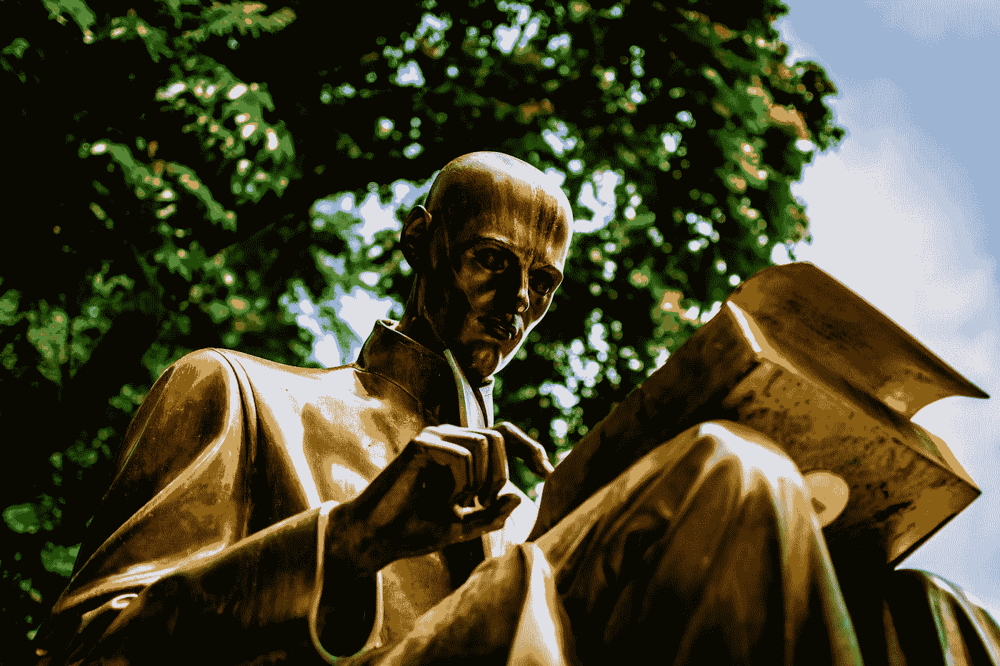

# 英语作为第二语言

> 原文：<https://medium.com/swlh/english-as-a-second-language-2420bad026f2>

## 如何克服写作中对犯错的恐惧

Photo by [Carl Cerstrand](https://unsplash.com/@cerstrand?utm_source=medium&utm_medium=referral) on [Unsplash](https://unsplash.com?utm_source=medium&utm_medium=referral)

正如我写作的一些特点可能暗示的那样，我的母语不是英语。

我之前提过，这一直是我的一个障碍。