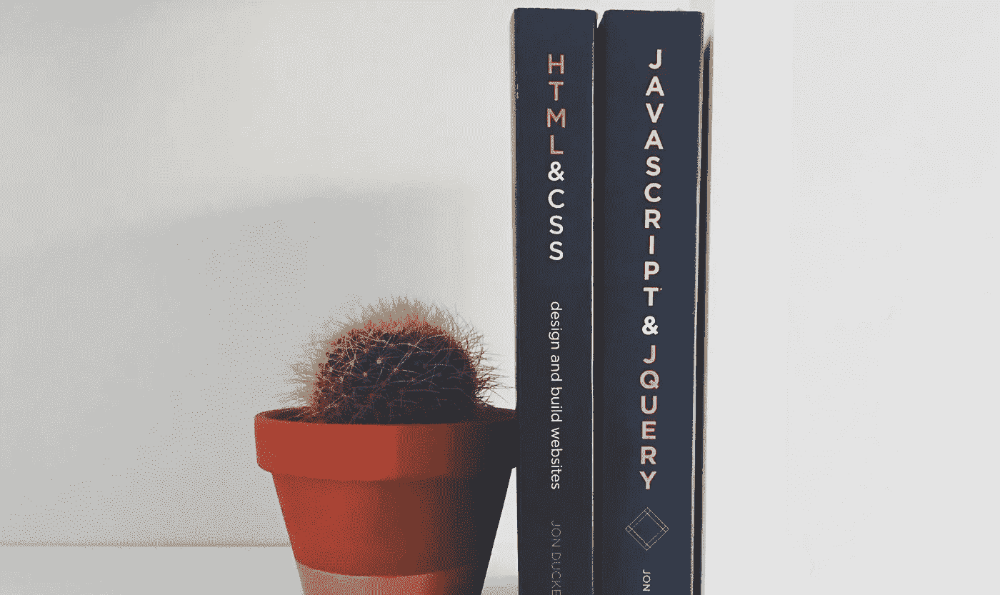

# 使用风格化组件和超光速粒子增强工作流程

> 原文：<https://medium.com/swlh/enhanced-workflow-with-styled-components-and-tachyons-e14a8ed4d25a>

Credit: [Greg Rakozy](https://unsplash.com/@grakozy) — Unsplash

> TL；DR——让超光速粒子来提升组件的响应能力，这样你就可以专注于美学细节。

如果您曾经处理过大型复杂的全局样式表的开销，就不难理解为什么 CSS-in-JS 被许多人采用。这并不是说这些模式没有问题。组件模式仍然是一个…