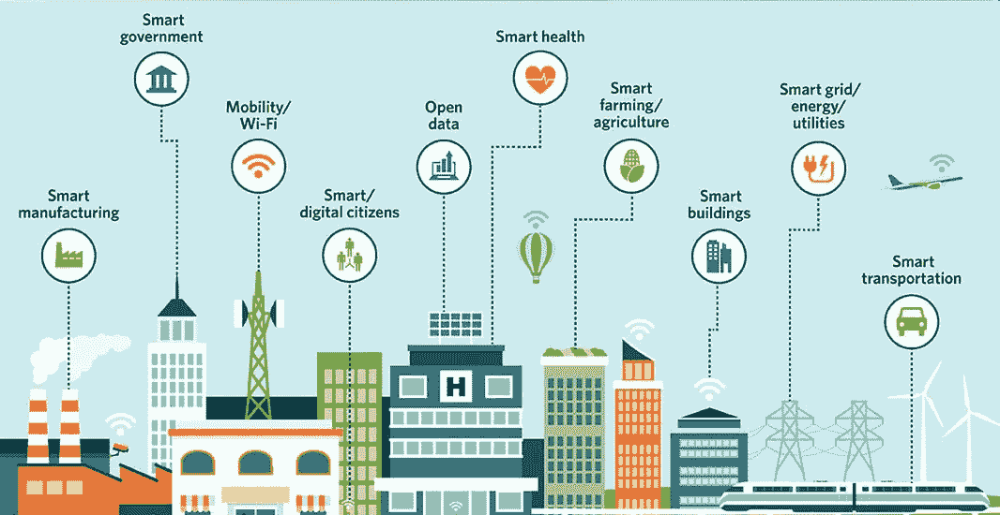
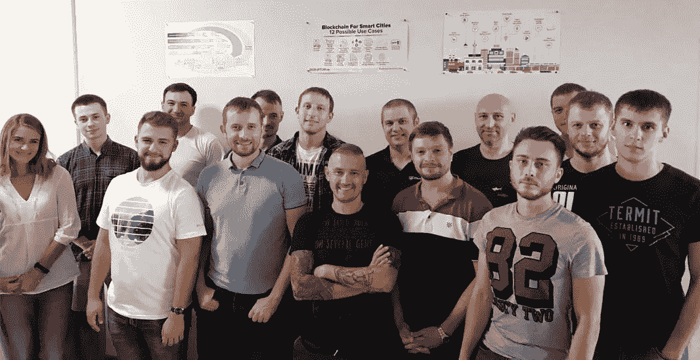

# 面向智慧城市的企业区块链

> 原文：<https://medium.com/swlh/enterprise-blockchain-for-smartcities-43ee3c814661>

# 什么是智慧城市？

21 世纪末，鲍勃和露西生活在一个完全由人工智能(AI)控制的城市里。他们根据自己的数字身份获得城市服务。大多数工业和日常生活一样都是机器人化的。研究新技术、设计或更新现有技术的公民获得了最高的社会地位。社会地位较低的人在无法为自己服务的地方为机器人的需求服务。在最坏的情况下，你需要在完全或部分自动化的行业中与机器人竞争工作。AI 背后最初的想法从来没有实现过。而且——事实证明,“人工”这个词本身已经过时了。

你认为露西和鲍勃看起来太超前了吗？嗯，谷歌一些现实生活中的[智慧城市用例](https://www.google.com/search?q=Smart%20city%20use%20cases)。或者观看[极乐世界电影](https://www.google.com/search?q=Elysium)来获得灵感。

简而言之，智慧城市是多种技术的结合，可以使城市日常生活和工作的许多方面实现自动化。

# 基础设施是如何控制的？

要实现城市流程的自动化，需要生产大量的设备、汽车、传感器、分析和自动化工具，将它们集成到城市基础设施中。然后，整个私营经济需要融入一个尽可能统一的体系。我们还没有提到融入该国的经济、政府、军事和全球机构。此外，我们甚至没有提到将城市整合成相互通信的集群。

一旦城市流程实现自动化，我们就会从各种设备和工具中获得大量数据。这些数据需要处理。但是我们不会深入研究如何处理这些数据。相反，我们想讨论如何存储这些数据以供处理。

我们需要一个数据库来存储来自智慧城市各个部分的数据。我们可以用一个普通的数据库吗？让我们尝试使用由顶级数据库制造商开发的、被认为适合企业级需求的那个。难怪，一个常见的解决方案不会起作用，因为它不够分散，无法在本地碎片中存储相当大的数据量，并且不提供防伪数据工具。

也许 NoSQL 数据库？也不行。顺便说一句，你可能已经注意到 [NoSQL 趋势已经好几年没有增长了](https://trends.google.com/trends/explore?date=all&q=NoSQL)。

由于这种现象的性质，智慧城市对数据库有特定的要求:

*   **分散**。因为 SmartCity 的各个部分遍布整个城市，在处理数据和做出决策时不能依赖单点故障。例如，你不能让紧急火灾传感器等待，直到中央当局允许启动水流来灭火。
*   **容错**。系统的这一部分应该能够独立工作，不依赖于其他组件或仅依赖于最低要求的元素。
*   **BigData** 。这是显而易见的。仅仅是保存和处理来自所有智慧城市部分的全部数据的能力。
*   **防伪保护**。如果一个公民控制了一个城市传感器，并产生了一堆错误数据，人工智能将使用这些数据来决定如何控制城市的某个部分，会怎么样？尤其是如果假币是以前制造的。

这可能是像 IBM 这样的软件巨头致力于开发下一代数据库的原因。像 [HyperLedger 面料](https://www.hyperledger.org/projects/fabric)。这种数据库既不叫“关系型”，也不叫“NoSQL”。它们被称为“分布式总账”。还请注意，分布式分类帐不一定需要块链，尽管他们通常有一个。

# 区块链作为智能城市软件设计模式

因此，我们知道哪些数据库足以满足智慧城市的需求。但是什么是区块链，为什么智慧城市需要区块链？

让我们回到我们认为最早的区块链相关出版物的历史:

> *“建立分布式哈希表节点身份的一种方法是使用公钥加密。”(分布式 k 元系统:分布式哈希表的算法。ALI GHODSI)。*

**DHT** 是分布式哈希表。分布式哈希表比区块链更古老，但描述了相同的概念。如果我们将分布式哈希表与公钥加密结合起来，我们就会得到区块链的现代概念。

PS:非常感谢“将军”对上述观点的深刻见解。

另外，在寻找中本聪时，记得阅读所有与分布式哈希表相关的研究文章。

因此我们得到了“区块链是什么？”。但是这和智慧城市有什么关系呢？

分布式账本(智能城市组件的数据库)需要一种方法来限制数据伪造。数据应存储有时间戳，加密安全，不能发布虚假数据或修改现有数据，也不能跟踪这种修改。这类似于关系数据库完整性约束(主键或外键),但有另一个目的——抑制数据伪造。

因此，区块链只是另一种防止假冒的数据库约束。仅此而已。甚至区块链也与去中心化没有任何关系，因为去中心化是另一种数据属性，没有区块链也可以轻松存在。

# 下一步是什么？

*   越来越多的数据库引擎将支持区块链。
*   将创建更多数据库来满足智慧城市的需求。
*   最后，区块链将不再是一个单独的宣传，而只是一个由专门的数据库引擎支持的完整性约束。
*   可以肯定的是，有人可能会想出另一种与区块链毫无关系的防伪技术。

为什么选择 Zfort 集团？

*   我们已经成功地做了两年的[区块链](https://www.zfort.com/blockchain-development)软件开发。
*   现在我们有了智慧城市。

智慧城市将人放在第一位，就像我们在 Zfort Group 所做的那样。未来，城市将不仅仅是混凝土建筑和布满灰尘的公园。物联网是满足现代公民高级需求的技术，我们的专家团队随时准备帮助私营和上市公司打造人们真正喜欢的出色产品。

给我们写封信，开始行动吧！

*最初发布于*:[https://www . zfort . com/blog/enterprise-区块链-smartcities](https://www.zfort.com/blog/enterprise-blockchain-smartcities)