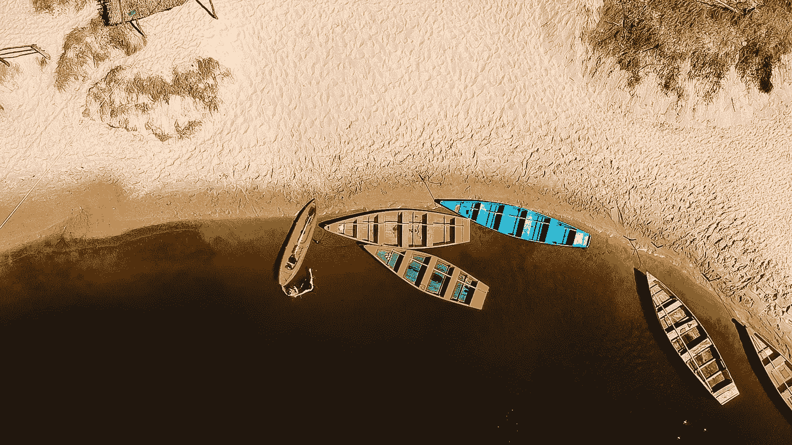

# 创业流。启动一个创意项目。

> 原文：<https://medium.com/swlh/entrepreneurship-flow-lunching-a-creative-project-127a01f13096>

***This union — creativity and structure — is a key factor for successful enterprises.***

创造力就像一个孩子。它没有计划或议程。它不等待任何结果或评估。它对线性时间和空间没有概念。它只是等待被表达。就是这样。这就像一个游戏，你只是为了好玩而玩，而不是为了别的。我的朋友是一位才华横溢的艺术家，她曾经看着自己的画说:“这里什么也没画。这一切都来了。”当我看的时候，我真切地感受到所有那些动物、树木、道路和鲜艳的颜色是如何出现在她的画布上并停留在那里的。创作一件艺术品是一种通灵；它是通过你的流动。你的身体和你的技能仅仅是给它一个结构的工具。

创业是一种特殊的创造性流动。在我们的星球上，所有华丽的事物和成功的商业曾经只是一个想法。

***想一想:一切都曾经只是一个念头。***

***成功的企业和有影响力的项目不是来自商业知识、商业背景或商业计划。它们与玩游戏或创作一幅画来源相同。*** 不同的是，一个企业有一个议程；它的全部目的是为了达到某个目标。在企业家创造力中，我们变得与成就紧密相连。

在这里，我们作为创造者希望给世界带来一些价值。这是游戏的一部分，然而这也是许多企业家和创意者的陷阱。事实上，这一部分会引起如此大的紧张，以至于有些人甚至没有开始就放弃了他们的想法。对他们来说，不是害怕被人看到，也不是害怕失败，而是害怕结构导致许多有才华的想法永远无法成为有意义的项目。

一个想法本身就是一种巨大的体验。当你突然捕捉到一些伟大的想法时，你会经历“哇！”瞬间。它给你很多能量和快乐。但是为了在实际层面上表达它，它需要线性发展，一致的节奏，一个有组织的结构，通过这个结构它将产生价值。

这就是为什么这么多有创造力的人(在各个层面，包括商界)会不自觉地被擅长建造结构的人所吸引。 ***创造力和结构的结合是企业成功的关键因素。当这两者相遇时，无论是作为两个商业伙伴还是同一个人的两个方面，这就是创业流真正发生的时候。***

## 如何进入创业流

让我们来看看流程的这两个部分，这样我们就可以理解在启动项目时平衡各个角度的重要性。

首先，让我们认识到，心流是一种生命力，它知道自己要去哪里。控制力量已经在流动中，否则它将是一个水花。所以对这种流动施加某种控制是没有意义的，只会让你陷入困境。但是没有“吸引力”的流动也是不存在的。这就是为什么它是一股“水流”而不是“水花”——它朝着某个方向前进。好吗？

**第二，**被这个想法超越并从中得到很多乐趣还不是心流状态，除非你只有五岁。

**第三，**既然流动本身已经有了吸引力，它就不需要被控制。必须允许它流向它流动的地方。

**第四，**如果水花本身没有流动的形式，它可以被创造出来。它要么是由你自己意识到需要一个结构而创造的，要么是由比你更擅长结构的人创造的。

这是你的创造力转化为创业流的地方——这是一种将一个想法分解成一个过程的技能，但不要过多地干预这个过程，同时保持这个过程。

不管他们的才能如何，许多创业者对成功项目的这两个组成部分以及如何平衡它们一无所知。他们变得不平衡，并在一开始就变得沮丧或停滞不前。我有时会参加硅谷的初创企业社交晚宴，令人惊讶的是，许多不同年龄和背景的聪明企业家在向商业天使推销他们的项目时，对他们的产品几乎一无所知(尤其是在“创意领域”)。他们对目标受众没有任何真实的感觉，也没有任何品牌哲学。**这些苦苦挣扎的企业家大致可以分为需要调整结构的人和更适合项目管理职位的人。事实上，在投资者面前推销之前，双方都将从合作中受益。我很少见过从一开始就拥有这两种技能的团队。在初创企业的世界里，这完全没问题。事实上，这就是网络的意义所在——找到彼此，互相学习。**

然而，**如果你独自启动你的项目**并且没有导师监督你的启动(尤其是如果你自己是一个有创造力的人)，**你最好理解这种平衡。**

创意/结构的结合通常是由两个人在某个项目中形成的(这对夫妇也是如此，有很多像这样的著名夫妇)，但并不总是这样。有时候你必须学会如何在一个人身上发展它。**这两个组件相互识别并开始相互对话需要时间**。两个人的结合，通常会很自然地发生。但是，当你是一个创业者，你对你的项目或业务中这种平衡的重要性一无所知，你可能会经历很多内心冲突，甚至不知道如何开始。直到你意识到它，它才会开始改变。

***此外，把它分解成步骤可以是一个创造性的过程。想象和理解一个结构，让你的想法成为一个项目，用大量的能量建造建筑，这也是一门艺术*** 。如果这个过程被视为“没有创造性”和“无聊”，它就会变得沉重，过于左脑化。事实上，它会对这个想法产生抵触情绪。

值得注意的是，我发现有时候同一个人在一个角色上可以变得更好，这仅仅取决于项目中的化学反应。就我自己而言，我倾向于非常擅长为他人的想法构建结构(这是我在企业界学到的)，但当涉及到将我自己的创造过程放入工作“网格”时，我更喜欢让别人监督我。

在业务层面上，这两个组件由一个著名的领导者/项目经理联盟提出。只有当这两个人关系融洽时，业务才会进入“流程”因此，如果你是一家初创企业，正在组建一个团队，请确保你明白这一点。如果你们俩都充满了创造力，这还不是未来成功的标志；如果你们都非常精通管理流程，能够在一分钟内创建一份商业计划，情况也是如此。

## 你碰到水流了吗？

你的新兴项目或业务冲击创业流的标志是什么？

你的项目或业务正显示出一些回报的迹象。 不一定是财务回报，但至少你能感觉到有交换在发生。你的想法引起了注意。人们喜欢它，想了解更多；投资者有兴趣谈论进一步的发展；你正在享受你的想法产生的涟漪；最重要的是，你最宝贵的资产——你的时间——仍然是你的 ，而不是别人的。在某个阶段，它肯定会转化为财务回报，但有了上述所有的地方，这个想法是有效的，整个过程是正确的。

**如果你错过了以上**中的任何一条，你很可能会不知所措，没有得到足够的反馈，有一种“缺失的一环”的感觉，你无法找到自己，并觉得没有交流发生。 ***不要埋头写商业战略或只是强调，后退一步，观察这两个组成部分中哪一个需要关注:创造力还是结构？*** 如果是创意，那你就是想太多，微观管理太多，迷失在结构中。如果是结构，你可能对项目的方向和关键因素不够清楚。有时候，你自己无法退一步看得更远。这是你需要第三方帮助的时候。寻求帮助。它最终会为你节省时间和金钱。

创业流程是项目开发的一个阶段，在这个阶段，创造力和结构力之间的平衡被优化到最大，这在外部(来自世界)和内部(在团队或你自己内部)两个层面上都产生了回报。

像所有生命体一样，你的企业会经历不同的生命周期，而**脱离流程**是任何项目发展的有机阶段。这可能意味着两件事:要么是死亡，要么是意外增长。

**把它想象成大脑的两个半球。**说到大脑活动，心流的状态就是左右半球最大限度同步的时候。我在大学期间作为一名神经语言学家正在研究这些情况，我知道一个人类要随意进入心流状态并不容易。但是我们可以发展这种能力，事实上，所有有效的人都在有意或无意地这么做。

当把我们的想法放到项目中时，我们也应该能够知道如何有意识地利用这种流动，并且能够保持它。

*也在 cmajor.co 出版*

## 这篇文章发表在 [The Startup](https://medium.com/swlh) 上，这是 Medium 最大的创业刊物，拥有+409714 人关注。

## 在这里订阅接收[我们的头条新闻](http://growthsupply.com/the-startup-newsletter/)。

