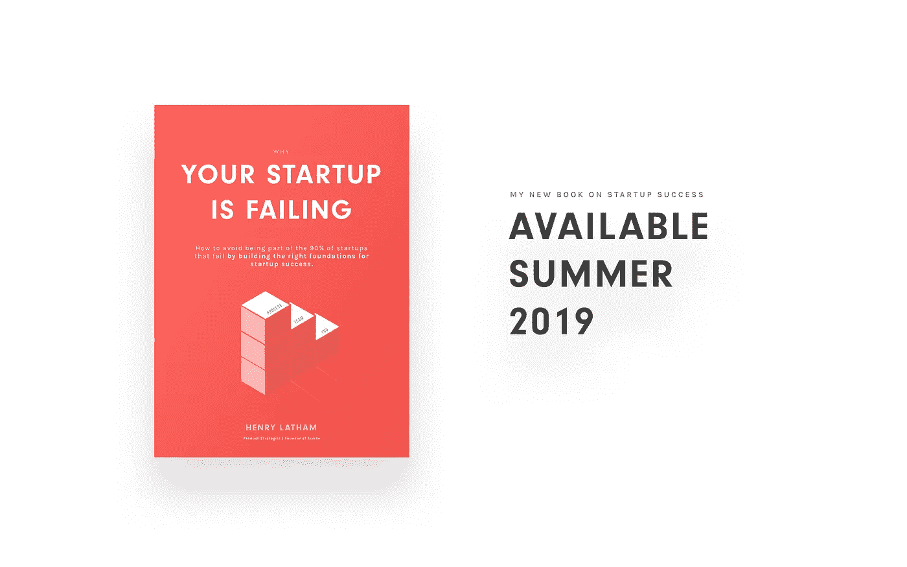

# 企业家精神的秘密敌人

> 原文：<https://medium.com/swlh/entrepreneurships-secret-enemy-ae4e3fe21a5>

## 克服创业焦虑

> 2002 年中期，我非常沮丧，简直没有主意了。抑郁症折磨着你的大脑。我会在凌晨 3 点摸黑坐在里面。我破碎王国的主人。每天我都变得更加破产，对此我无能为力。破产是非常可怕的。
> 我会喝酒来帮助睡眠。那我会拒绝醒来。然后恐惧会重复，直到我再次睡着。我假装对我的孩子们微笑。我假装对妻子微笑。
> 人们说，当你假装微笑时，往往会引发快乐，因为你欺骗了你的大脑，让它认为你是快乐的。
> 我可以告诉你:我的大脑没有被愚弄。如果有什么不同的话，假笑让我更加沮丧。
> ***——詹姆斯·阿尔图彻，成功企业家，播客主持人&投资人***

[7%的美国成年人口患有抑郁症](https://www.healthline.com/health/depression/facts-statistics-infographic)。然而令人震惊的是，30%的企业家患有精神疾病。

事实上，据旧金山加利福尼亚大学的迈克尔·弗里曼博士进行的一项调查显示，49%的企业家有精神健康问题。

每个企业家都在一定程度上患有焦虑症，包括我自己(在弗里曼博士的研究中，27%的人明确表示患有焦虑症)。

这是野兽的天性。事实上，这是成功的必要因素。

这是必要的，因为创业公司的一切都是不确定的。当事情不确定时，它们会让我们担心。

> 几乎你做的每件事都有很多不确定性和风险。你承受的压力水平通常会以极快的速度和巨大的幅度放大事情难以置信的高点和低点。
> *—马克·安德森*

因此焦虑是不可避免的。患之不可。

克服焦虑——学会控制焦虑——是可能的。但是摆脱它的生活却不是。

因为开始一项新业务意味着我们在极端不确定的条件下运营。我们什么都不知道，直到我们尝试了各种各样的东西，找到了唯一有效的东西。

而且，当建立一个企业时，我们深入了解谁是市场，我们正在解决什么问题，我们应该建立什么解决方案，以及我们是否能从该解决方案中赚到足够的钱来生存。

因此，任何一个企业家，如果没有从新的视角、新的信息、新的思维过程中获得无尽的可能性，那他就是生活在幸福的无知中。

他们无法接受自己一无所知的事实。一切都不确定。一切都是假设，直到它被证实。

焦虑是必要的，因为这意味着我们在担心我们应该担心的事情:我们是否正在朝着建立一个有利可图、自我可持续的企业前进。

# 如何克服焦虑

不幸的是，无论我们如何寻找，都没有简单的解决办法。没有快速解决办法。

这需要很多努力。这需要很多艰难的自省&与自己进行不舒服的对话。需要反复试验才能发现什么适合你，什么不适合。

这需要冥想。它需要记日记。我们需要阅读前人的智慧。那些也在寻找意义&追求美好生活的人。

这需要一种情感上的成熟，而我们并没有被教导去培养这种成熟。

我们学习如何赚钱。如何定位一个企业？如何考上大学？第一份工作。爬上公司的阶梯。

但是没有人教我们如何快乐。满足意味着什么。过好生活意味着什么。

为了学会面对自己——复杂的、多面的、不断变化的自己——我们必须致力于一个艰难的自省和反思的过程。

我们必须建立一个系统来帮助我们克服它，比如我为处理我自己的焦虑、[而开发的系统，在我的新书](https://bit.ly/2tVQnYG)中有概述。我们必须努力:

1.  要坚强，这样我们才能更好地在困难和失败中坚持下去
2.  2.更加留心，这样我们就能更清楚和理性地看待事物
3.  3.专注于真正重要的事情——本质上的事情——将重要的事情从琐碎的事情中分离出来，从而做出影响深远的决策

Learn how I overcome anxiety to be more effective & more fulfilled in my personal & professional lives

我们必须学会培养这些特质，以帮助我们接受和克服焦虑，而不是被焦虑所俘获或淹没。