# 苹果/谷歌生态系统中我自己产品的出轨

> 原文：<https://medium.com/swlh/escapades-with-my-own-product-in-the-apple-google-ecosystem-fa7468ecd526>

## 许多开发人员梦想推出我们自己的产品，无论是大的还是小的。这些年来，我有过许多想法(这些想法不容易货币化)——以下是我最终坚持其中一个想法时学到的东西。

这篇文章包含一些技术语言——但是任何以任何方式参与过 iOS 或 macOS 开发的人都会理解我在说什么！

当[在日本开发 iOS 应用时](/the-lair/my-return-to-tokyo-3c512a4ca1ef)我在翻译文档时遇到了麻烦。我必须将日语文本复制到我的剪贴板上，用谷歌翻译打开一个浏览器标签，然后将文本粘贴进去——这是一个非常具有破坏性的过程，经常需要快速连续地重复。有时这甚至是不可能的，因为设计偶尔会以图像的形式出现，这意味着文本是不可复制的。

每当我遇到让我的工作流程变慢的问题时，我往往会花一两个周末[尝试](/@maxchuquimia/pushing-your-calendar-events-into-your-slack-status-ceb79904b185) [到](/@maxchuquimia/use-google-appsscript-to-move-old-emails-to-the-bin-automatically-8e0ba5a6b627) [自动化](/@maxchuquimia/turn-your-function-keys-into-a-touch-bar-52aa3d919aab)[流程](https://itnext.io/quickly-switch-between-local-mocks-with-charles-51ffda2d8a29)。我想出了翻译这个:一个应用程序，使用 OCR 阅读和翻译你屏幕上的任何文本。

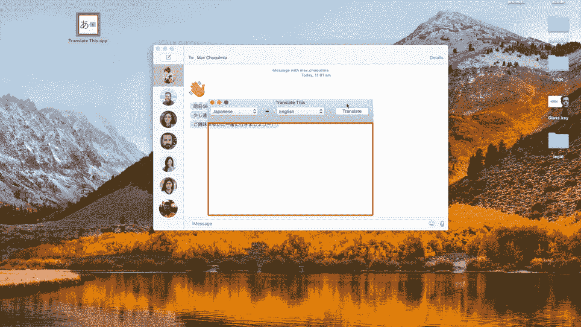

[https://youtu.be/nu14jJRXXnw](https://youtu.be/nu14jJRXXnw) — I even composed the music to give it that classic Facebook demo video feel

对我来说，这是一个完美的产品:它不多也不少于我想要它做的。由于 Mac 上没有类似的产品，我心想，为什么不发布它呢？我希望贝伦斯坦熊“自行车课”的故事是一个关于 Mac 应用开发的警示故事。

# 它是如何工作的

通过将截图发送到我在 NodeJS 中编写的谷歌应用程序来翻译这个作品，该应用程序使用谷歌视觉来执行 OCR 并检测图像中的字符，并将它们传递给谷歌翻译。然后，端点将翻译后的文本返回给翻译此客户端。谷歌为新用户提供了大量的积分，所以我不用支付任何费用就能建立我的 MVP。我一直记得这样一个事实，有一天我需要按识别的字符和翻译的字符付费，这在我的脑海里有点太遥远了...稍后我会告诉你更多这方面的内容。

# 用户的兴奋

发布后，我发现《翻译这本书》比我预期的更受欢迎。Mac 应用程序的免费分析解决方案很少，所以最终我选择了 Fabric，因为我将使用他们的 Crashlytics 进行崩溃报告。不幸的是，Fabric 的分析仪表板不允许我返回并查看历史数据🙄，但我可以在 AppStoreConnect 中看到，在第一个月，我有 1000 多次下载。后来我转用了谷歌分析——但是他们不支持 Mac 应用程序，所以我不得不从头开始编写上传事件数据的所有代码。如果你想在你的项目中使用它，[你可以](https://github.com/maxchuquimia/google-analytics-swift)。

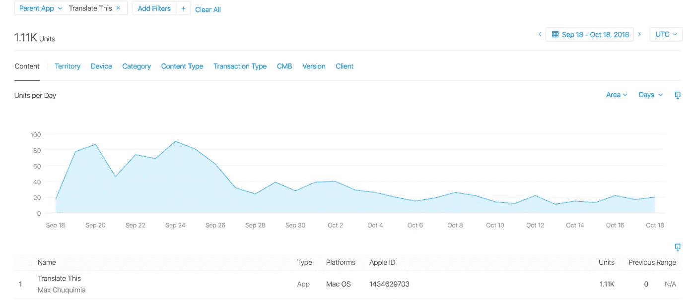

These downloads are purely from people searching for translation apps and choosing mine from the smorgasbord that’s available — I didn’t advertise anywhere

## 反馈！

不少用户花时间访问了翻译网站，并通过电子邮件给我发来了来自世界各地的想法、错误和积极反馈，例如:

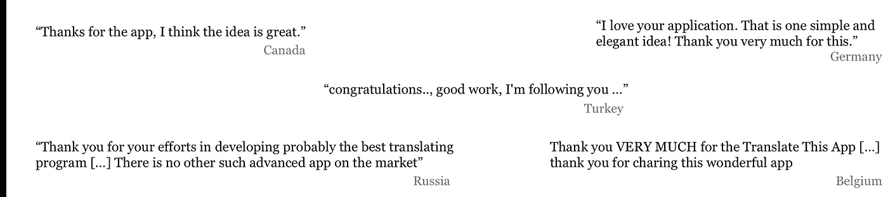

People signed off their emails by saying which country they were in, which was nice

这让我内心产生了一种温暖的模糊感，我想为我的用户做正确的事情。我花了很大力气来修复他们发现的错误，并实现他们建议的功能。一个普遍要求的功能是让应用程序“生活在我的状态栏中”——似乎用户需要一种方法来快速激活翻译，无论他们使用哪个应用程序。这个反馈也与帮助我设计体验的 [Amy Cheong](https://medium.com/u/523528c8e800?source=post_page-----fa7468ecd526--------------------------------) 的建议一致。

# 2.0 版—屏幕截图风格

尽管扔掉代码令人难过，但为了完全重新设计翻译交互，这是必须要做的事情。因此，几周后，一个新的版本完成并发布了:

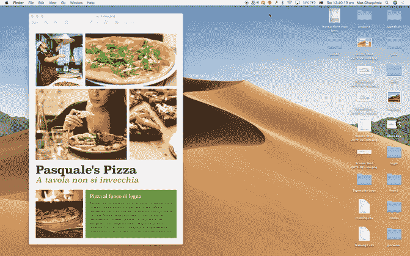

[https://youtu.be/rc3qdib4aoo](https://youtu.be/rc3qdib4aoo)

在任何时候输入`Command+Control+T`都会立即激活选择模式，而不需要从状态栏访问应用程序。从商业角度来看，我不希望在拖动后立即开始翻译，因为如果用户第一次没有正确拖动，会增加不必要的成本，所以最终的体验是模仿 QuickTime 中开始屏幕录制时发生的情况。

2.0 版本没有像它的上一个版本一样产生很多正面的评论(直到人们坚定地抱怨说他们希望在 3 版本发布后重新得到它🤷‍♂️).这也是我最不喜欢的，因为:

*   **整个交互非常定制化**(由我这个 iOS 开发者而非 Mac 开发者开发)，因此无法高亮显示和复制文本等错误给用户带来了痛苦。
*   **在翻译过程中，您不能点击/滚动到其他应用程序。这是上述观点的副作用。支持多显示器意味着持续跟踪鼠标并使用一个大的透明窗口。我和其他用户都抱怨说，他们必须先结束翻译过程，然后才能与其他应用程序进行交互。**
*   **你必须不断地重新绘制翻译区域。**如果您要翻译的内容持续出现在一个位置(例如，来自外国同事的松散信息流)，那么每次您想要翻译时都要从头开始创建矩形，这是一件令人沮丧的事情。
*   **“状态栏里的应用是病毒”**，一位用户写道。当我下载了一个应用程序，却发现它又是另一个占据了状态栏空间的应用程序时，我也很恼火。

2.0 还包含了一种向用户呈现 web 内容的方式。在接下来的几周里，这礼貌地要求他们完成一项调查，这样我们就可以了解谁是我们的用户，并邀请他们到 Slack 频道进行进一步的提问和测试版发布。只有 11 个人完成了调查——我本以为会有更多的人完成，因为我每个月都会看到 300 个重复使用的用户。没有人加入松弛通道。很难从这么少的回复中推断出信息:有趣的是我们的用户比我们最初想象的要老得多。分析告诉我们，Translate This 在工作时间使用最多，所以这也很有趣。

## 最糟糕的错误报告

通常当用户报告错误时，他们对问题的描述由于缺乏信息或蹩脚的英语而难以理解。这意味着，在对问题所在做出假设之前，必须进行一些反复。

一旦将支付引入应用程序，我觉得我需要做更多的工作来帮助自己诊断可能出现的任何问题。因此，我做了一件我希望几个月前就做好的事情:我添加了一个“复制调试信息”按钮，它可以生成一份报告，用户可以粘贴到给我的电子邮件中。为了确保报告的完整性，会计算一个哈希。如果用户以某种方式篡改数据，我将无法重新计算散列。在我所有的未来项目中，我计划从第一天起就准备好使用类似的功能。

## 由 macOS 更新演示的墨菲定律

有一个 bug 对我的用户数量有很大的负面影响。这一点也不是我的错。

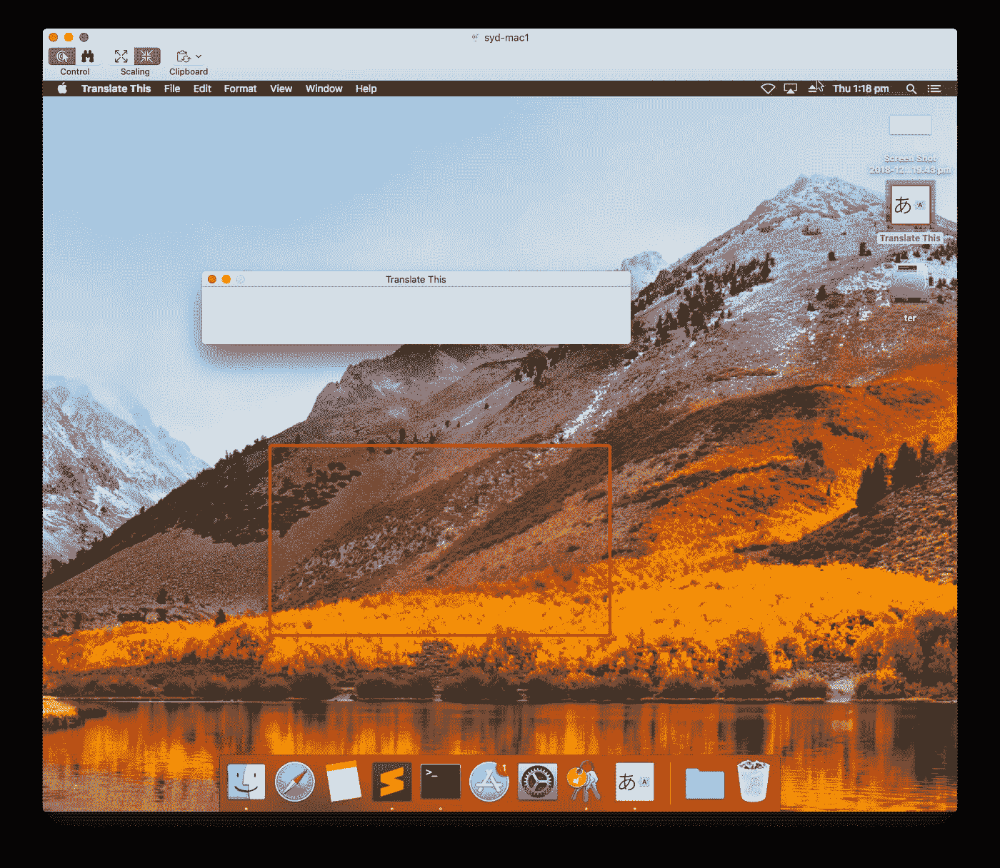

How is this even possible. There’s no code involved in drawing the UI as I used a Storyboard!

在安装一个小的安全更新(macOS 10.13.6)时，用户发现启动 Translate 会导致一个黑屏。幸运的是，工作中的一台 Mac 运行的是上述版本，所以我能够重现这个问题。研究显示，Translate 这不是唯一受影响的应用程序:

 [## VS 代码空白的用户界面，当它在 mac 上启动时

### 感谢贡献一个堆栈溢出的答案！请务必回答问题。提供详细信息并分享…

stackoverflow.com](https://stackoverflow.com/questions/54443202/vs-code-blank-ui-when-it-launched-on-mac-os-high-sierra)  [## OSX 10.13.6 升级-黑屏应用-苹果社区

### 我昨天更新到 10.13.6，这是一场灾难。现在多个应用程序(邮件、Safari、地图、Excel、应用程序…

discussions.apple.com](https://discussions.apple.com/thread/8459195) 

不幸的是，我无能为力。我甚至尝试在受影响的操作系统上再次编译该项目，但毫无效果。最终，痛苦地，我停止了尝试，回到支付处理上。**绝对感觉 Mac 开发远不如 iOS 支持！**

# 3.0 版—货币化

同样，我不得不把代码扔出窗外，重新开始。第三次重写是它的两个前身的混合:签名的红色翻译矩形就像一个正常的窗口，一个单独的窗口浮动在语言选择等。

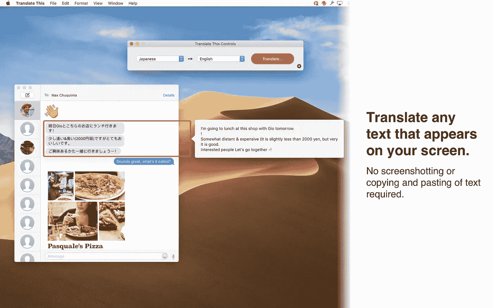

[https://itunes.apple.com/us/app/translate-this/id1434629703?ls=1&mt=8](https://itunes.apple.com/us/app/translate-this/id1434629703?ls=1&mt=8)

不出所料，付费墙加入后，使用率直线下降。当然，也有反馈:

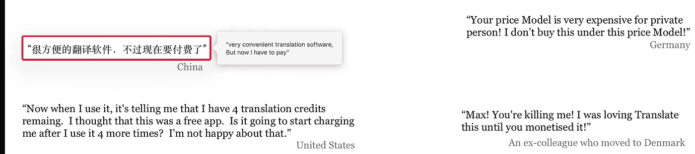

Just before I completed writing this article, the U.S. review was appended with “Update: I just used up my free credits so I am going to delete this app. When I signed up, it said nothing about having to pay for subsequent translations. To me, this is deceptive and I won’t reward that. I’m changing my rating to 2 stars from 4.” I was fairly annoyed until I realized his Appstore review username is the same as his Twitter handle — it turns out he is a very, very angry person.

正如任何一个 Cocoa 开发者会告诉你的，如果应用程序使用苹果自己的机制之外的机制进行购买，苹果会拒绝它们。他们还从任何交易中抽取高达 30%的佣金，所以我绝对同意我们的价格有点高。

在决定用户如何付款时，我有许多选择:

## 保持自由

列出这一点很重要，因为毕竟这是一个选项(事实上这是我更喜欢的选项)。然而，我的银行账户余额显示这是不可持续的。

## 每月和/或每年订阅

对于用户来说，这是最简单的选择，因为他们可以订阅，不用再考虑它。苹果会在第一年抽取我收入的 30%，然后对于每个继续订阅的用户，他们会[把他们的分成](https://developer.apple.com/app-store/subscriptions/)减少到 15%。然而，很难计算用户在如此长的时间内会使用多少应用程序，因此不可能确定订阅的价格。如果我弄错了价格，我将无法在下一个计费周期调整价格，因为苹果要求开发者让用户保持原来的订阅价格。

如果你在 Mac 上进行订阅，需要注意的一件事是验证收据，并将订阅绑定到自己生成的用户标识符上看起来一点也不简单——出于安全原因，苹果没有提供样本代码，以阻止黑客学习如何破解一个解决方案…

## 按字符付费

从商业角度来看，这是最好的解决方案，因为预测每个用户产生的成本相当容易。然而，偶尔会有误报，按字符付费对用户来说可能是一种混乱/不寻常的体验。

## 点击付费

比按角色付费更容易开发，也更容易向用户解释其工作原理。然而，与订阅类似，很难计算用户通常会使用多少字符。

## 其他途径

*   **广告收入**被计算出远远不够支付成本。此外，在 Mac 应用程序中显示广告的选项非常少。
*   **“给我买杯咖啡”按钮**。我很高兴在看到上面引用的反馈后，我们没有这样做。
*   **第三方支付网关。**被拒绝，因为在没有 AppStore 的情况下分发应用程序将意味着更高的利润，但更低的可发现性。

## 判决

点击付费似乎是最简单的解决方案。这意味着是时候使用分析和计费数据来计算前几个月的平均点击成本了。我提高了自己的电子表格技能，创建了一个“每次点击成本”表——显示我为每次点击向谷歌支付的平均金额(价格包括 OCR、翻译和网站托管):

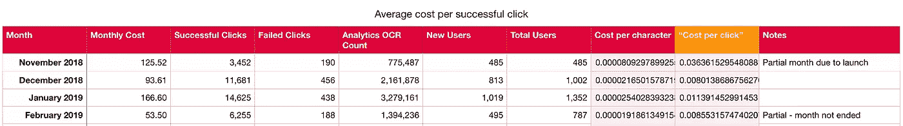

Don’t forget that each OCR-ed character is then sent to the Translation API, incurring another cost

然后，使用 AppStore 价格层级作为指南，我创建了一个表格来显示用户可以支付的绝对最低金额:

I couldn’t figure out the formulas for looking up data in other tables. Probably should have just wrote a script to do this instead of using a spreadsheet.

当然，这不是可持续的定价:为了给新用户免费试用，并且不对失败的 API 调用收费，我还需要能够支付额外的成本。另外，如果你继续读下去，你会发现我最终使用了 Firebase，因此可能产生的成本需要考虑在内。哦，AppStore 的价格等级并不总是很好地映射到国家之间的美元。我的最终价格表是:

🥜🥜🥜🥜

如你所见，我们的利润微不足道🥜

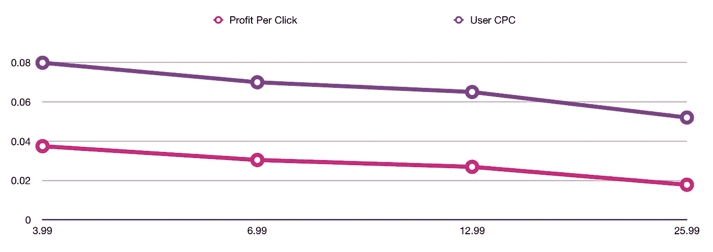

This shows how users are encouraged to by more credits at once — the price per click goes down slightly.

# 安全问题

作为一名 iOS 开发人员，我已经习惯了用户无法看到、修改或删除我放入他们的钥匙串、用户默认设置和文件系统中的特定项目的奢侈。在 Mac 上，您可以:

*   打开钥匙串应用程序并使用您的密码来查看由任何第三方软件添加的任何数据
*   使用终端中的命令`defaults read/write <bundle id>`查看和修改任何软件存储的键值数据
*   使用`opensnoop`命令查看任何软件访问的文件(或在 Finder 中随意浏览)

这并不理想，因为我需要确保我的用户不能通过找到我存储的剩余数量并用上面提到的任何工具增加它来奖励自己更多的翻译。我再次[需要一个云数据库](https://link.medium.com/L9Z6SA6QEU)。

## 存储数据

最初，我想使用 CloudKit 来存储剩余的翻译数量。计数器将自动绑定到每个用户的账户，这意味着他们可以在多个设备之间轻松共享他们的翻译积分。将数据存储在他们的私人数据库中意味着我不需要付费。然而，有一些警告:

*   如果用户为应用清除了他们的 iCloud 数据会怎么样？
*   如果他们没有登录怎么办？
*   如果两个设备之间的同步不够快怎么办？
*   我如何知道我的负债是什么？

最后一点非常重要:如果我需要停止销售该应用程序，我想知道剩余的翻译积分总数，以便我可以预见我的最终成本。

因此，我选择了 Firebase，再次将自己与谷歌绑在了一起。我不得不手动处理网络请求，因为就像我为这个项目评估的许多第三方工具一样，Firebase SDK 不支持 macOS。最终的服务架构图如下所示:

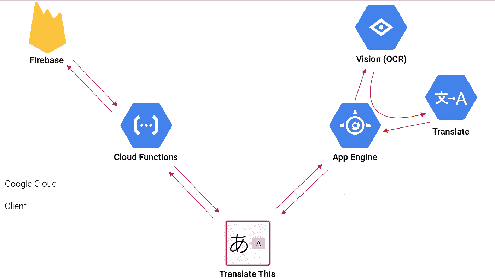

如果灾难来了，我需要结束翻译这种生活，我可以运行一个脚本来计算 Firebase 数据库中有多少信用点没有使用，并决定是否让用户耗尽它们，或者是否伪装自己和[搬到尼泊尔](https://youtu.be/MH0ttEYOpbU?t=6)。

如你所见，有许多活动部件。我最终需要维护相当多的 Git 存储库:

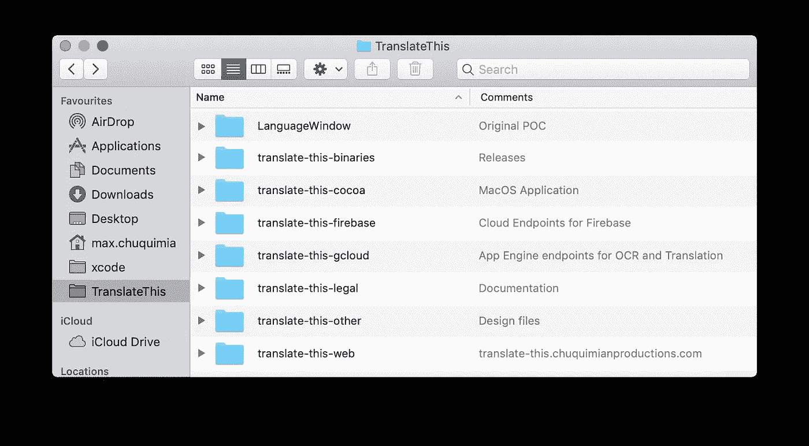

让应用程序引擎直接与 Firebase 交互是有意义的，但是我选择不这样做，因为这是我第一次使用 NodeJS，我害怕在某个地方打破某些东西(“没有任何东西意味着任何东西”，一位同事曾经在谈论 JavaScript 时说)。我完全同意。).当我在本地运行项目时，其中一个 Google APIs 根本不工作，所以我需要在部署它们之前确定我所做的更改。因此，将 Firebase 代理代码作为一个单独的存储库意味着我可以确保我的更改不会影响到流程的其他部分。

# 生存危机

我突然意识到，Translate This 本质上不是*我的*产品，而是我为谷歌免费打造的产品。我花了无数时间来实现和重新实现功能，试图让用户满意，但大部分收入(在苹果拿走 30%的分成后)都流向了谷歌。我们甚至没有从在我们的应用程序中使用谷歌的品牌来吸引更多用户中受益。

我想起了我和一个朋友获得一个 Apple TV 开发工具包的时候:我们兴奋地开发了一个基于 Instagram 标签播放图像幻灯片的应用程序，不料几个月后当 Instagram 重新评估他们的 API 访问时，它被无条件关闭。它所依赖的公司会带来类似的灾难性结局吗？

我为什么要这么做？我总是写脚本来帮助自己工作，但很少分享。我刚刚花了几个月的时间建立了一个项目，它的唯一目的甚至不是我热衷的事情。

# 这一切值得吗？

也许吧？“价值”是什么意思？这可能不是支付抵押贷款的产品，但它肯定教会了我很多很多东西，我需要在我的下一次冒险中保持关注。我可以把它放在我的简历上，所以这也是有价值的。

# 概括起来

这只是对迄今发生的一切的概述。将来，在我开始另一个项目之前，我想回来阅读以下内容:

*   选择你热爱的事情。不要强迫自己成为一个不能让你兴奋的产品的唯一支持者。
*   问问你自己，你正在构建的东西是否真的只是另一家公司产品的延伸**，如果是的话，你是否可以这么做。**
*   为了避免让你的用户失望，确保你的产品是可持续的，**尽早计划你的盈利策略！**即使你关心你的用户，最终他们也不会关心你。
*   如果你正在开发一个 Mac 应用，请注意**你习惯使用的工具可能根本不被支持**，即使它像分析一样基本。
*   想想你将如何回应用户提出的问题:一个让他们生成调试数据的**按钮**可以创造奇迹。
*   最好选择你在过去**体验过的技术**。

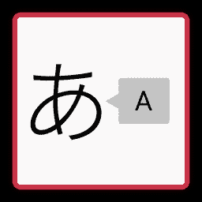

*感谢阅读！我是 Max Chuquimia，澳大利亚悉尼的 iOS 工程师。这是我和 Amy Cheong 的合作项目。* *如果你对翻译本的未来有宏伟的构想，* [*请随意问好*](http://translate-this.chuquimianproductions.com/contact.html) *！*

# 编辑:翻译此内容已从 AppStore 中移除

当 macOS Catalina 发布时，苹果开始要求应用程序在捕捉屏幕之前请求明确的“屏幕录制”权限。但是，翻译这个只是简单的截图而不是录音。苹果开始拒绝我发布的更新，我甚至接到他们的电话，有人(抱歉地)解释说，因为翻译这个*截图*而不是*屏幕记录*，所以我不能使用屏幕记录权限。App Store 评论代表了解到 macOS 中没有截图权限，所以他建议我完全改变用户体验……我觉得这样会破坏为这么多用户带来的易用性。

因此，当谷歌最终发布翻译 API 的突破性变化时，我无法发布更新，被迫从 AppStore 中删除了 Translate。

希望有一天苹果会改变主意，或者在未来的 macOS 更新中添加截图权限。

# 编辑 2:马科斯·蒙特雷

似乎苹果在最新版本的 macOS 中加入了一个非常相似的原生功能…🤷‍♂️🤷‍♂️🤷‍♂️🤷‍♂️

## 这篇文章发表在 [The Startup](https://medium.com/swlh) 上，这是 Medium 最大的创业刊物，拥有+430，678 名读者。

## 订阅接收[我们的头条](https://growthsupply.com/the-startup-newsletter/)。

