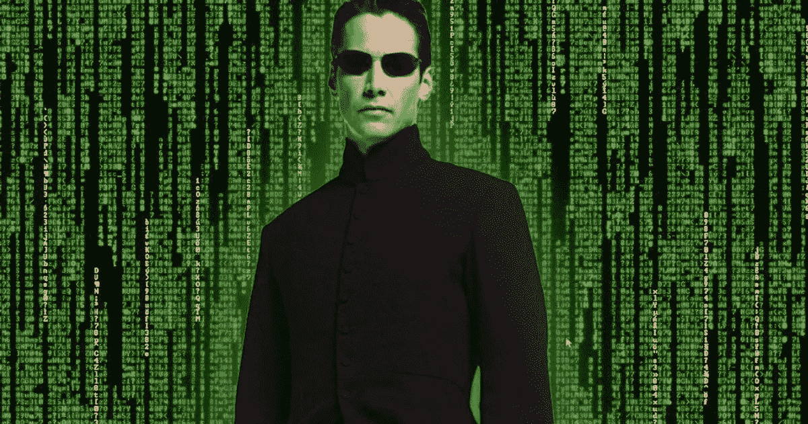

# 逃离母体，拥抱意识

> 原文：<https://medium.com/swlh/escape-the-matrix-and-embrace-the-consciousness-9b5350e61a7e>

Matrix movie still

你接受“现实”为福音吗？你是那种说“现实世界就是这样运作的”并接受现状的人吗？你有没有想过为什么“真实世界”这个词几乎总是用在负面的语境中？

既然你在读这篇文章，我会假设你对现状并不完全满意。所以让我们吃红色药丸，然后下兔子洞。