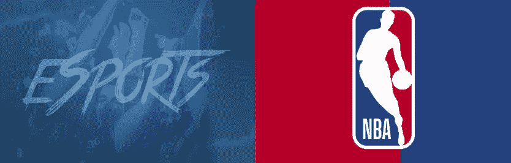
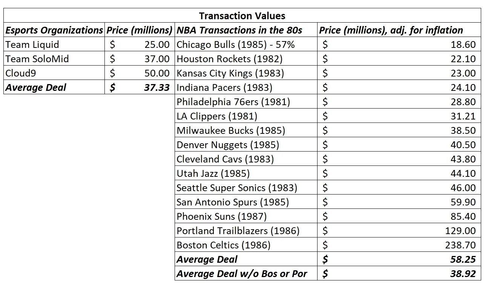
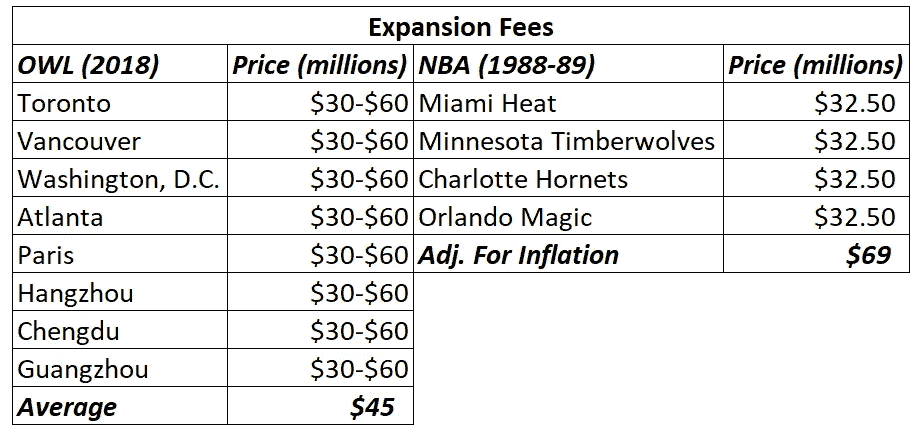
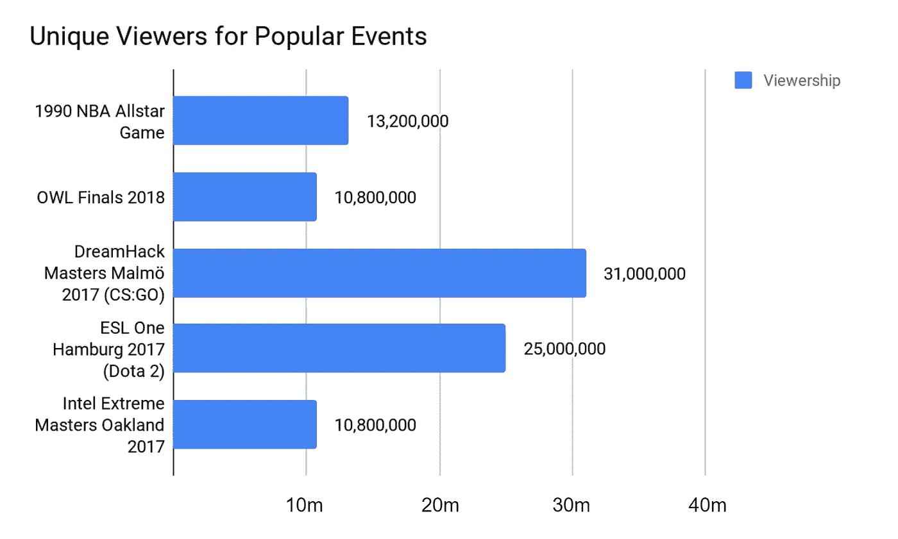
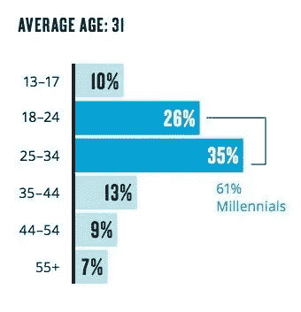

# 电子竞技:$1B 团队？(80 年代的 NBA)

> 原文：<https://medium.com/swlh/esports-1b-teams-nba-in-the-1980s-914e8173c99d>

今天，每支 NBA 球队的价值都超过了 1B 美元，我们相信在不久的将来，电子竞技组织的价值会与此持平，甚至更高。历史正在重演，但这次要快得多。

在注意到 Cloud9 筹集了 5000 万美元、TSM 筹集了 3700 万美元、Team Liquid 筹集了 2500 万美元以及 OWL 特许经营权的利润丰厚的扩张费等电子竞技团队的交易后，它让我们想起了 20 世纪 80 年代 NBA 发生的事情。对这些电子竞技团队和特许经营权的投资与 20 世纪 80 年代支付给 NBA 特许经营权的价格非常相似。

> 对于电子竞技组织来说，1B 的估值之路会比 NBA 走得更快。

# 主要要点:

> 1)团队交易值相似
> 
> 2)扩展费也差不多
> 
> 3)电子竞技的全球观众将推动比 NBA 专营权更高的估值
> 
> 4)资产价值增值时间表将比 NBA 估值快得多

# 1)交易价值:NBA(3800 万美元)，电子竞技(3700 万美元)

在 20 世纪 80 年代，15 支 NBA 球队被全部或部分收购，交易价值从 980 万美元(1982 年休斯顿火箭队)到 1.2 亿美元(1986 年波士顿凯尔特人队)不等。与电子竞技领域最近的主要融资相比，这与顶级电子竞技组织 3700 万美元的平均水平非常相似:

显然，你会注意到波特兰和波士顿这两个显著的局外者。仅它们一项就使平均值增加了近 50%。然而，真正有趣的是，当你调整通货膨胀并从表格中删除这两项时，平均 **NBA 特许经营投资与最近对电子竞技组织**的 3 笔最引人注目的&投资相差不到 5%。

购买 NBA 特许经营权和投资电子竞技团队/组织之间的一个显著区别是交易的结构。当这些 NBA 特许经营权交易达成时，它们通常是为了**完全拥有一支球队的所有权**，而电子竞技交易通常是围绕这些组织的部分所有权**的风险投资交易定价。然而，这并没有消除这样一个事实，即交易价值在所有情况下都非常相似。**结论:如今的电竞机构比 80 年代的 NBA 球队值钱多了。****

> 对于电子竞技组织来说，1B 的估值将比 NBA 来得更快

当这些 NBA 交易完成时，球队的估值在 1000 万美元到 1.2 亿美元之间，今天每个 NBA 球队的价值都超过了 1B。这种价值增值的大部分可以归因于技术进步，它允许更广泛的观众，这反过来又为 NBA 及其球队创造了有利可图的媒体转播权交易。这很重要，因为电子竞技特许经营已经有了收视率，而收视率带来了媒体交易。

> 我们今天生活的数字时代有潜力以指数级的速度加速特许经营的增值过程…

# 2)拓展费:NBA(6900 万美元)，OWL(3000-6000 万美元)

在 1988 年和 1989 年，我们看到了 NBA 的扩张，有四支新的队伍:迈阿密热队、明尼苏达森林狼队、夏洛特黄蜂队和奥兰多魔术队。1989 年，这些团队中的每一个都支付了 3250 万美元(扣除通货膨胀后为 6900 万美元)的扩张费。

根据 ESPN 的说法，OWL 的扩展费用在 3000 万到 6000 万美元之间。有趣的是，NBA 需要类似的费用(6900 万美元)，而且只增加了 4 支队伍，而 OWL 增加了 8 支队伍。

同样值得注意的是，NBA 成立于 20 世纪 40 年代，而 Overwatch 游戏于 2016 年 5 月 24 日推出。NBA 花了 40 年时间才达到这些数字和估值，而电子竞技只用了 24 个月就为 OWL 创造了同样的需求和价值。(哇)——无论你是猫头鹰(OWL)的粉丝，还是游戏本身的粉丝，还是相信它能经久不衰的称号，这都是一项令人印象深刻的成就，体现了电子竞技背后的内在价值，它的观众，以及世界各地竞技娱乐不断发展的格局。

NBA 和 OWL 的一个关键区别在于，在 NBA，所有四个扩张团队都在美国，但在 OWL，扩张团队在北美(多伦多、温哥华、亚特兰大)、欧洲(巴黎)和亚洲(杭州、成都和广州)。

值得注意的是，对电子竞技组织的投资也是对多个游戏头衔和联盟的多样化押注，而不仅仅是一个。这使得电子竞技组织的价值更高。

> 投资一个电子竞技组织可能会有类似于拥有爱国者、骑士和扬基队的回报……所有这些都在一个特许经营之下。

# 3)受众:Esports / OWL(全球)、NBA(美国)

是什么让这些 OWL 特许经营本来就更有利可图，是他们的观众是全球数字观众，而不是以美国为中心(就像 20 世纪 80 年代的 NBA 那样)。

这使得更广泛的粉丝群可以参与到制作的内容中，也让更广泛、更忠诚的粉丝群得以发展。理论上，这应该会让这些特许经营权比 20 世纪 80 年代的 NBA 特许经营权升值更快，即使起点价格大致相同。

## 收视率比较:OWL(10.8 米)，NBA(13.2 米)

当试图评估一个电子竞技组织的未来价值时，另一个需要注意的问题是，与 1990 年 NBA 全明星赛的观众人数相比，现在的观众人数是多少(你能找到的观众数据最远的地方):

1990 年，电子竞技的收视率已经超过了 NBA 的收视率，当时交易和扩张的价值与电子竞技组织和 OWL 相当。

如今，美国职业篮球联赛的特许经营权价值都在 1B 以北，自 1985 年以来，CAGR 的特许经营权价值约为 12%，而美国职业篮球联赛的技术进步远不及我们今天在 2018 年看到的。

想象一下，如果在 80 年代和 90 年代，来自世界各地的 NBA 球迷可以收看他们想看的任何比赛，这会对这些球队的价值产生什么影响。

电子竞技团队大幅升值的另一个原因是他们粉丝的年龄。NBA 观众的平均年龄是 42 岁，但根据尼尔森的数据，电子竞技观众的平均年龄是 31 岁，61%的观众是千禧一代:

Average Age of Esports Viewers (Credit: Nielsen)

这应该会推动估值的升值，因为这些观众不仅是看电子竞技长大的，而且随着年龄的增长还会继续玩。对于传统体育，许多观众只是粉丝，如果他们年轻时玩过，他们可能不会再玩了。

千禧一代(以及即将到来的几代人)对他们从小玩到大(今天仍在玩)的视频游戏有着持久的亲和力，因为他们能够在高水平的竞争中享受完全相同的游戏。这种动力将让他们保持多年的参与度(类似于高尔夫，你可以打很长时间)。世界上大约有 450 名职业 NBA 运动员可以享受 NBA 的竞争力，但数百万人有能力在与职业电子竞技运动员类似的比赛水平上比赛。

# 结论:历史正在重演…但速度更快

NBA 和电竞/ OWL 的对比出奇的相似。随着数字时代的兴起，电子竞技的人口数量远远超过篮球，更年轻的年龄组，以及世界各地仍未货币化的电子竞技粉丝群，我们相信我们可以看到电子竞技组织的估值与今天的 NBA 特许经营相当…

> …关键区别:电子竞技可以在 5-10 年内完成 NBA 花了 30 多年才完成的事情。

> →接下来:[电子竞技团队:被视为科技公司](/konvoy/esports-teams-valued-as-tech-companies-79d134a3e00d)
> 
> →关注我们的出版物: [Konvoy(中)](https://medium.com/konvoy)

## 这篇文章发表在[《创业](https://medium.com/swlh)》上，这是 Medium 最大的创业刊物，有+421，678 人关注。

## 在这里订阅接收[我们的头条新闻](https://growthsupply.com/the-startup-newsletter/)。

