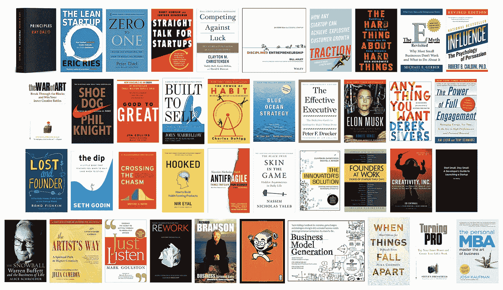

# 企业家书架上的必备书籍

> 原文：<https://medium.com/swlh/essential-books-for-the-entrepreneurs-bookshelf-cd203b947fe6>

## 为企业家策划的书架

## 40 本关于建立、启动和扩大业务的最佳书籍

以下是我读过的 100 多本关于创业的书中排名前 40 的书。如果你还没有读过，我强烈推荐你把它们加入你的阅读清单。