# 在 Excel 中用蒙特卡罗方法估算圆周率

> 原文：<https://medium.com/swlh/estimating-pi-with-monte-carlo-in-excel-c47725feaaa7>

## 大一几何课终于派上用场了

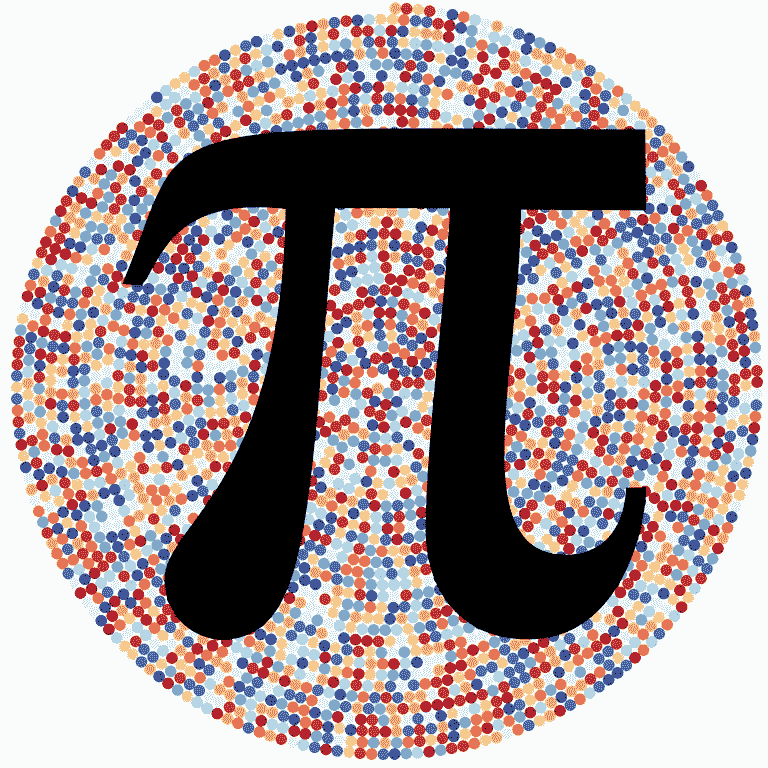

Art created with Pi by color coding each digit. Originally created by [Martin Krzywinski](https://fineartamerica.com/profiles/martin-krzywinski.html?tab=artworkgalleries).

当我在看《副总统》节目时，Kent Davison，Selina 竞选团队的民意测验专家和数据处理专家提到他最喜欢的数字是欧拉数，这让我想知道数学家们是如何得出这些日常生活中使用的数字的。我开始阅读这些重要数字的历史，然后偶然发现了圆周率的历史。在阅读了长长的[维基百科页面](https://en.wikipedia.org/wiki/Pi)后，我相信圆周率是数学中最迷人的数字之一；在人们能记住圆周率的多少位数方面有比赛，在计算圆周率的多少位数方面有比赛，圆周率之后有一个假期，然而圆周率的准确性与其日常使用并不真正相关。当给圆周率加上额外的数字时，收益会强烈递减， **3.14 与圆周率的真实值**只相差 0.5%。[美国宇航局的科学家在开发空间集成全球定位系统/惯性导航系统(SIGI)时，使用圆周率为 16 位数的圆周率进行计算](https://blogs.scientificamerican.com/observations/how-much-pi-do-you-need/)。我读到的所有这些东西让我想到，如果不是数学家或者没有疯狂的计算机，怎么能估算圆周率。

# 蒙特卡洛简介

蒙特卡洛用于通过模拟随机性来解决问题。蒙特卡洛模拟通常用于赌博，以估计概率。海军将使用蒙特卡洛模拟来确定在搜索和救援任务中某人最有可能位于的区域。我用蒙特卡洛模拟法来模拟标准普尔指数的表现，并对投资组合进行随机游走。**简单来说蒙特卡洛基本上只是利用随机性进行模拟猜测和检验。**

# 如何用蒙特卡罗方法估计圆周率

E 估算圆周率是蒙特卡洛模拟中一个常见的例子。最好的部分是，你只需要知道一些基本的几何来估算圆周率。这个想法是圆的面积是:

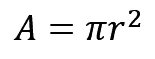

> 所以，如果半径是 1 英寸，那么圆的面积就是π。

如果半径是 1 英寸，那么圆的直径必须是 2 英寸。很好，除了**之外，如果你只知道圆的面积是π**，你如何推导π？嗯，因为圆的直径是 2 英寸，我们也可以把圆放在一个 2 英寸的正方形里面。圆将接触正方形的边，但是正方形的一部分将不会与圆重叠。

> 下面是推导圆周率的基本逻辑。

由于正方形的面积是 4 英寸，圆的面积是π，所以面积比将是**π/4。**

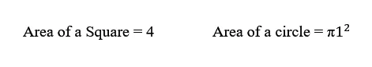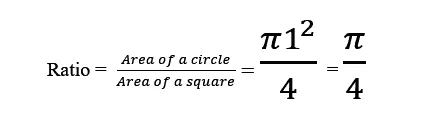

For the visual learners

假设我们在图上放置一个 2 英寸的正方形和一个半径为 1 英寸的圆，其中形状的中心位于 x = 0 和 y = 0 处，因此坐标为(0，0)。

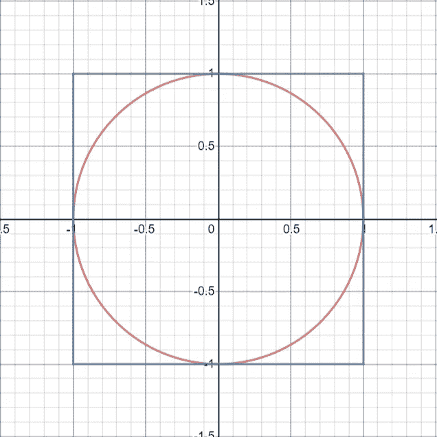

## 如果我们在正方形内部画出随机的点，数一数圆里有多少个点，正方形里有多少个点，那么比值应该是π/4。所以，如果我们把这个比率乘以 4，我们就会得到圆周率。

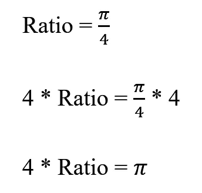

All we need to do is find the ratio

> 但是，我们怎么知道哪些点在圆里，哪些点在正方形里呢？

容易，**每个点离原点的距离小于或等于 1。**利用勾股定理可以求出圆内的点。

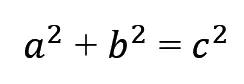

hello old friend

c 的平方是三角形的最长边**，也是圆****(1 英寸)*的半径。*

> *所以只要 x 和 y 的平方之和小于等于 1，**就一定在圆里面。***

*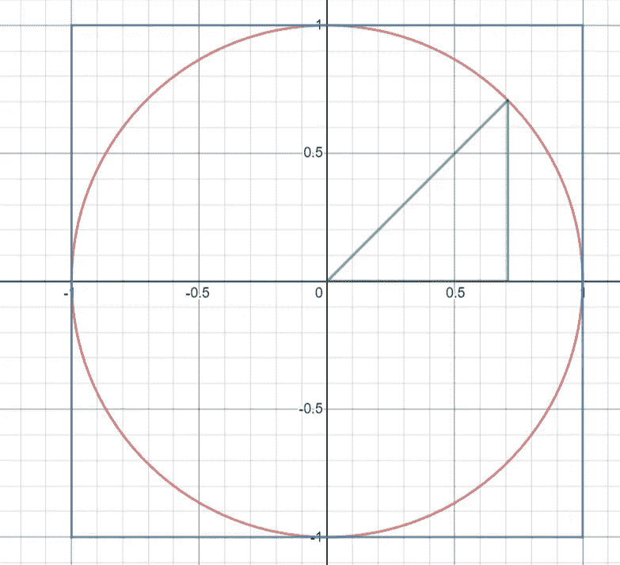*

*The hypotenuse is 1 inch long. Note how the sum of x and y squared is less than or equal to 1 inside the circle.*

# *Excel 中的蒙特卡罗模拟*

*你不需要复杂的软件来运行蒙特卡洛模拟。虽然现在我用了很多 R，但是我仍然相信 Excel 是最好的*统计软件，因为它的普及和易用。你真的可以推动 Excel 做更多的事情，不仅仅是数据透视表。**

# **创建随机变量和底层逻辑**

> **首先创建两列，分别标记为 x 和 y**

**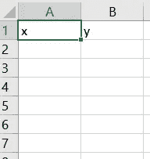**

**现在，为了模拟随机性，使用 rand 函数，在两列中都键入 **=RANDBETWEEN(-1000000，1000000)/1000000** 。这是为了模拟-1 和 1 之间的随机数。我之所以用一百万而不是一，是为了给数字增加额外的小数位数。突出显示这两个函数，单击位于单元格右下角的正方形，并向下拖动到 1001 行。这将复制公式 999 次以上。**

**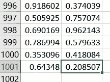**

**转到工作表顶部的 C 列，单击单元格 **C2** 。键入 **=IF( (POWER(A2，2) + POWER(B2，2)) < =1，1，0)** 。双击右下角填写剩余行。这是寻找点是否在圆内的基本逻辑。该公式计算 x 和 y 的平方，并检查它是否小于或等于 1。如果点在圆内，则输出 1，如果点在圆外，则输出 0。**

# **进行蒙特卡罗模拟**

**分别在单元格 **D2** 和 **D3** 中输入 1 和 2，并高亮显示单元格。双击突出显示的单元格的右下角，以填充其余的单元格。**这产生了蒙特卡洛模拟将进行的迭代次数**。之后，点击单元格 **C1** ，输入**= 4 *总和(C2:C1001) / 1000** 。眼熟吗？这是估算圆周率的公式！总和是计算落在圆内的点数，分母是正方形内的总点数。这是计算圆周率所需的比率，我们需要做的就是把它乘以 4，得到圆周率。**

> **但很可能不像圆周率。**

**这就是数据表有助于提高精确度的地方。我们只绘制了 1000 个点，这是一个相对较小的样本。我们需要绘制更多，但我们没有足够的行数来绘制 100 万个点或运行 100 万次模拟。创建数据表将对此有所帮助。点击单元格 **E2** 并输入 **=C1。**这是为了引用单元格，将在后续迭代中添加到记录中。高亮显示 **D2** 和 **E2** 并按**shift+control+向下箭头**选择整个表格。转到**数据选项卡**，点击**假设分析**，然后点击**数据表**。**

**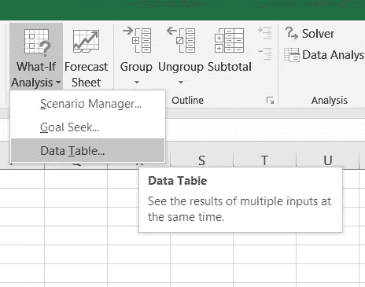**

**在列输入单元中输入 **F2** 。这是一个你其实不需要知道为什么的把戏。(因为我不知道你为什么这么做，你就是这么做)**

**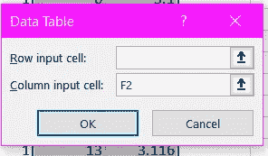**

**单击 OK，您将看到表中填充了 Pi 的估计值。点击 **E2** 并输入**=平均值(E2:E1001)。**这将对圆周率的所有估计值进行平均，以创建一个与圆周率的实际数值非常相似的平均估计值！您已经成功地创建了 1，000，000 个数据点的比率，并导出和估计了 Pi。玩玩它，看看你离圆周率有多近。更改样本大小(A 列和 B 列中的行数)或向数据表中添加更多行以增加迭代次数。**

**添加的迭代次数或样本越多，蒙特卡洛就越精确。**

**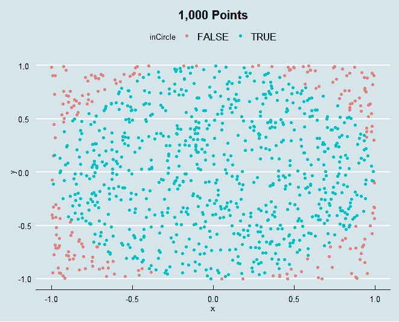****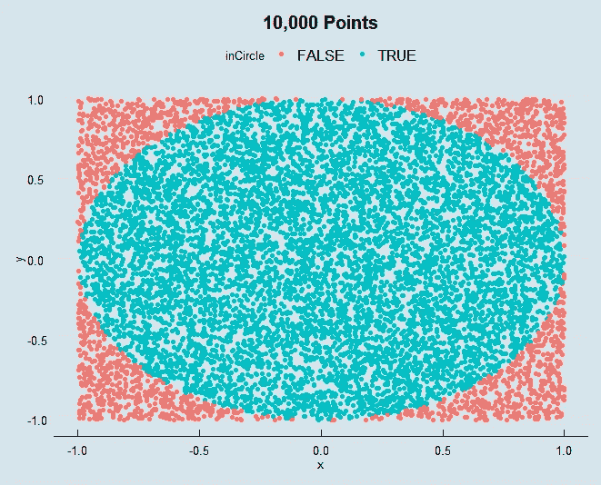****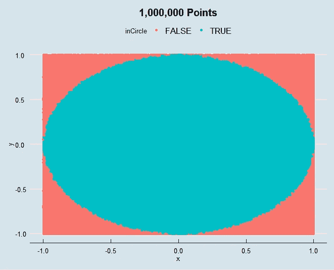**

**如果你想用 R 语言来做这件事，并重新创建上面的图形，我附上了 R 代码。**

```
**library(tidyverse)
library(ggthemes)#Create an empty data frame
piSimulation <- data.frame("")#Adds 1,000,000 random points between -1 and 1
piSimulation <- cbind(piSimulation, x =runif(1000000,-1,1))
piSimulation <- cbind(piSimulation, y =runif(1000000,-1,1))#Removes the extra column
piSimulation <-  piSimulation[,-1]#Logic for checking if points are inside the circle
piSimulation <-  piSimulation %>% mutate(., inCircle = (piSimulation$x^2 + piSimulation$y^2) <=1)#Estimation of Pi
4 *sum(piSimulation$inCircle, na.rm = TRUE) / 1000000#Creates row reference to serve as a point count for graph
piSimulation$ID <- seq.int(nrow(piSimulation))#Graphs the points and filters the data to the first 10,000 points
ggplot(data = piSimulation %>% filter(., ID < 10000), mapping = aes( x, y, color = inCircle)) + geom_point() + theme_economist()**
```

**如您所见，用 R 创建它只需要不到 10 行代码。**

# **整理想法**

**蒙特卡洛是一个有趣的工具，无论你在哪个领域，它都有很有用的应用。你可能会问**为什么我不只是运行第一象限**的模拟，而是使用 rand()函数，其中 x 和 y 总是正的。我认为从概念上理解更容易**，然而，只在第一象限绘图更容易实现。蒙特卡罗方法有一些美妙之处。我认为这是由于利用随机性和混沌找到一个解决方案的能力，否则无法找到。或者也许我只是真的想住在[摩纳哥](https://qtxasset.com/styles/breakpoint_sm_default_480px_w/s3/luxurytraveladvisor/1514485016/MonteCarloMonacoCreditXantanaiStockGettyImagesPlusGettyImages_0.jpg/MonteCarloMonacoCreditXantanaiStockGettyImagesPlusGettyImages_0.jpg?HaO_VuTJd_hkgyC2wr5PlKFFCIflUZN7&itok=W9GnCXzh)。****