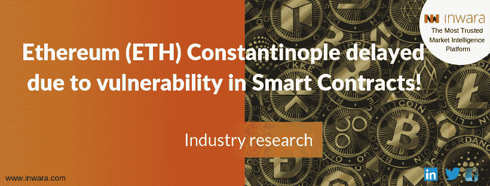

# 以太坊(ETH)君士坦丁堡因智能合约中的漏洞而延期！

> 原文：<https://medium.com/swlh/ethereum-eth-constantinople-delayed-due-to-a-vulnerability-in-smart-contracts-ded25dac14aa>

## 新的全系统更新延迟

## 以太坊(ETH)君士坦丁堡 hardfork 延迟会影响交易者吗？

两周前，[以太坊的](https://www.ethereum.org/)社区被告知其新的全系统更新“君士坦丁堡”中的潜在漏洞