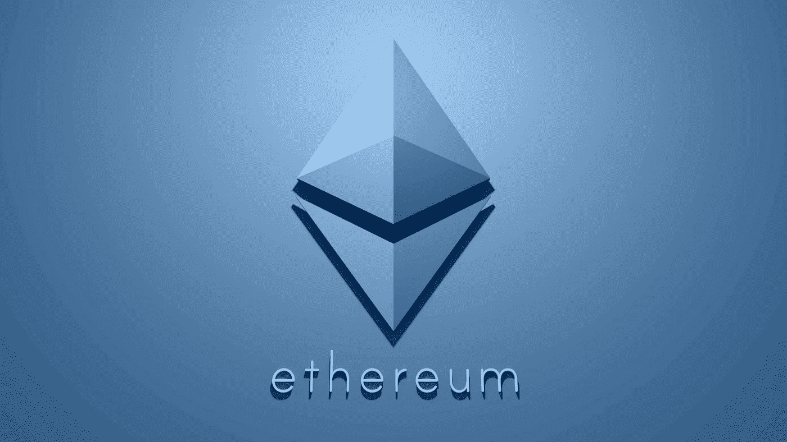
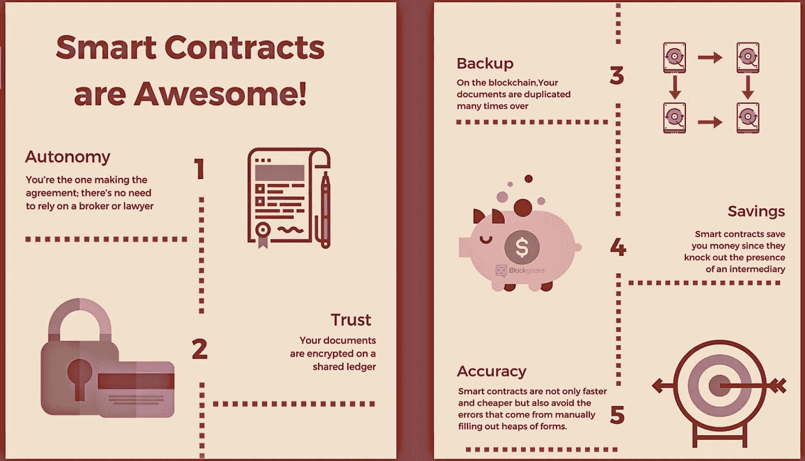

# 以太坊过于简单:以太坊初学者指南

> 原文：<https://medium.com/swlh/ethereum-oversimplified-a-beginners-guide-to-ethereum-fdd251c84d35>

到目前为止，全世界都听说过最著名的加密货币，比特币，市值最大的加密货币。然而，比特币并不是唯一的加密货币；如标题中所述，以太坊有数千种加密货币，本文将要讨论的是市值排名第二，在加密货币市场中发挥巨大作用的加密货币。

首先，让我们讨论一下以太坊是如何由谁创建的。

2013 年，一位名叫 Vitalik Buterin 的年轻天才有了一个想法，他在一份白皮书中与他的朋友讨论了这个想法，在他的想法传开后，大约有 30 人找到他讨论这个新概念，尽管他期待着批评和人们指出他工作中的错误，但这从未发生。过了一段时间，在 2014 年 1 月，这个项目被公开宣布。

为了全面了解以太坊，它如何潜在地影响我们的社会，它的目的是什么，有必要了解它的主要元素是什么，以及以太坊与其他以太坊的区别。

首先，以太坊是分散的，这意味着它不受任何单一管理实体的控制。大多数业务、企业和在线服务都建立在一个集中的管理系统上。以太坊，作为一个去中心化的系统，根本不受任何人控制，完全自主。它由全球数千名志愿者用他们的电脑运行。

其次，很多人把比特币和以太坊混为一谈。然而，他们有着非常不同的目标，比特币是第一种加密货币，它的基础是区块链技术，并得到它的完全支持。

以太坊采用了这项技术，并大幅扩展了它的功能。以太坊是一个完整的网络，有它的编码语言，支付系统，互联网浏览器。最重要的是，它允许用户在以太坊的区块链上创建去中心化的应用。

> ***简而言之，以太坊是一个公共的、开源的、基于区块链的分布式软件平台，允许开发者构建和部署去中心化的应用。***

如上所述，以太坊是分散的，这意味着它采用点对点的方式工作。所有发生的互动都是由参与其中的人支持的，没有任何权威参与和控制它。

以太坊系统完全由一个叫做“节点”的宇宙系统支持节点是由将整个以太坊的区块链下载到他们的电脑上并完全执行系统所有共识规则的人组成的，他们在网络上工作并通过这样做获得回报。

“智能合约”使这些有自己公认规则的交易以及网络的许多其他方面成为可能。智能合约的目的是自动执行这些交易。这些条款完成后，将触发一项交易或任何其他具体行动。很多人认为这些智能合约是未来。此外，许多人认为它们将取代所有其他合同协议，因为智能合同比传统合同法更安全。此外，它们降低了与签约相关的交易成本，并在双方之间建立了信任。

**以太坊是加密货币吗？**

以太坊不仅仅是“钱”，它是一个软件平台，旨在充当一个去中心化的应用商店以及去中心化的互联网。当然，像这样的系统需要货币来支付运行程序或应用程序所需的所有资源。这就是“以太”的用途。

展望未来，以太是一种不需要第三方来处理支付的数字资产。此外，它不仅是数字货币，而且也是以太坊网络内的应用程序所必需的。当任何人想要更改应用程序内的任何内容时，必须支付一定金额的交易费，以便系统处理更改。

> ***参考列表:***
> 
> 以太坊是什么。初学者指南。(未注明)。[https://coin telegraph . com/ether eum-for-初学者/what-is-ether eum # how-ether eum-works](https://cointelegraph.com/ethereum-for-beginners/what-is-ethereum#how-ethereum-works)

*如果您想了解更多，请访问 BIDITEX 页面并提出您的问题，关注我们的*[*Twitter*](https://twitter.com/biditex_com)*，* [*脸书*](https://www.facebook.com/biditex/) *，* [*中型*](/@biditex) *，* [*电报*](https://t.me/biditex%20%28edited%29) *，* [*LinkedIn* 投标变更用](https://www.linkedin.com/company/biditex)**。**

**

## *这篇文章发表在 [The Startup](https://medium.com/swlh) 上，这是 Medium 最大的创业刊物，拥有+409，714 名读者。*

## *在这里订阅接收[我们的头条新闻](http://growthsupply.com/the-startup-newsletter/)。*

**