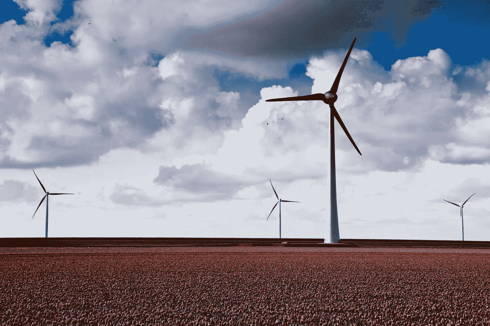
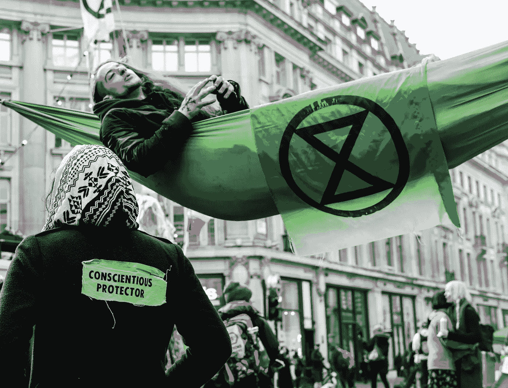

# 道德养老金可能拯救地球

> 原文：<https://medium.com/swlh/ethical-pensions-might-save-the-planet-bef2ac6a3d19>

## ***但是我们能承担得起这个风险吗？***

Would you put your retirement savings into green energy? Photo by [Aniek Wessel](https://unsplash.com/@aniekw?utm_source=unsplash&utm_medium=referral&utm_content=creditCopyText) on [Unsplash](https://unsplash.com/search/photos/wind-farm?utm_source=unsplash&utm_medium=referral&utm_content=creditCopyText).

我的养老金少得令人尴尬，可怕。除了在英国国民医疗服务系统兼职 3 年之外，我的整个职业生涯都是自主创业。没有一个雇主来匹配我的投入，为退休储蓄的选择是相当可怕的，而且总是有一个不这样做的理由。首先，我实在太穷了(我从事艺术工作——你应该明白这一点)。然后我开始攒钱买房子……然后我意识到我已经 32 岁了，如果我不马上开始，我会希望我活得不够长，不会后悔。

我们在这里讨论的数字很小。但是做点什么似乎比什么都不做好得多。因此，我进行了一些研究，并决定开设一个自我投资个人养老金，或 SIPP。我选择了一家 SIPP 在消费者调查中一直被高度评价的公司，与其他一些选择不同，它没有安装费；只是每年的管理费，是我投资的钱的%(结果是几乎没有任何东西的 0.45%…几乎没有任何东西。万岁)。

**我们大多数人不懂投资，这让投资变得很可怕**

SIPPs 的一个关键特点是，你正式对自己的投资决策负责。作为一个没有投资经验的人，让我松了一口气的是，我选择的供应商提供了一些“管理投资组合”，你可以选择一个风险水平(高、中或低)，并得到相应的投资组合，而不是……嗯，我真的不知道我还能如何从数以千计的投资选项中选择，这些选项对我来说都像是双重负担。我选择了中等风险，中等回报，然后完全忘记了这一切。

如果我们把养老金投入到那些威胁我们生存的行业，绿色生活还有什么意义？

然后，2019 年到了。灭绝叛乱。气候紧急事件。我读了*甜甜圈经济学。我开始尝试各种各样的无塑料洗发水，并搭配各种油腻的发型。我开始怀疑，如果我每月的养老金都投资在化石燃料上，我能做的任何拯救地球的事情真的重要吗？*

Extinction Rebellion protest. Photo by [Kevin Grieve](https://unsplash.com/@kevin_1658?utm_source=unsplash&utm_medium=referral&utm_content=creditCopyText) on [Unsplash](https://unsplash.com/search/photos/extinction-rebellion?utm_source=unsplash&utm_medium=referral&utm_content=creditCopyText).

我在推特上打电话寻求一些建议。我被指向像 Triodos 和有目的的钱这样的地方。我研究了这些和其他一些选项，但当考虑到安装费、可能的回报和客户服务时，没有一个选项看起来非常有吸引力(我至少有一个提供商根本没有回应我的电话请求。在我给他们的电子邮件中透露了一些粗略的数字后，我不禁感到有点被冒犯了，因为他们大概认为我不值得这么做。

**“道德”并不像听起来那么简单……**

我做了一些阅读，了解了更多关于不同类型的“道德”养老金。我真的没有想到‘道德’是一个主观的术语，取决于你的道德观。我要花*一辈子*才能正确理解我的养老金可能投资的所有实体的做法，并判断它们是否符合我对“道德”的定义。

相反，我了解到，选择遵循排除原则的管理基金是可能的:即，它们避免投资于任何积极涉足特定领域(如武器、烟草或化石燃料)的公司。事实证明，我现有的提供商有一个这样的基金，也是因为它在风险和回报方面的记录而被推荐的。记住，只有一个。这大概意味着，我面前的数百种其他基金选项不符合“道德”标签的最低要求。尽管这令人沮丧，但它坚定了我开始转移投资重点的决心。我把账户上的现金转移到了“道德”投资基金。

**…但我们不想成为坐视地球毁灭的人。是吗？**

我剩下的养老金怎么办，它已经被投资到“中等风险，中等回报，可能在某种程度上不道德”的基金中了？我还在考虑该怎么办。我很希望有人比我更了解股票市场，并直言不讳地说“没有人知道我们的投资会发生什么。道德基金本身并不因为道德而具有风险。去争取吧。”在那之前，我仍然在两种恐惧之间徘徊，一种是害怕因为一个不可靠的投资而失去我的退休基金，另一种是害怕因为全球灭绝而失去每个人的退休金，如果我们不把钱花在我们应该花的地方，这种情况可能会发生。