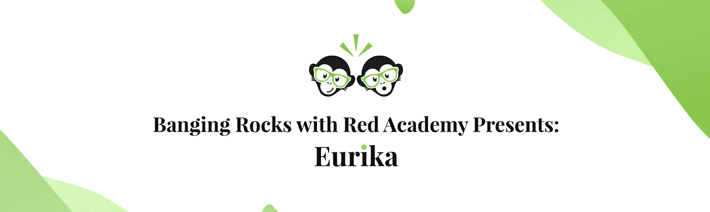

# eurika:UI 案例研究

> 原文：<https://medium.com/swlh/eurika-ui-process-cd39889787a7>

# 介绍

对于我们在 Red Academy 的第三个项目，我们与当地社区合作伙伴合作，根据客户和应用程序用户的要求和需求设计了一款应用程序。

我们与我们出色的客户 Daniel 和他的公司 Banging Rocks 合作，将名为 Group Works 的实体卡片组数字化，该卡片组支持主持人执行小组聚会，无论是…