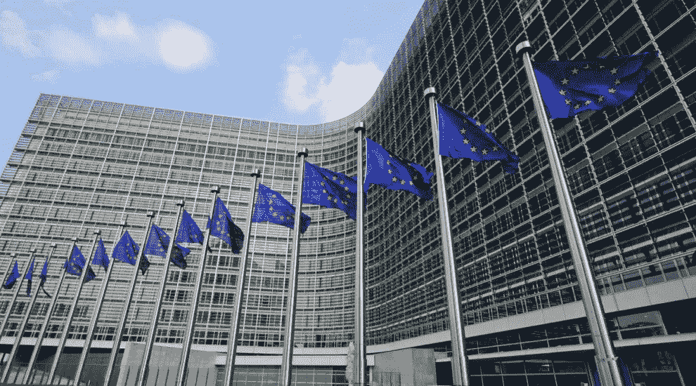

# 欧洲加密货币合法化

> 原文：<https://medium.com/swlh/european-crypto-currency-legalization-bfe4a78809fb>

就政府层面的法律认可而言，2019 年是加密货币充满希望的一年。

瑞士已成为领先的加密货币中心之一，并在加密货币和区块链行业的法律监管领域处于领先地位。2017 年 1 月，在楚格，在当地政府的支持下，为那些使用密码术和区块链技术的人建立了密码谷协会。2018 年 12 月，瑞士政府公布了监管区块链行业的法律规范，并要求修订现有的金融立法。今天，五分之一的数字资产市场属于在瑞士和列支敦士登注册的 50 家最大的加密企业代表。

意大利是法律承认数字技术进程的另一个积极参与者。2019 年 1 月 29 日，意大利参议院宪法案件和公共工程委员会批准了简化法令 Decreto Semplificazioni 的文本。这是意大利政府首次尝试监管区块链行业。议会成员必须在 2019 年 2 月 12 日前通过相关法律。这份文件将取消之前引入的数字服务税。从 2020 年起，与实现数字议程有关的特别专员职能将分配给意大利总理或其代表，他们可以吸收高技术领域的专家参与。该法令还界定了基本术语，确保在登记过程中审查法律文件:“分布式分类账技术”(DLT)、“智能合同”和“数字记录”。

政府层面的高技术合法化表明全球金融市场逐渐向数字商业模式过渡。继欧洲领导人之后，乌克兰也开始积极参与发展数字货币的法律地位，并建立监管金融和技术行业的规则。

Simcord 公司成功地与乌克兰国家法律科学院就法律协调和获得科学和法律专家意见“Bitbon 系统的法律基础”的相关问题进行了合作。该书将于 2018 年底出版，但为了确保其相关性和与其他国家法律框架的一致性，该书被推迟到 2019 年第一季度出版。

此外，为了澄清概念和区分含义以及一致地解释加密货币、代币和数字资产等现有术语，Simcord 正在制定数字资产的定义，作为上述与乌克兰国家法律科学院合作的一部分。该公司的计划包括为全球社区提供一个统一的测试，允许评估任何加密工具与数字资产属性的一致性。

密码行业的概念和法律法规的统一证实了数字基础设施的吸引力，以及为其在欧洲和全球金融生态系统中的发展建立有利法律环境的必要性。

*原载于 2019 年 2 月 18 日*[*【thebitcoinnews.com】*](https://thebitcoinnews.com/european-crypto-currency-legalization/)*。*

## 这篇文章发表在 [The Startup](https://medium.com/swlh) 上，这是 Medium 最大的创业刊物，拥有+426，678 名读者。

## 在这里订阅接收[我们的头条新闻](https://growthsupply.com/the-startup-newsletter/)。

