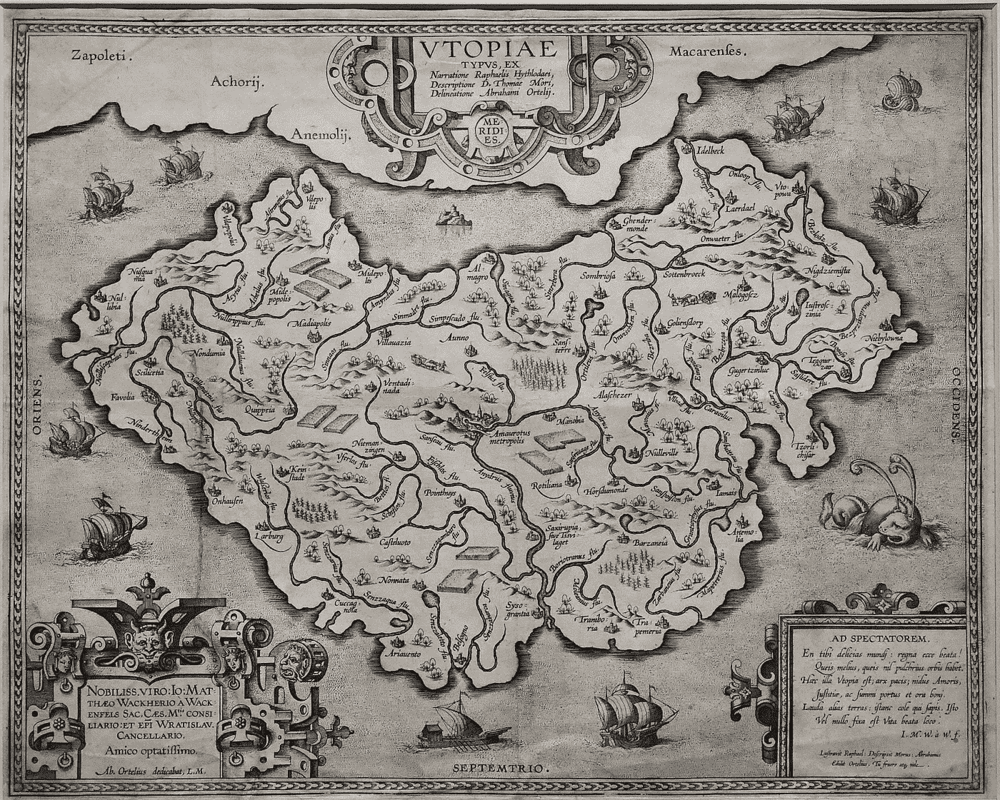

# 每一个乌托邦都变成了反乌托邦

> 原文：<https://medium.com/swlh/every-utopia-becomes-a-dystopia-9f6513c7d493>

A Map of Utopia

我记得里根对戈尔巴乔夫说“推倒这堵墙。”抱歉，那是假新闻。或者至少是善意的谎言。我不可能在 1987 年听到西柏林的现场会议。在德里，可能已经过了我的就寝时间。我也记得在某本杂志上读过它。也许时间。也许是新闻周刊。或者因为它是国际新闻，我甚至可能会在像《今日印度》这样的印度杂志上读到它…