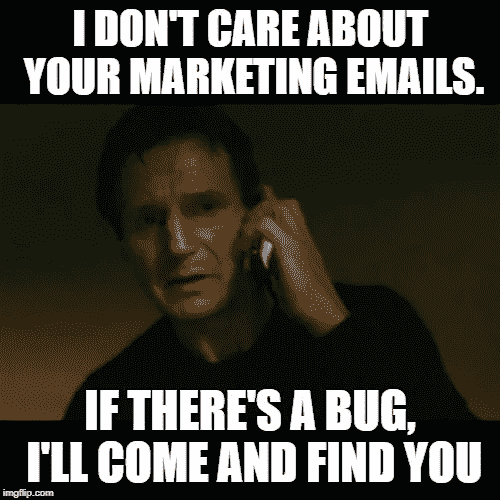
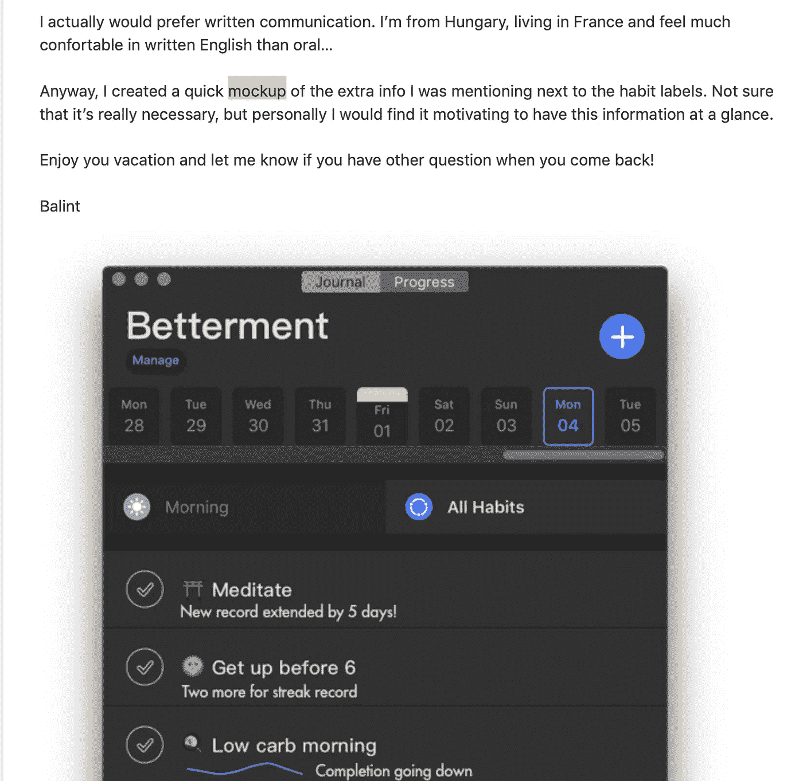
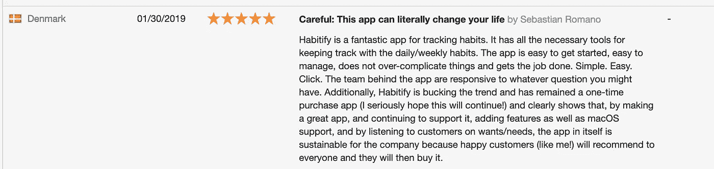
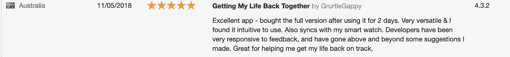
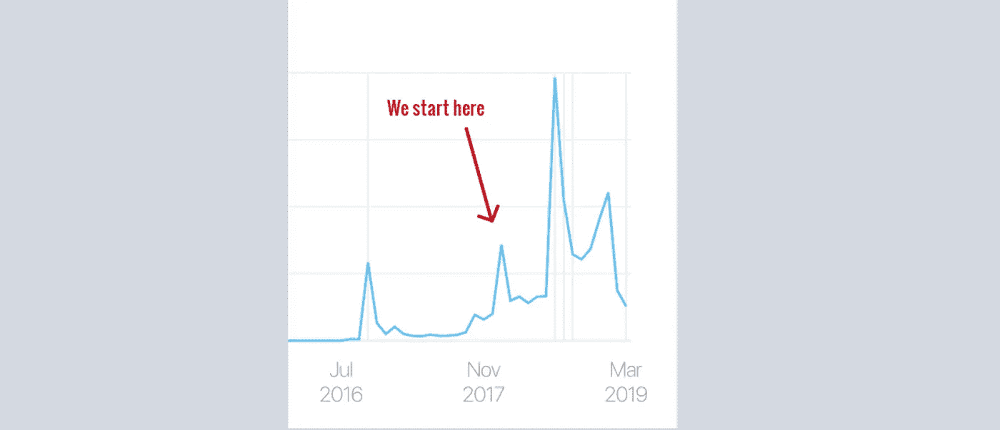
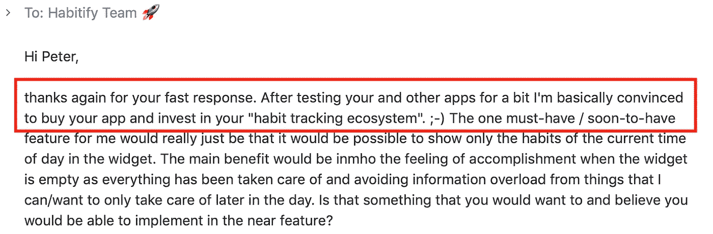
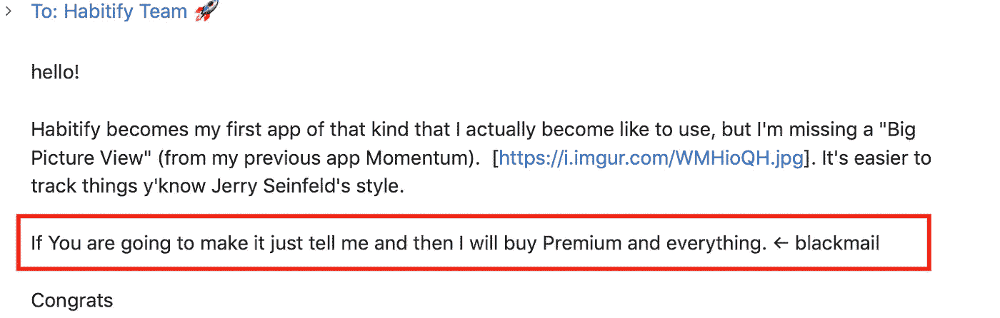
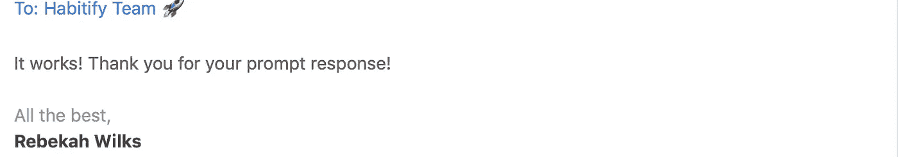
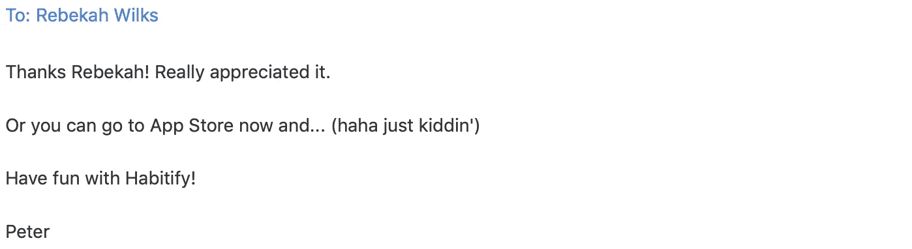
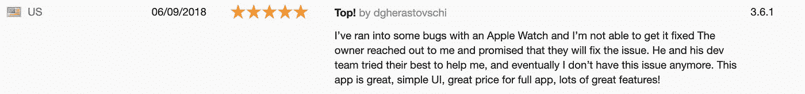

# 每个人都应该阅读支持邮件。

> 原文：<https://medium.com/swlh/everyone-should-read-support-emails-d873008288b7>

以及我将支持邮件放在销售宣传第二屏的 7 个原因

Photo by Nikolay Tchaouchev via [Unsplash](https://medium.com/u/2053395ac335?source=post_page-----d873008288b7--------------------------------)

[Habitify](https://habitify.me/?ref=Medium-support-emails) 自 2016 年以来已经上市 2 年，但直到 2017 年末，我们才指定了一个团队(由 [Alan Ng 领导。](https://medium.com/u/3bf601090fda?source=post_page-----d873008288b7--------------------------------))来关注一下。

从那以后，我们很快就看到了我们决定的影响。以至于我一度想知道为什么不早点这么做。

如果你在路上，这里有一个每个人都应该参与客户支持的原因非常简单的总结。这也是为什么我团队中的每个人，不管是什么角色，都必须从支持客户开始实习/工作的原因:

*   提供见解
*   与高级用户联系
*   改进评论
*   让每个人都保持一致
*   创造销售
*   好玩！
*   良好的品牌

# 提供见解

## 当前的错误、翻译错误

我们只有一个测试员，显然，她不能让每块石头都不放过。因此，这封邮件让每个人都意识到“我们应用程序中的错误”，并引导我们立即采取行动。

bug 的紧急程度由收到的电子邮件数量决定。有趣的是，用户可能会忽略你的营销邮件，也就是你提供额外价值和获得一些“虚拟皮肤”的努力，但如果有错误或翻译错误，他们会追捕你。

Welp, consider each user as a Liam Neeson Junior…

我从这些用户身上学到的是，我必须当场采取行动。通常情况下，前一秒我收到了一封投诉邮件，下一秒我看到了一条投诉推文(来自同一个用户)，下一秒我在 App Store 上获得了 1 星评级。

我是说…拜托？？？

## 用户的问题

如果说这些年来我学到了什么，那就是:

> 用户通常更善于给出解决方案，而不是指出(他们的)问题。

这曾经是我们很头疼的事情，因为我们认为这个应用程序遗漏了太多东西(糟糕到不行)。

但是后来我们跟进，我们发现问题只是少数，可以通过当前功能或快速更新来解决。

我们经常选择快速电话来跟进他们的问题。如果你在寻找一些好的用户采访技巧，我强烈推荐 uxplanet.org[的这篇文章](https://medium.com/u/7c430ec86a4f?source=post_page-----d873008288b7--------------------------------)

 [## 更好的用户访谈的 6 个技巧

### 停止寻找答案。发现真知灼见。

uxplanet.org](https://uxplanet.org/6-tips-for-better-user-interviews-ad925afc52df) 

## 人们如何使用应用程序

我们意识到，人们使用应用程序的方式与我们预期的不同，他们在反馈邮件中清楚地展示了这一点。

这对我们来说是非常有价值的信息。

作为开发人员，我们经常在云端考虑“supernova”特性，我们的用户对这些特性有完全不同的观点和用途。

例如，我们的应用程序 Habitify 旨在帮助人们[一次形成几个习惯](https://habitify.me/?ref=Medium-support-emails)，我们有特定的功能来对习惯进行分组，并最大限度地减少人们必须使用应用程序来完成某个动作的时间(例如，3D 触摸、微件、可操作通知……)

事实证明，大多数人使用 Habitify 来记录他们生活中的几乎每一个动作(从“起床”、“刷牙”、“做早餐”到“用牙线剔牙”、“上床睡觉”，以及这之间的一切——你能想到的)——这就像一个待办事项列表，但对于习惯来说。

更重要的是，他们倾向于在一天中多次访问该应用程序，只是为了看看他们做了什么(他们声称这给了他们成就感)和*看看接下来是什么。*

他们想去*看看接下来会发生什么。*

这是我们从来没有想到的。我们建立提醒来减少大脑的工作，但是他们仍然想知道接下来会发生什么。多么讽刺！

## 识别阿基利高跟鞋

好吧，所以除了错误和翻译，用户的问题和他们如何使用应用程序不一定是应用程序的弱点。

可能是:入职时间太长，登录错误文本太“命令式”，设置太混乱，设置屏幕有误导性…

> 如果有人像妈妈一样挑剔、爱管闲事、讲究，那肯定是我们的用户。

不过，这很好。尽管与这些人打交道听起来很有挑战性，但正是他们将我们拖向现实，并在追求新功能之前“强迫接触”我们完善应用程序。

# 与超级用户联系

回复电子邮件的一个不可否认的优势是发现并联系高级用户。

对我们来说，超级用户一直是最好的朋友、品牌倡导者、bug 报告者、想法产生者、激励者、翻译者、精神支持者、老师(我可以为他们列出 100 个可敬的名词)

因此，经过近一年的支持团队建设，我们也为我们的超级用户培养了一只眼睛:

*   非常长的电子邮件，有礼貌的开头和结尾。有些人甚至像写论文一样指出习惯的改进点…
*   深入了解他们如何使用该应用程序的细节
*   提供非常具体的解决方案。我是说，看看这个:

He even redesigns Habitify for us! Thanks [Balint Fulop](https://medium.com/u/309259d7567?source=post_page-----d873008288b7--------------------------------) !

*   参考他们使用过的其他应用程序
*   包括关键词:“爱，喜欢，太棒了，猫(耶！)，开心”

这对我们有什么帮助？我们会锁定他们，邀请他们参加封闭测试，支持大型发布，或者在遇到困难时寻求第二种意见。

# 改进评论

人们经常谈论做一个好的应用程序。

但是如果应用程序还没有那么好呢？然后，我们必须表明我们愿意把它做好，或者至少，这是我们的计划。

我们有一个团队专门负责回复电子邮件和支持实时聊天，在许多情况下，我们已经成功解决了用户误解(导致他们非常烦恼)或遭受应用程序问题(升级、同步……)的情况

作为回报，我们得到了启发性的评论:

Thank you so much!!

根据我的研究，评级的提高会推动应用排名上升，从而产生更多的下载量。

简直是一箭双雕:)

# 让每个人都保持一致

它告诉营销人员在营销活动中仍然有一个死链接。

它告诉客户支持者，她解决 bug 或找到临时解决方案的速度不够快。

这告诉开发团队，他们在部署代码时仍然不够小心。

它告诉我，Habitify 并不完美，我们需要更多地关注一些功能。

支持邮件通常是我们午餐和晚餐的主要话题。它加强了每个人之间的联系，知道我们面临着同样的挑战。

不可否认，我经常固执己见，抵制新的想法或解决方案。但直到我收到电子邮件，声称有一个问题需要这些想法，我才开始认真思考这个问题。

就其核心而言，电子邮件是任何创意提案最具体的证据。

# 创造销售

人们经常在打开钱包之前问我们一些具体的功能。由于迅速及时的反应，我们已经获得了许多案件。

自从我们专注于客户支持，我们的月收入大幅增加。

当然，增长还有其他因素，但是通过这样的电子邮件，我们相信我们的支持团队确实为财务增长做出了贡献(Alan Ng，干得好。)。！)

*Scream*

# 好玩！

谁说回复邮件很无聊？

我们必须面对各种各样的人:愤怒的人、抱怨的人、相信的人……

每一种都给了我们一次情感之旅。它训练我们的适应能力，但同时也帮助我们远离受限的办公室空间。

我们经常会遇到这样的支持聊天

Lol I was blackmailed by my own user haha

或者这一系列快速的“邮件快照”

From: [Rebekah Wilks](https://medium.com/u/3a2dd1b5b6bb?source=post_page-----d873008288b7--------------------------------)

From: [Rebekah Wilks](https://medium.com/u/3a2dd1b5b6bb?source=post_page-----d873008288b7--------------------------------)

From: [Habitify](https://medium.com/u/ecd18d893610?source=post_page-----d873008288b7--------------------------------)

From: [Rebekah Wilks](https://medium.com/u/3a2dd1b5b6bb?source=post_page-----d873008288b7--------------------------------)

From: [Habitify](https://medium.com/u/ecd18d893610?source=post_page-----d873008288b7--------------------------------)

From: [Rebekah Wilks](https://medium.com/u/3a2dd1b5b6bb?source=post_page-----d873008288b7--------------------------------)

# 良好的品牌

如今，在各方面竞争激烈的情况下，赢得用户的心归根到底是要有更好的服务。你可能会问，我们可以从应用程序中提供什么服务？

是邮件和实时聊天。

即使用户的手机上可能有数百个应用程序，并且不总是在手机上，他们仍然希望得到关注，尤其是付费的应用程序。

我发现，Habitify 用户下载并支付该应用的关键决定因素之一是，他们看到我们通过 changelog、twitter、电子邮件和实时聊天与用户积极互动。他们不会因为自己的问题立即得到解决，就不愿意留下一个好的 5 星评级。

A happy customer!

现在，我很自豪地说，Habitify 不仅拥有习惯追踪市场上最简单、最直观的用户界面和 UX 应用程序，而且还拥有反应最灵敏、最善良、最搞笑的客户支持团队。

这是众所周知的。

如果有关于我们的推销，那最有可能出现在第二张幻灯片上(在介绍之后)

—

## “每个人都应该阅读支持邮件”是我在做了 5 年独立开发者(从产品开发、市场营销、团队管理到客户管理)后学到的一系列无尽经验中的第 4 篇

## 如果你认为我的故事对你有用，你可以多鼓掌一次、两次或四十次👏👏👏帮助其他人更容易地找到这个:D

## 这篇文章发表在 [The Startup](https://medium.com/swlh) 上，这是 Medium 最大的创业刊物，拥有+434，678 名读者。

## 订阅接收[我们的头条](https://growthsupply.com/the-startup-newsletter/)。

