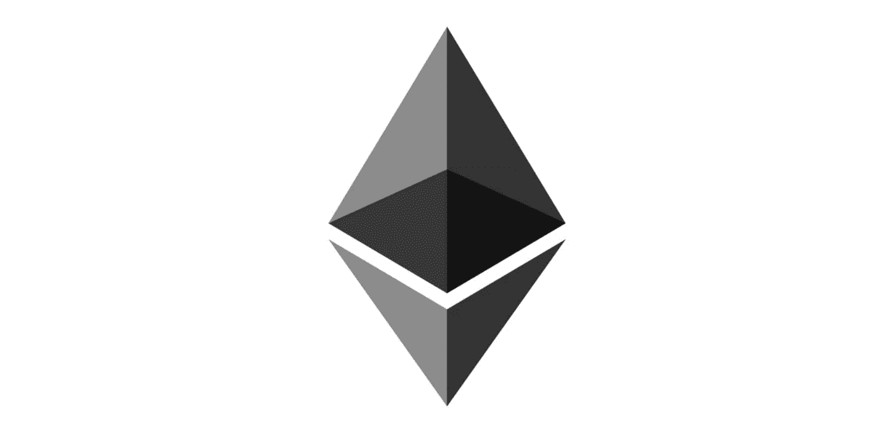
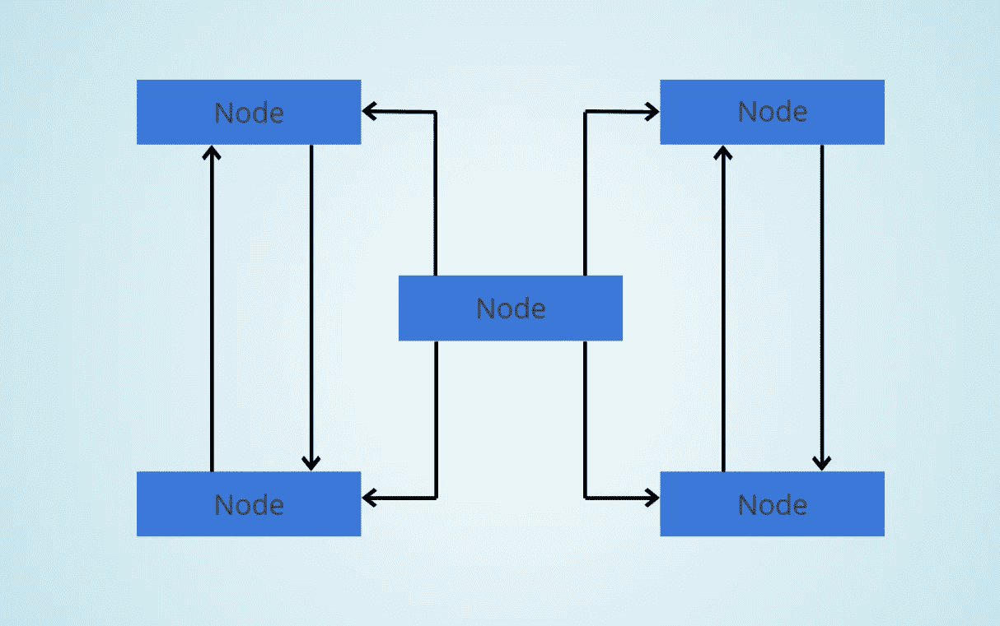
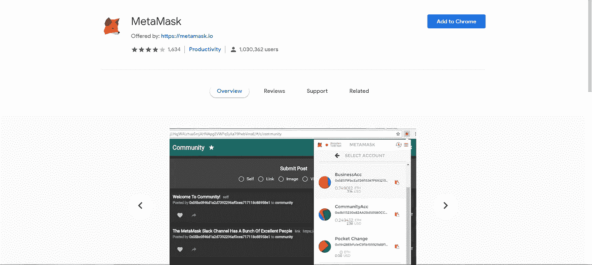
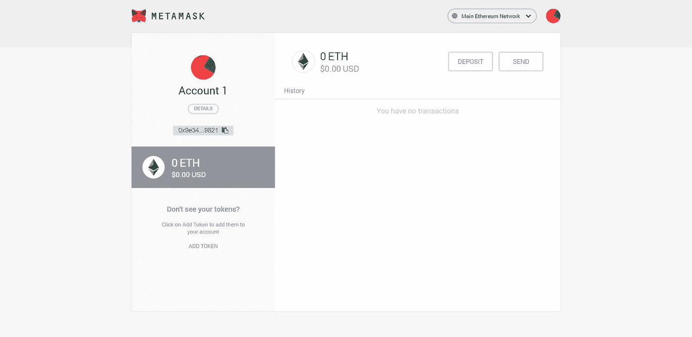
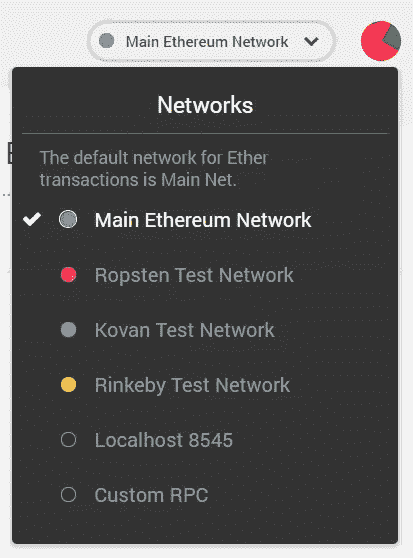
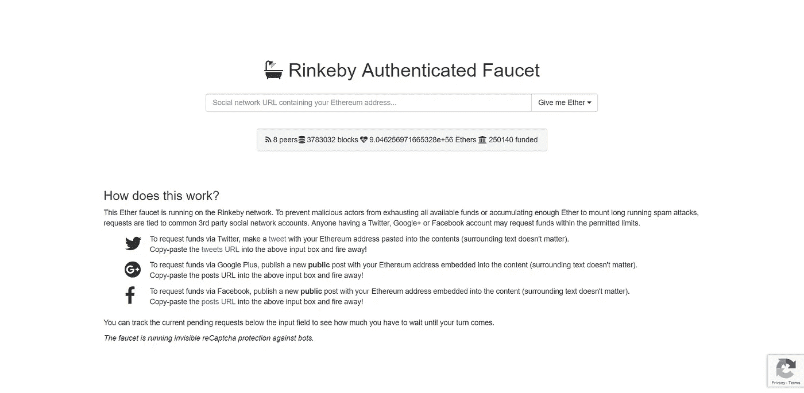
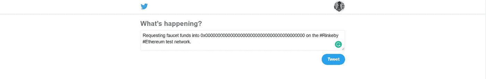
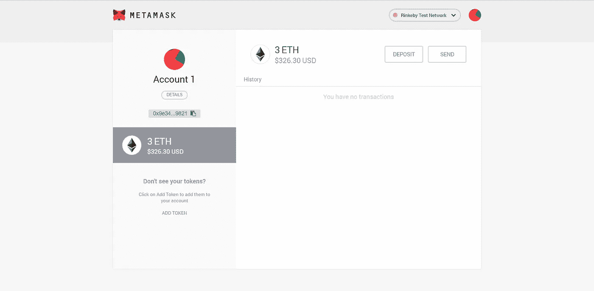

# 我所知道的关于以太坊的一切——第一部分

> 原文：<https://medium.com/swlh/everything-i-know-about-ethereum-part-1-d09eff38fefc>

## 一系列的帖子详细介绍了我所了解的以太坊的一切

以太坊——一个基于区块链的开源计算平台和操作系统，允许我们编写智能合同。

这是解释以太坊是什么的最短方法。但这不是最好的，因为它留给我们更多的问题，如什么是区块链？什么是智能合约？操作系统？它是用什么语言写的？

在这篇文章中，我将尝试回答这些问题，以及许多其他我第一次听说以太坊时充满的问题。

# 序言——比特币和区块链

区块链的理论诞生要追溯到 2008 年 10 月 31 日。这是一个名为中本聪的匿名实体发布了一篇学术论文，描述了一个允许个人之间进行货币交易而不需要银行等金融机构充当中间人的系统。这个系统被称为**比特币**。

但实际的比特币网络是在 2009 年 1 月上线的。请记住，比特币是由人们在不涉及中央机构(银行)的情况下相互转账的想法组成的。这最终导致了去中心化网络的想法，这是区块链的主要特征之一。

最终，人们开始说比特币是基于区块链，而比特币中的区块链被用来存储货币交易清单。

但这只是我说的比特币网络，都是去中心化的钱。虽然大多数人关注的是分散资金如何带来一系列全新的机会，但人们开始想知道分散是否也可以应用于金钱以外的东西。

维塔利克·布特林就是其中之一。他在 2013 年写了一篇学术论文，讨论了对交易进行程序化控制的必要性。他还引入了术语“**分权自治公司**”(DAC)。他把这种纸命名为**以太坊。**

你可以在这里阅读维塔利克的论文[。](http://web.archive.org/web/20131228111141/http://vbuterin.com/ethereum.html)

维塔利克还谈到了智能合约。智能合约基本上是一些放在以太坊区块链内部的代码，可以通过编程来做某些事情。

实际的以太坊区块链系统于 2015 年 7 月 30 日上线，大约 7200 万以太坊比特币被“预开采”。

2016 年，由于一些智能合同的缺陷导致价值 5000 万美元的以太坊加密货币(Ether)被盗，以太坊被拆分为两个独立的区块链。新版本被称为以太坊(ETH)，旧版本被重命名为以太坊经典(ETC)。

# 什么是以太坊网络？

现在你已经对比特币和区块链有了一些基本的了解，让我们进入以太坊网络是什么以及它是如何工作的。

以太坊是一个区块链网络，可以用来转移资金，存储数据，等等！

以太坊网络有许多不同的类型。但是这些网络中的每一个都是在多个块或节点相互连接时形成的。

每个节点只是一个运行以太坊客户端的系统(计算机)。**节点上包含整个区块链的副本。**

上一段的最后一句话是区块链和其他数据库，或者比特币和银行的主要区别点。

在 AWS、MongoDB、Firebase 等数据库的情况下，通常有一个存储用户所有数据的中央数据库。但是在区块链的情况下，没有中心数据库。区块链的每个节点充当数据/货币的存储空间。这也是为什么区块链被描述为分散的**。**

现在我们对以太坊网络有了基本的了解，你需要问自己的下一个问题是:

> 谁可以加入这个网络？

答案是**任何人**。

让我们把一般人群分成两部分:

*   开发商
*   用户

开发者和用户可以通过两种不同的方式加入以太坊网络。这是因为开发人员希望使用网络来创建与网络交互的应用程序，而用户则希望作为消费者使用网络。

开发人员使用一个名为 **web3.js** 的库，它实际上是一个库的集合，允许开发人员使用 HTTP 或 IPC 连接与以太坊节点进行交互。开发者使用 web3.js 向以太坊网络汇款、存储数据和部署智能合约。

没有编码经验的普通用户可以通过以下两种方式与以太坊网络交互:

*   元掩码
*   下雾

Metamask 只是一个浏览器扩展，允许人们与以太坊网络进行交互。而 Mist 是一个成熟的网络浏览器，就像 Firefox 和 Chrome 一样，只是它可以用来与以太坊进行交互。Mist 仍在开发中，Metamask 是使用以太坊的更好选择。

# 安装元掩码

要安装 metamask，请确保您的系统上安装了 Google Chrome 浏览器。然后打开[网络商店](https://chrome.google.com/webstore/category/extensions?utm_source=chrome-ntp-icon)并搜索 Metamask。通常第一个搜索结果就是我们要找的。它看起来会像这样:

元蒙版通常有一个狐狸图标。点击添加到 Chrome 按钮，浏览器会自动安装扩展。然后你会被要求输入新的密码来创建一个新的以太坊账户。以太坊账户允许用户向以太坊账户转账和部署智能合约。

一旦你完成了以太坊账户的创建，你将会得到一个 12 个单词的肺炎名为“种子短语”。它对每个以太坊帐户都是唯一的，可用于将您的以太坊相关数据导入其他系统。所以要保持安全和隐私！

最后，您将看到元掩码帐户的主屏幕，如下所示:

你会注意到屏幕右上角有一个下拉菜单，设置为“主以太坊网络”。点击它，你会看到以下选项。

MetaMask 会将主以太坊网络设置为默认。在公共网络中，硬币实际上是有价值的，我们可以部署世界上任何人都可以使用的应用程序/智能合同。

Ropsten，Kovan 和 Rinkeby 是测试网络，人们可以在那里测试应用程序/智能合同，甚至可以获得免费的以太币！不要对此过于兴奋，因为您只能将它们用于测试目的。

为了这篇文章(以及我将来写的任何其他文章)的目的，让我们选择 Rinkeby 测试网络。

# 以太坊账户

在下图中，您可以看到 MetaMask 在页面的左侧显示“帐户 1”。

这意味着您可以在元掩码中创建多个帐户。您还会注意到，在“Account 1”的正下方有一长串字母数字字符。

当您在 MetaMask 中创建一个帐户时，您告诉 MetaMask 为您创建三个不同的东西。账户地址、公钥和私钥。这三样东西都是十六进制数字，对每个账户都是唯一的。

帐户地址是您与其他人共享的唯一标识符。但是公钥和私钥是您帐户的一种密码。这些密钥用于授权将资金转入和转出您的帐户。如果一个人没有账户的私钥，那么他就不能完全访问账户中的任何资金。因此，请确保妥善保管，不要与他人分享。

# 接收乙醚

打开一个新的浏览器标签并转到`faucet.rinkeby.io`。这是在您的帐户中获得免费以太币的最简单方法。再说一次，这些以太币在世界上一文不值，只能用于测试目的。

一旦你进入上面提到的网址，你会看到这样的内容:

那么这个网站是怎么运作的呢？

你只需要发送一条 tweet，里面有你的以太坊账户地址，如下所示:

用你的以太坊账号地址替换长串的 0。发布推文后，复制推文的链接，粘贴到上面的网站。水龙头然后将验证推文，如果一切顺利，你会看到一些以太币在你的帐户！

不要被页面上显示的`$326.30 USD`所迷惑。这些以太币在现实世界中仍然一文不值。如果你切换到其他测试网络，甚至主网络，你的硬币的价值将回到零。

不管值不值真钱，我们的账户里现在有一些以太币了。这是怎么回事？我们只是发了一条微博。

当我们将推文的 URL 链接发送到 Rinkeby 水龙头时，它将 URL 发送到其后端服务器。后端服务器随后创建了一个事务对象。该对象包含与我们和水龙头达成的协议相关的所有数据。

# 未完待续…

让我们暂停一下，因为这篇文章有点太长了。在下一篇文章中，我将“谈论”更多关于区块链、智能合约、Solidity 编程语言，并写一个智能合约！

感谢阅读这篇长文！我希望这篇文章能帮助你更好地理解以太坊。如果你喜欢这篇文章，请给我一些👏请在下面随意评论。干杯！

## 这篇文章发表在 [The Startup](https://medium.com/swlh) 上，这是 Medium 最大的创业刊物，拥有+417，678 名读者。

## 在这里订阅接收[我们的头条新闻](http://growthsupply.com/the-startup-newsletter/)。

