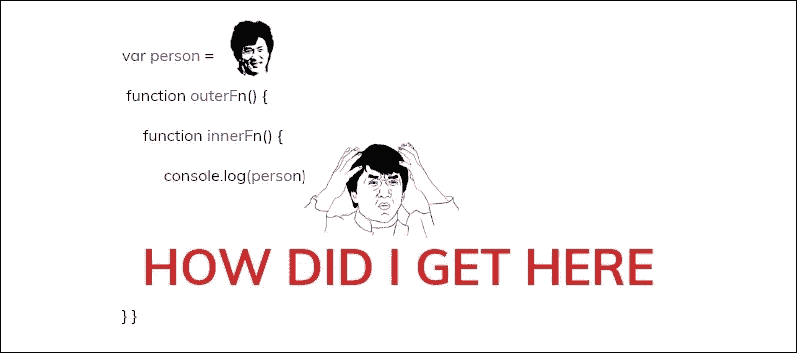

# 关于 JavaScript 范围您需要知道的一切

> 原文：<https://medium.com/swlh/everything-you-need-to-know-about-the-javascript-scope-f81cbffa9491>

Why is JS scope so weird

我记得我作为 JS 程序员的早期，无法理解为什么人们使用 **bind/call/apply** 方法，以及如何使用或管理 **' *this* '** 关键字。如果您是 JavaScript 新手，刚刚开始在 jQuery 中编写一些事件处理函数，或者在 Angular 或 React 中创建了一些基本组件，那么从长远来看，这些信息肯定会对您有所帮助。