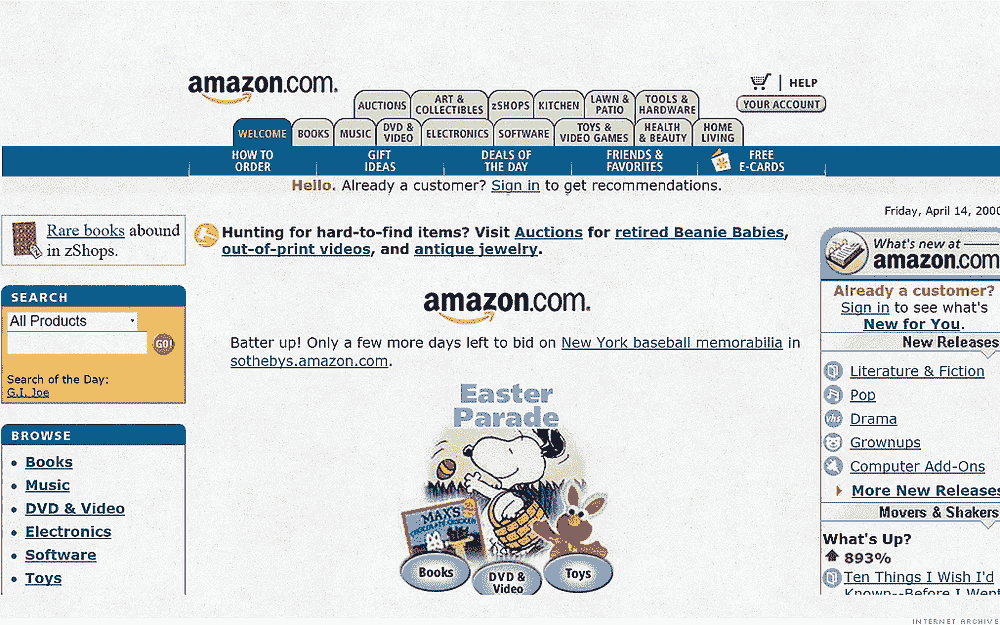

# 电子商务设计的演变

> 原文：<https://medium.com/swlh/evolution-of-e-commerce-design-a0e6441df406>

如今，最受欢迎的网上购物体验已经成为我们生活中不可或缺的一部分，比如节省时间、快速支付和趋势跟踪。

如果需要用最简单的方式来解释这种对社交媒体影响很大的网购体验；有了我们追随的影响者的影响，我们可以不经尝试和接触就购买任何产品。

在这个广告也向数字化发展的时期，我们用最能描述产品体验的图片、视频和销售网站购物。现在，当我们想买化妆品时，我们可以通过阅读或跟随使用它的人的评论来购买产品，而不是去商店。

## 从前…

20 年前，这一切的经验转移并不是很快。当你看购物体验时，在网上购物并不容易。如果你想到达“购买按钮”，你应该走很长一段路！

## **视觉体验决定一切**

今天，美学设计理念实际上已经发展到触手可及的程度。一个吸引人的照片视频，易于购买的按钮和一个好的广告预算来销售一个产品对电子商务来说已经足够了。这种情况导致了设计带来更多的美学关注，这让设计师们感到高兴。因为当开始销售一种产品时，老板们已经形成了对美学的关注，并与设计师们一起为品牌价值而工作。

视觉关注和故事需求造就了高质量的产品。因为新的设计趋势开始通过仅仅成为一场视觉秀来推销你能买到的产品。

网上购物体验以这种方式发展的事实有一个社会学的解释。在消费处于最高水平的日子里，所有代人(x，y，z)都享受着获取一切和即时消费的便利。

## 节省你的时间和精力

关于电子商务的 3 代 3 例。

> 1.一个老阿姨可以很容易地拿走猫粮，而不用离开房子给猫吃。她不需要携带沉重的包裹。
> 
> 2.职业女性工作强度大，她们总是在网上购物。所以她可以很容易地拿到她喜欢的鞋子。
> 
> 3.学生不用离开房间就可以点餐。

事实上，所有这些人在日常生活中都获得了一些时间。时间管理在现代是宝贵的，人们总是希望快速、舒适和安全地消费。

## 当我们回顾电子商务 20 年的发展时，我们会发现，在线支付方式更容易获得，也更容易消费。

谢谢！💁🏻

D.

## 这篇文章发表在[《创业](https://medium.com/swlh)》上，这是 Medium 最大的创业刊物，有+433，678 人关注。

## 订阅接收[我们的头条新闻](https://growthsupply.com/the-startup-newsletter/)。

