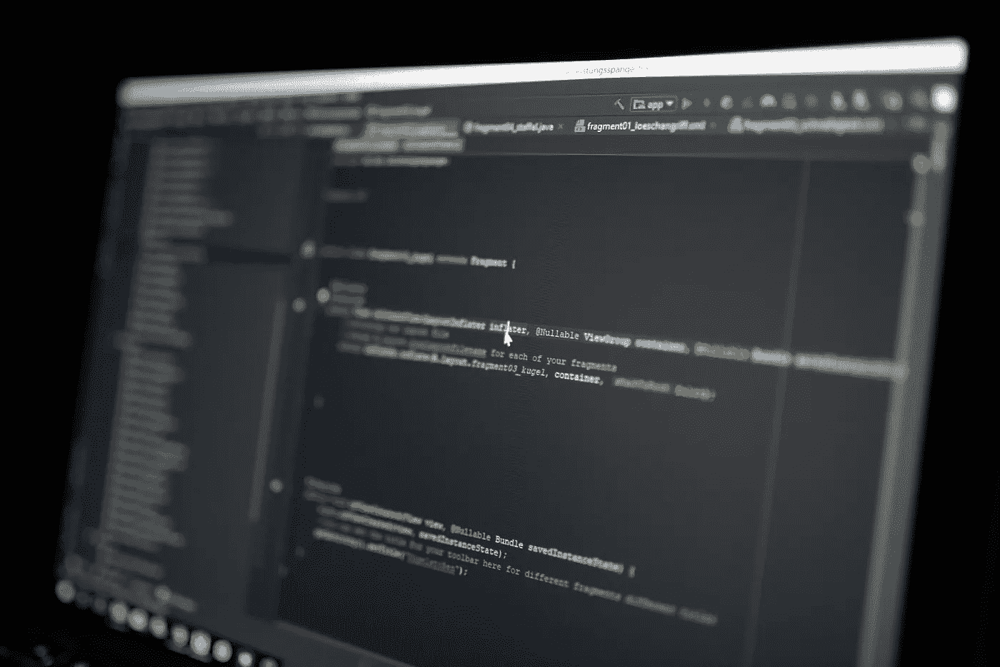

# Java 流中的异常处理

> 原文：<https://medium.com/swlh/exception-handling-in-java-streams-5947e48f671c>

Photo by [Maximilian Weisbecker](https://unsplash.com/@maximilianweisbecker?utm_source=unsplash&utm_medium=referral&utm_content=creditCopyText) on [Unsplash](https://unsplash.com/search/photos/java?utm_source=unsplash&utm_medium=referral&utm_content=creditCopyText)

在我与从 Java 7 迁移到 Java 8 的公司一起工作的过程中，我看到许多人对使用流和高阶函数等很酷的新特性感到兴奋。Java 8 去掉了许多样板代码，使代码不那么冗长。

但是不正确地处理异常最终会导致我们拥有臃肿的 lambdas，这违背了清理的目的…