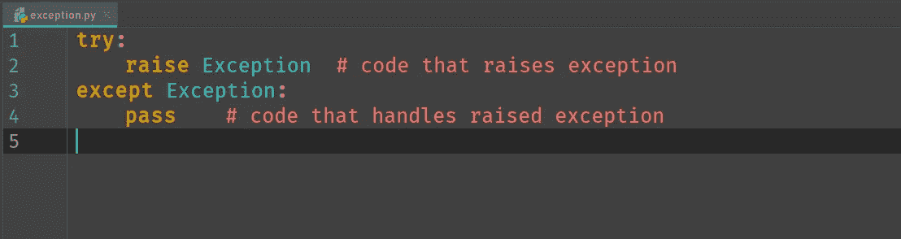

# Python 中的异常

> 原文：<https://medium.com/swlh/exceptions-in-python-a545249f1272>

# **概述**

**1** 简介
2python 中的异常
**— 2.1** 处理异常
**———2 . 1 . 1**基本 try-except 块
**———2 . 1 . 2**多个 except 子句
**———2 . 1 . 3**单个 except 子句中的多个异常
**———2 . 1 . 4**别名【T22 — — 2.2.1 引发内置异常
**— — 2.2.2** 定义并引发自定义异常
**3**logger . exception