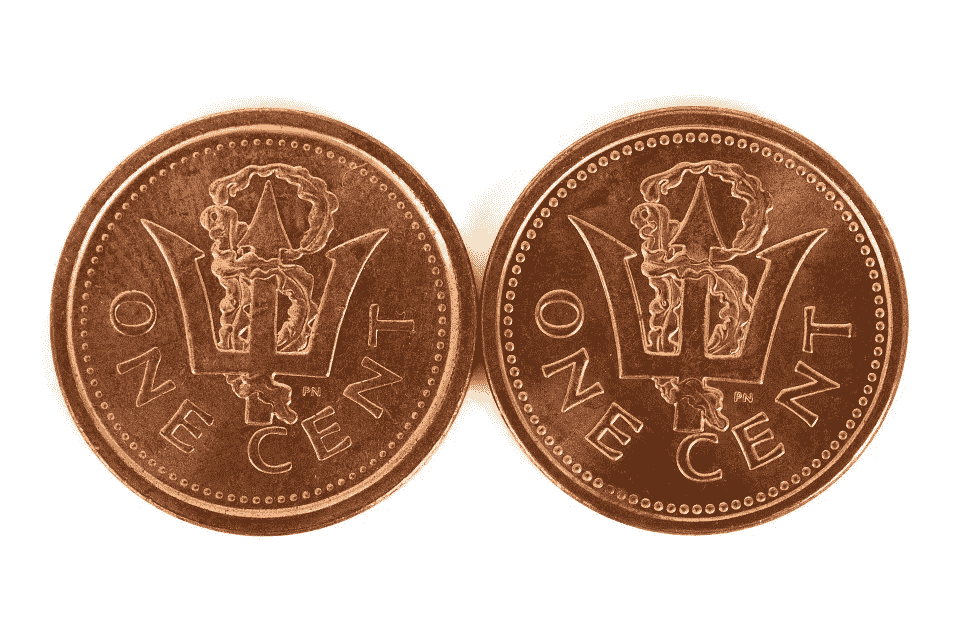

# 兴奋和紧张

> 原文：<https://medium.com/swlh/excitement-and-nervousness-ed64161f10a9>

一枚硬币的两面。

GETTY IMAGE

## 你是否曾经对某件事如此兴奋，但另一方面又被难以置信的事情吓坏了？

我的一个朋友今天向我提到了这一点，当时我告诉她关于我即将到来的音乐巡回演唱会，我大脑中的二分法。

> *“两个声音在说话* …