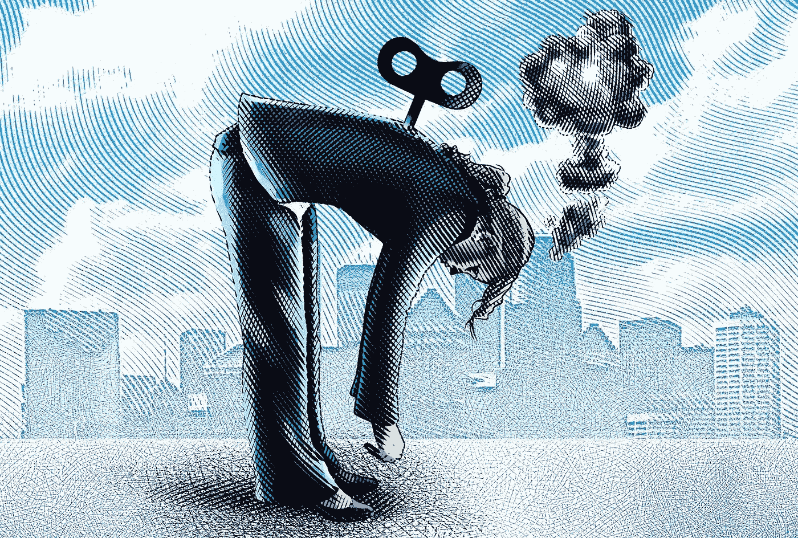

# 疲惫可以伪装成懒惰。

> 原文：<https://medium.com/swlh/exhaustion-can-be-disguised-as-laziness-f37074f1ff58>

Image Credit: iStock

奇普·希斯和丹·希斯使这个想法闻名于世，然后蒂姆·费里斯与他的数百万追随者分享了这个想法。

它的意思是，当我们变懒的时候，它可能是别的什么东西。我们并非生来懒惰，但当我们抱着“拼命干到死”的态度时，我们会变得精疲力竭。

奇普和丹认为，我们的懒惰往往是因为筋疲力尽。变得如此容易…