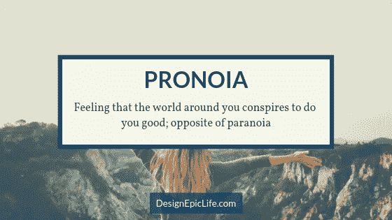

# 用这本情感词典扩展你的情感词汇

> 原文：<https://medium.com/swlh/expand-your-emotional-vocabulary-with-this-dictionary-of-emotions-ae18e1a33239>

Photo by [Alvin Mahmudov](https://unsplash.com/@alvinmahmudov?utm_source=medium&utm_medium=referral) on [Unsplash](https://unsplash.com?utm_source=medium&utm_medium=referral)

让我们做一个快速测试:列出你能回忆起的每一种情绪，而不用到处寻找或询问任何人。

准备好了吗？走吧。

我会等的。

…

你想出了几个词？5?10?15?不止这些？

在这篇文章中，我给你列出了世界各地从 A 到 Z 的 300 多种情绪。

每天，你都会经历各种你自己都没有意识到的情绪。识别不同的情绪可以增强你的情商，这是你在这个世界上成功的关键技能。

《T2》一书的作者 Lisa Feldman Barrett 认为，识别不同的情绪可以构建情绪粒度，这意味着能够构建精确的情绪体验。

建立情感粒度的好处是巨大的:

*   识别不同不愉快感觉的人在调节他们的情绪时比其他人灵活 30 %。
*   在压力大的时候，他们不太可能过度饮酒。
*   当有人伤害他们时，他们不太可能勃然大怒。
*   他们在社交场合表现得体。
*   他们以更好的方式处理恐惧和焦虑。

听起来不错？

下一个问题是——你如何建立你的情感词汇？

你可以拿一本字典来挑选所有的情感词汇，或者继续滚动来找到最终的情感列表，并学习你没有意识到的新词汇。

你会发现许多来自不同文化和语言的词汇(其中一些摘自蒂芙尼·瓦特·史密斯的《人类情感之书》。与其相信你的记忆力，我建议你把这篇文章保存起来，不时地回头看看，以增加你的情感意识。

我已经跳过了一些单词，它们是已经包含在列表中的一种情感的同义词。

现在不再拖延，下面是按字母顺序排列的人类情感列表:

# A

意大利语:饱餐一顿后的困倦感。

当我们爱的人或期望得到善待的人伤害我们时，我们会感到痛苦和愤怒。

**无信仰**(源自欧洲中世纪和文艺复兴时期):对宗教意象的精神麻木或厌恶，被认为是由重复的崇拜性质引起的厌倦所引起的。

**钦佩**:一种高兴、赞同和喜欢的感觉。

爱慕:一种深深的爱和钦佩的感情。

喜爱:喜爱或喜欢的温和感觉。

**焦虑**:感到烦恼或紧张。

极度痛苦:强烈的痛苦感觉。

**警报**:对危险的焦虑意识。

疏离感:与其他人疏远(在社交上迷失方向)的感觉。

Amae (日语):一种想要扑到爱人怀里得到呵护和安慰的冲动。

惊奇:非常惊讶或惊奇的感觉。

(由美国小说家戴维·福斯特·华莱士创造的):对事物被随意解释感到不舒服。

娱乐:因娱乐而产生的一种愉快的感觉。

愤怒:一种强烈的情绪，指向一些真实的或假想的委屈。

**苦闷**:极度精神痛苦。

敌意:引起强烈敌意的恶意情绪。

**烦恼**:微怒；烦躁。

**期待**:在考虑或等待一个预期事件时，一种包含愉快、兴奋或焦虑的情绪；悬疑。

焦虑:一种模糊的、不愉快的情绪，是对某种(通常是不明确的)不幸的预期。

冷漠:缺乏情感或热情。

忧虑:担心或害怕不好或不愉快的事情会发生。

惊人的:极其令人惊讶或印象深刻的。

依恋:对某人或某事的喜爱、喜爱或同情。

吸引力:对某物或某人的兴趣、渴望或吸引力。

厌恶:强烈的不喜欢或厌恶

意识到的(日语):短暂的、消逝的超越之美的苦乐参半的时刻。

敬畏:一种混合着恐惧或惊奇的崇敬之情。

**Awumbuk** (来自巴布亚新几内亚柏宁人):因来访者、朋友或亲戚的离去而引起的悲伤、疲倦或厌倦。

# B

**困惑**:当太多的选项，尤其是那些排列混乱的选项，让我们难以遵循，或者不知道我们应该朝哪个方向前进，让我们感到沮丧，愤怒，甚至暴躁，但最重要的是，过量的信息让我们筋疲力尽，产生堵塞感，并对事物的随机无目的产生一种存在焦虑感。

**极度渴望:突然想要亲吻某人的冲动。**

漫长的一天结束后爬上床时的一种欣快感。

**迷惑**:对晦涩的词语、不完整的列表产生的一种不可思议的感觉。

**困惑**:因不理解而产生的困惑或不解；困惑。

**困惑**:一种让自己受挫的潜意识欲望，阻止我们追求目标或获得渴望的成功。

痛苦:一种深深的、痛苦的愤怒和敌意的感觉。

幸福:极度快乐的状态。

无聊:当一个人无所事事，对周围环境不感兴趣，或觉得一天或一段时间无聊或乏味时所经历的一种情绪状态，偶尔也是一种心理状态。

Brabant (由道格拉斯·亚当斯和约翰·劳埃德创造):想看看你能把一个人推多远，或者看看如果…

# C

**平静**:内心平静的精神状态，没有激动、兴奋、干扰、精神压力或焦虑；宁静；宁静。

无忧无虑:当没有任何事情困扰你时，你会有一种愉快的感觉。

关心:感受并表现出对他人的关心和同情。

愉快:一种自发的好心情。

**厌烦**:大为恼火；出于耐心。

**肚子疼:胃底的一种焦虑和不安的感觉。不像“蝴蝶”，肚子疼经常发生在深夜，因为我们预计到一个迫在眉睫的最后期限。**

舒适:一种身体或心理上的轻松感，通常表现为没有困难。

Commuovere(意大利语):通常用来表示“温暖人心”，但直接与一个让你感动得流泪的故事有关。

**同情心**:同情怜悯和关心他人的苦难或不幸。

补偿:当另一个人经历幸福和快乐时，感受到的一种幸福和快乐的移情状态。

**信心**:一个人可以信任或依赖某人或某事的感觉。

**轻视**:认为一个人或一件事没有价值或不值得考虑的感觉；鄙夷；不屑。

满足:一种满足的情绪状态可能来自于对自己的处境、身体和思想的放松。

勇气:足够勇敢和自信去做你相信的事情

渴望:对某种特定事物的强烈渴望。

好奇心:想知道或学习某事的强烈愿望。

网络恐惧症:对网络“研究”引发的“疾病”的“症状”的焦虑。

愤世嫉俗:一种愤世嫉俗的不信任感。

# D

失败:伴随着在实现目标的过程中遭遇挫折的感觉。

喜悦:极度快乐或满足的感觉。

作为一个局外人的迷惑感。

抑郁症:极度沮丧和沮丧的感觉。

渴望:想要拥有某物或希望某事发生的强烈感觉。

绝望:感觉一切都是错的，没有什么会变好。

奉献:热烈的爱的感觉。

失望:当你的期望没有实现时产生的一种不满足感。

不满足:对比现状更好的东西的渴望。

**气馁**:面对障碍时绝望的感觉。

不满:一种愠怒的不满情绪。

厌恶:由不愉快或令人不快的事情引起的厌恶或强烈反对的感觉。

不喜欢:一种厌恶或敌意的感觉。

沮丧:面对麻烦或危险时突然或完全丧失勇气和坚定性；压倒性和致残的恐怖；精神的消沉。

不悦:一种烦恼或不赞成的感觉。

厌恶:一种强烈厌恶的感觉；反感。

心烦意乱:非常担心和不安。

极度焦虑、悲伤或痛苦。

无所事事的快乐。

怀疑:一种不确定或缺乏信心的感觉。

恐惧:害怕的期望或期待；惶恐不安。

**杜恩德**(西班牙语):当一件艺术作品深深打动我们时，我们感受到的神秘力量。

# E

**热切**:做某事或拥有某事的热情；敏锐。

狂喜:巨大的幸福或喜悦的激动的压倒性感觉。

**Ei viitsi** (爱沙尼亚语):轻微懒惰的感觉，不能被任何事情困扰。不想工作也不想去任何地方。

得意洋洋:骄傲和乐观的令人愉快的心理状态；没有抑郁。

尴尬:一种自我意识、羞耻或尴尬的感觉。

**同理心**:理解并进入他人的感受。

着迷:一种对奇妙和不寻常的事物非常喜欢的感觉。

热情:强烈而热切的享受、兴趣或赞同。

入迷:充满惊奇和魅力的喜悦感。

嫉妒:由他人的财产、品质或运气引起的不满或怨恨的渴望。

**Eudaimonia** (希腊文):一种充实和繁荣的感觉；快乐、健康和繁荣的满足状态。

极度兴奋:一种极度兴奋和快乐的感觉或状态。

(丹麦语):感觉到的当下的永恒。

恼怒:一种强烈的恼怒或烦恼的感觉。

兴奋:一种强烈的热情和渴望的感觉。

# F

**Fago** (Ifaluk):一种独特的情感概念，模糊了同情、悲伤和爱之间的界限。这是对需要帮助的人的同情，这迫使我们去关心他们，但这也是一种强烈的感觉，有一天我们会失去他们。

恐惧:由于危险、痛苦或伤害的威胁而引起的不愉快的情绪。

附注:我没有包括所有的恐惧，因为这样做会让这篇文章太长。如果你想进一步探索，这里有一份 [*恐惧症清单*](https://www.healthline.com/health/list-of-phobias) *。*

Feierabend (德语):一天工作结束时的节日气氛。

Fernweh(德语):对一个你从未去过的地方感到想家。

凶残:野蛮、残忍或暴力的。

菲耶罗(意大利语):迎接艰难挑战的享受。

(挪威语):当你开始坠入爱河时，那种坚不可摧的欣快感。

**正式感，一种**(由艾米莉·狄金森创造):一种脆弱的情绪平衡，沉重地压在最近遭受创伤或深切悲痛的幸存者身上。

**诈骗，感觉像个**:意图欺骗他人的人。

恐惧:一种因预期某种特定的痛苦或危险而经历的情绪(通常伴随着逃跑或战斗的欲望)。

挫败感:因无法改变或实现某事而感到不安或烦恼的感觉。

**狂怒**:狂暴或猛烈的愤怒。

# G

**欢乐**:喜庆欢乐的感觉。

感受完全的安全，就好像没有任何东西可以伤害你。这通常与特定的地点或人有关。

**Gezelligheid** (荷兰语):一种特别舒适的感觉；既包括物质环境——在一个温暖舒适的地方，周围都是好朋友——也包括感觉被“拥抱”和安慰的情绪状态；hyggelig(丹麦语)；gemütlich(德语)。

Gigil (他加禄语):想捏或挤一些可爱得让人受不了的东西的冲动。

喜悦:当好事降临到我们喜欢的人身上时的那种感觉。

喜悦:极大的喜悦，尤指因自己的好运或他人的不幸而喜悦。

阴郁:一种阴郁的坏脾气的感觉。

**戈雅**(乌尔都语):由于梦幻般的故事情节而完全沉浸在故事情节中的感觉。有时，怀疑的中止会跟随读者进入现实生活。

感激:一种感谢和欣赏的感觉。

泰语:不愿意接受他人帮助的感觉，因为这会给他们带来麻烦。

悲痛:强烈的悲伤，尤指因某人的死亡而引起的。

罪恶感:因感觉对某些过错负有责任而产生的自责。

# H

**韩**(韩语):希望与绝望同时并存；对苦难的集体接受，加上对事情有所不同的平静渴望，以及坚持到底的坚定决心，甚至坚持到底。

幸福:以从满足到极度快乐的情绪为特征的幸福状态。

仇恨:强烈的厌恶感，可能引发敌意、愤怒或怨恨。

**神经质:一种普遍的焦虑、恐惧、不安或恶心的感觉。**

对一个地方根深蒂固的喜爱，一个人对这个地方有强烈的归属感；希拉特语(威尔士语)。

**无助**:一种无力管理的感觉；无力感。

**囤积，渴望**:储存贵重物品。

**居家**:家的感觉。

想家:在离开家的一段时间里对家的渴望。

恐惧:一种强烈的恐惧、震惊或厌恶感。

**敌意**:感到反对或不喜欢；不友好。

生气，处于恼怒或烦恼的状态。

谦逊的，感觉的:对自己重要性的谦虚或低估。

**屈辱**:强烈的尴尬感。

饥饿:因缺乏食物而导致的不适或虚弱感，并伴有进食的欲望。

**伤害**:感情上的痛苦或苦恼；心理煎熬。

Hwyl (威尔士语):旺盛的感情；充满了喜悦和兴奋。

歇斯底里:过度或无法控制的恐惧或兴奋。

# 我

(日语):看到值得称赞的人克服障碍时产生的。

**Ikigai** (日语):觉得生活‘美好而有意义’，觉得‘值得继续活下去’的感觉；存在的理由。

**Iktsuarpok** :等待某人到来时的那种期待感，经常导致断断续续地去外面查看他们。

**Ilinx** (罗杰·卡伊洛斯杜撰):肆意破坏的“奇异兴奋感”；一种旋转、坠落和失去控制的感觉。

不耐烦:对变化和兴奋的渴望。

冷漠:缺乏兴趣、关心或同情。

愤慨:因被认为受到不公平待遇而引起的愤怒或烦恼。

**迷恋:对某人或某事强烈但短暂的热情或崇拜。**

居住能力:愿意留在一个地方；不离开家的倾向。

**不安全感**:对自己的不确定或焦虑；缺乏自信。

受侮辱的，感觉受侮辱的:因为一句话或一个行为而受到不尊重或轻视的。

**兴趣**:想了解或学习某事或某人的感觉。

恼怒:感到烦恼、不耐烦或有点生气的状态。

# J

嫉妒:对某人或他们的成就、财产或可感知的优势感到嫉妒和怨恨。

**愉快**:心情愉快、愉快，充满幽默感。

**喜悦**:极大的快乐和幸福的感觉。

欢腾:一种巨大的幸福和胜利的感觉；欢欣鼓舞。

# K

Kaifas (立陶宛语):完成了一件意义重大的事情，然后得到了令人惊叹的奖励，这种感觉让人如释重负；suaimhneas croi(盖尔语)。

**Kaukokaipuu** (芬兰语):对远方的渴望；极度渴望去一个你从未去过的地方，或者渴望去除了你现在所在的地方以外的任何地方。

意外之喜

Kilig(他加禄语):当一些浪漫或可爱的事情发生时，你肚子里蝴蝶的感觉。

**锦鲤 No Yokan** (日语):一见钟情的感觉。

# L

Lagom (瑞典语):一种适度的感觉，做任何事情都要做到恰到好处。

L'appel du vide (法语，“虚空的召唤”):一种沿着高高的悬崖行走，被跳跃的冲动或扑到迎面而来的火车前面的渴望所控制的感觉。

利格特(由伊隆哥特人创造):由悲伤的情况引起，但与愤怒密切相关。

无精打采:缺乏兴趣或精力的感觉。

(捷克语):因突然看到自己的不幸而引起的痛苦和折磨的状态。

厌恶:强烈的不喜欢或厌恶的感觉；仇恨或憎恶。

孤独:因为没有朋友或陪伴而悲伤。

爱情:一种关于尊重和喜爱的强烈的积极情感。

**情欲**:强烈的性欲。

**Lykke** (丹麦语):生活中一切都很完美的感觉。

# M

在我们非常尊敬的人面前慌张的感觉。

男人(印地语):一种发自内心的渴望，这种渴望是基于这样一种认识，即我们所渴望的反映了我们内心最深处的自我。

**Matutolypea** :起床心情不好。

**Mehameha** (塔希提语):与鬼魂和其他超自然现象出现时的不可思议的感觉有关的恐惧。

忧郁:一种忧郁的悲伤情绪，通常没有明显的原因。

**有点恼火**:有点恼火；生气了。

**Míng mù** (中文):一个人过得很好的感觉；死而无憾；尤塔-嘿(切罗基语)。

痛苦:巨大的精神痛苦或不适的感觉。

**莫诺无意识**(日语):对事物的无常感同身受，对它们的逝去既有短暂的温柔悲伤(或渴望)，也有对这种状态是生活现实的更长、更深的温柔悲伤。

病态好奇心:对死亡、暴力或任何其他可能造成身体或情感伤害的事物的好奇心。

病态:不正常的阴郁或不健康的精神状态。

**mudiā**(梵文):以他人的快乐为乐，替代的快乐；幸灾乐祸的反义词。

# 普通

Nakhes (意第绪语):从你孩子的成就中看到的骄傲或喜悦，无论多么微不足道；纳契斯；k'velen(希伯来语)。

Naz(乌尔都语):一个人知道对方的爱是无条件的、不可动摇的，这种自豪感油然而生。

紧张:紧张时的焦虑感；激动或惊恐。

nginyiwararringu(来自西澳大利亚沙漠的 Pintupi 土著):一种突然的恐惧，使人站起来看看是什么引起的。

涅槃(梵语):一种“终极”形式的幸福，包括彻底而持久地从痛苦中解脱出来。

怀旧:对过去一段时间的感伤的渴望或渴望的感情。

# O

负债的强烈不适。

乐观主义:对未来或某事成功的希望和信心。

Orka(瑞典语):精疲力尽到不想做某事，甚至是令人愉快的事情。

愤怒:愤怒、震惊或愤慨的极其强烈的反应；一种义愤填膺的感觉。

**不知所措，感觉**:感觉过强产生的强烈情绪效果。

# P

恐慌:一种压倒一切的恐惧和焦虑感。

偏执狂:一种非理性的、持续的感觉，认为人们在“追杀你”。

激情:对某人或某事的强烈热情或强烈欲望。

反常:故意表现出不合理或不可接受的行为。

悲观主义:感觉事情会变得很糟糕。

对后代的爱。

生气:因受到轻视，尤其是对某人自尊心的轻视而产生的恼怒或怨恨的情绪。

**怜悯**:因他人的痛苦和不幸而产生的悲伤和怜悯的感觉。

**快感**:快乐满足和享受的感觉。

**脾气暴躁**:变得极度且无法控制地愤怒，经常到了暴力的地步。

骄傲:一种深深的喜悦或满足感，来自于自己的成就、亲密伙伴的成就，或来自于广受赞赏的品质或财产。

**Pronoia** :感觉周围的世界都在密谋对你好；与偏执狂相反。

Prostor**(俄语):对广阔空间的渴望，在无限的空间中自由漫游，不仅是身体上的，还有创造力和精神上的。**

# 稀有

**暴怒**:猛烈无法控制的愤怒。

狂喜:一种强烈的快乐或喜悦的感觉。

Razbliuto (俄语):你对一个你爱过但不再爱的人的空虚感。

后悔:对一件事或一个人做了或没做的事感到悲伤、后悔或失望。

放松:一种清新宁静、没有紧张或担忧的感觉。

解脱:从焦虑或痛苦中解脱出来后的一种安心和放松的感觉。

不情愿:不愿意或不愿做某事。

悔恨:对犯下的错误深感后悔或内疚。

**责备**:对耻辱或羞耻表示不赞成或失望。

**厌恶**:强烈的厌恶。

怨恨:一种深深的、痛苦的愤怒和敌意的感觉。

**retruuvailles**(法语):与久别的人重聚的快乐。

(大卫·拉勒米创造的):在口袋里打电话的幻觉。当你把手机放回口袋时，任何片刻的兴奋都会立即伴随着些许的羞愧和尴尬。

**路怒症**:公路车辆驾驶员表现出的攻击性或愤怒行为，包括针对另一名驾驶员或行人的粗鲁和攻击性手势、言语侮辱、身体威胁或危险驾驶方法，以试图恐吓或释放挫折感。

浪漫:一种与爱情相关的兴奋和神秘的感觉。

**Ruinenlust** (德语):不可抗拒地被摇摇欲坠的建筑和废弃的地方吸引的感觉。

**Rus** (Ifaluk):不愉快的惊喜。

# S

悲伤:与不利、损失、绝望、悲伤、无助、失望和悲伤的感觉有关或以此为特征的情感痛苦。

**满足感**:当一个人的愿望、需求或期望得到满足时，他所感受到的满足感。

**Saudade** (葡萄牙语):一种深深的怀旧或极度忧郁的情感状态，渴望一个人所爱的不在的东西或人；多尔(罗马尼亚语)；夏目漱石(日语)。

幸灾乐祸(德语):因了解或目睹他人的麻烦、失败或羞辱而产生的愉悦、喜悦或自我满足感。

**Sehnsucht** (德语):生活憧憬；对生活的另一种状态和实现的强烈渴望。

**自怜**:对自己的烦恼过度的、自我专注的不快。

**多愁善感**:夸张且自我放纵的温柔、悲伤或怀旧。

羞耻:因意识到错误或愚蠢的行为而产生的屈辱或痛苦的感觉。

震惊:当不幸的事情意外发生时，你感到的痛苦和难以置信。

害羞:一种害怕尴尬的感觉。

**西苏**(芬兰语):面对逆境的非凡决心；愿意坚持完成艰难甚至无聊的任务；阿詹娜(冰岛语)；sitzfleisch(德语)。

自视甚高:对自己或自己的成就过分自豪。

**宋**(密克罗尼西亚 Ifaluk 人杜撰):接近愤怒，或训诫，带有说教的意味，没有报复的倾向。

悲伤:因自己或他人遭受的损失、失望或其他不幸而产生的极度痛苦的感觉。

恶意:伤害、激怒或冒犯某人的欲望；感觉需要看到别人受苦。

压力:因不利或苛刻的环境而导致的精神或情感紧张或紧张状态。

**Sukha** (梵文):‘真正的’快乐；不是指一个人“碰巧”经历的积极感受，而是植根于道德和精神成熟的繁荣状态。

愠怒:阴沉、喜怒无常、充满怨恨的性格。

惊喜:当完全出乎意料的事情发生在你身上时，你感到的惊讶。

怀疑:认为某事是可能的、有可能的或真实的感觉或想法。

# T

**塔拉布**(阿拉伯语):音乐引起的狂喜或着迷。

苏格兰语:当你不得不问候一个你不太记得名字的人或和他说话之前的焦虑。

**技术压力**:每天与电脑技术打交道所带来的压力。

**紧张**:精神或情感紧张或焦虑的状态。

恐怖:一种压倒一切的恐惧和焦虑的感觉。

文本期待:等待文本回复时的期待。

兴奋:一种突然的兴奋和愉悦的感觉。

**Ti voglio bene** (意大利语):对家人、朋友、动物的依恋。

Torschlusspanik (德语):当我们注意到时间不多时，我们会感到焦虑不安。

托斯卡(俄语):一种没有任何渴望的渴望，一种病态的渴望，一种模糊的不安。

胜利:因成功而欣喜或狂喜的状态。

# U

**浮世绘**(日语):一种活在转瞬即逝的美好时光中的感觉，
超脱于生活的痛苦。

一种感觉，觉得所有的事情都“太多”了，而且都是错的。

# V

复仇心:一种恶毒的复仇欲望。

西班牙语:代表另一个人的羞耻感，尽管那个人自己可能并没有感到羞耻；弗雷姆施门(德语)；myt hpe(芬兰语)。

Viraag (印地语):与所爱的人分离的情感痛苦。

**病毒性**:通过分离实现爱情。

**Voorpret** (荷兰语):Pre-fun，在聚会或活动发生之前感受到的享受感；沃尔弗劳德(德语)。

脆弱:感觉暴露在被攻击或伤害的可能性中。

# W

瓦比-萨比(日语):一种接受生活中的不完美并将其视为美丽的状态。欣赏生命的流动。

一个人在森林里的感觉和与自然的联系；friluftsliv(挪威语)；shinrin-yoku(日语)。

漫游癖:对漫游、旅行和探索世界的强烈渴望或冲动。

**温暖的光芒**:利他的快感。

Weltschmerz (德语):当生活不能满足你时，你所产生的听天由命的感觉。

惊奇:由美丽、非凡或陌生的事物引起的一种惊奇和钦佩的感觉

担心:对实际或潜在的问题感到焦虑和困扰的状态。

**愤怒**:极度愤怒。

# Y

渴望:对某事的强烈渴望。

**Yūgen** (日语):一种被难以穿透的存在深处打动内心的感觉。

# Z

**热情**:追求事业或目标的巨大能量或热情；强烈的渴望。

就这些了，伙计们！有多少我们已经感受到的情感却不知道有一个词来形容，这难道不令人惊讶吗？

如果你不断扩大你的情绪词汇，你在处理消极情绪时会更舒服，也会更快地欣赏积极的情绪。

现在我知道，当我发表这篇文章时，我感觉很开心。

> 你今天学了多少新单词？用你今天学到的一个新单词和你的朋友分享这篇文章。

# 想扩大自己的“幸福词汇”？

## [点击报名参加为期 10 天的免费电子邮件课程，探索真正幸福的 18 个要素](http://bit.ly/happiness-ingredients)。

*原载于*[*DesignEpicLife.com*](https://designepiclife.com/list-of-emotions/)

## 这篇文章发表在 [The Startup](https://medium.com/swlh) 上，这是 Medium 最大的创业刊物，拥有+409，714 名读者。

## 在这里订阅接收[我们的头条新闻](http://growthsupply.com/the-startup-newsletter/)。

