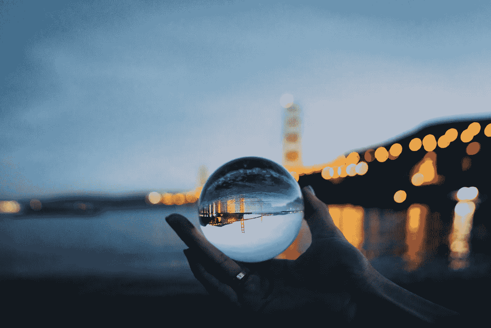

# 期望——希望的源泉和失望的根源

> 原文：<https://medium.com/swlh/expectation-the-source-of-hope-and-the-origin-of-disappointment-a4310ccbe022>

What comes next? (Photo by [Sasha • Stories](https://unsplash.com/photos/v-MCKaHqtvE?utm_source=unsplash&utm_medium=referral&utm_content=creditCopyText) on [Unsplash](https://unsplash.com/search/photos/crystal-ball?utm_source=unsplash&utm_medium=referral&utm_content=creditCopyText))

如果你曾经和小孩子相处过，你可能会被问到，如果你只能拥有一种超能力，你会拥有哪种超能力。我的梦想是飞行。

第二个非常接近的目标是更有效地控制我的思想和情绪的能力，尽管这个目标不会激起孩子们的热情，也不会出现在漫威的漫画中。这个…