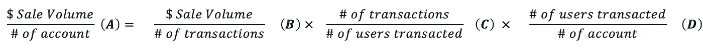

# AB 测试调用框架

> 原文：<https://medium.com/swlh/experiment-call-out-framework-6e8d1bd27f93>

## 测试呼叫的决策框架

喊出 AB 测试结果并不简单。我们仍然没有一个单一的模型或公式可以在不影响决策质量的情况下使测试呼叫无脑。等待 AI 革命继续！

仅仅对关键指标进行标准 T 检验不足以做出决策。这是因为你的用例可能不满足测试的所有假设。也是因为很容易[误用](https://www.nature.com/news/statisticians-issue-warning-over-misuse-of-p-values-1.19503)它。统计学家开始讨论是否是时候让[跨过](https://aeon.co/essays/it-s-time-for-science-to-abandon-the-term-statistically-significant)这道坎了，这是有原因的。

在你的日常工作中，你一定遇到过以下困境

1.  你的主动性给你 1%的提升。电梯的美元价值以百万美元计。唯一的问题是北极星度量没有统计学意义(74%)。
2.  您测试了产品功能。收益 2%。97%的统计显著性。你推进到生产阶段才意识到好处并不存在。你认为这是概率决策的局限性吗？事实是，这里发生了很多你可能错过的事情。经历疲劳可能是一个因素。但是，这可能是测试读数的分析框架不够健全的结果。这篇文章将只传递对分析框架的思考。

[多模型](https://hbr.org/2018/11/why-many-model-thinkers-make-better-decisions)方法是帮助我们穿越这些决策泥潭的便捷工具。与单个模型相比，使用多个模型可以提高决策质量。一个模型弥补了另一个模型的缺口。

这就是我们如何在我们的环境中思考它。我们将逐一解开这些类别。

**1:统计显著性:**

我们需要一个用户友好的平台，在所有相关指标上具有统计意义。这里有两点值得记住。

1.我们不仅要为我们的 Northstar 指标准备好 stat sig，还要为所有其他导致 Northstar 指标的指标准备好。例如，让我们假设我们需要打电话为亚马逊发布一个产品特性。我们想对销售量产生影响。对于这个用例，我们必须将销售量分解成它的组成部分，并对这些组成部分和销售量进行统计。该组件可能如下所示

将指标分解成各个组成部分可以提高决策制定的质量。这也让我们在选择决策时更有信心。这就是为什么它有帮助 1:我们开始了解北极星度量的运动的驱动因素。2:某些指标比其他指标更符合 t 检验标准的假设。3:一些指标比其他指标更快达到显著性。

**2。**序贯检验是一种鲜为人知的统计方法，值得更多的关注。期望我们在[规定持续时间和样本量](https://www.evanmiller.org/how-not-to-run-an-ab-test.html)之前不看实验结果是不现实的。偷看影响决策质量。顺序测试是一种避免偷窥问题的方法。

我们正致力于将此整合到我们的“实验召集决策框架”中。稍后我们将对此进行单独发布。

**2:增长模式一致性(GMC)**

哲学家可能称之为[认知连贯主义](https://en.wikipedia.org/wiki/Coherentism)。对我们来说，这意味着当我们看到一个测试结果时，我们必须在我们对业务的整体理解的背景下看到它。他们说:“你的业务是一个生态系统。你的指标是关键物种。”生态系统的健康取决于所有的物种以及这些物种之间的复杂关系。同样，一家公司的健康是不同元素之间微妙平衡的结果。我们必须努力理解我们业务中所有元素之间的关系。

如果结果不符合我们对用户行为和生态系统的理解，它很可能是一个噪音。如果结果符合我们对生态系统的理解，我们可以继续推出北极星指标中统计上不重要的运动。

这里有几个具体的步骤可以帮助我们理解 GMC 的作用

1.  花时间了解你的生态系统及其组成部分。为你的产品开发一个增长模型。工作量很大，但值得花时间。这将使团队更聪明地提出假设。这也将减少决策所需的资源和时间。没有增长模型并不是忽视 GMC 进行实验的借口。此外，当我们开始在头脑中分析 GMC 实验时，它有助于我们发展洞察力，这将有助于我们发展和完善增长模型
2.  在调查结果时，考虑用户流量。如果用户在做最后一个动作之前需要做两个动作，我们必须看到测试和控制在这些动作中成比例的移动
3.  段。看着数字，想想为什么？你知道你推出的产品功能对回头客的帮助大于对新用户的帮助。你在结果中看出来了吗？如果不是，它是否让你改变了对新回头客行为的理解？要么你需要更新你对用户行为的理解，要么你看到的这个测试的结果就是噪音。

**3:质量数据**

我们都听说过无数次了，定量数据告诉我们“什么”、“何时”、“何地”和“谁”的问题的答案，而定性数据告诉我们“如何”和“为什么”的问题的答案。

“如何”和“为什么”是同样重要的问题。如果我们不了解用户群的动机和需求，我们就无法很好地理解生态系统或开发增长模式。而且，如果我们对生态系统没有很好的理解，我们将在 GMC 上做非常普通的工作。如果不处理好 GMC，我们可能永远无法解决我们在开始时试图解决的困境。

**4:业务重点/产品策略的变化**

倒霉事时有发生。对于一个成长中的企业来说，这种情况确实比我们可能愿意承认的要多。您可能会了解到，您不允许为所有用户启动体验。在最后一刻，您被告知需要根据法律反馈更改信息。业务优先级或新的业务约束的变化只不过是测试设计和实验成功标准的变化。

对商业生态系统的良好理解使我们能够穿越商业约束。
不断变化的业务的实验召唤策略是要很好地处理成功指标的所有组成部分，以及它如何受到治疗变量的影响。

有时候你可能想回去再试验一次。但在某些情况下，您可以针对特定的细分市场推出体验。对于其他部分，您可以只保留合法的治疗变量。但是，也请想办法用替代信息影响漏斗中的用户。

# **解决困境**

为了摆脱开头提出的困境，我们必须求助于许多模型思维。我们必须从不同的角度来看实验结果。

对于困境 1，如果我们看到整个生态系统的积极提升，即使北极星指标不显著，我们也可以继续推出。

对于困境 2，一旦我们在生态系统的背景下观察升力，我们将意识到我们不能将整个 2%的升力归因于我们的经验。这种提升可能来自没有直接接触测试的用户。它可能来自那些没有从测试中获得直接价值的用户。

# **高质量决策的要点**

作为一个组织，要使高质量的决策成为一种规范而不是一次性事件，我们必须将框架生产化。我们必须努力工作，让所有相关信息都可以通过键盘获得。我们必须以一种即使是没有经验的用户也能理解的方式来呈现它。

1.  Stat Sig:我们不仅自动化了北极星指标的 stat sig 数据，还自动化了所有其他领先指标的 stat Sig 数据。
2.  GMC:这个数据是有上下文关系的。但不难得出我们必须为产品的每个部分寻找的必要数据点、漏斗、细分市场和用户流。我们应该努力实现 it 自动化，并准备好这些相关视图以及关于成功指标的“stat sig”数据。
3.  为你的产品或组织的成长模式而努力。冠军所有的测试都不应着眼于移动北极星度量的原因。我们可以将 north start 指标分解成几个部分，并测试试图在这些指标中移动指针的想法。我们不仅致力于北极星度量优化，也致力于漏斗优化或环路优化。
4.  在定义假设和成功标准时要更加深思熟虑。如果您很好地处理了增长循环并定义了您的成功标准，您可能不需要为 GMC 做大量的测试后发布工作。一个小时的假设、测试设计和成功标准的工作抵得上 10 个小时的测试后工作。
5.  尽量将相关的质量数据放在测试结果旁边。它让人们在做决定前更加深思熟虑。