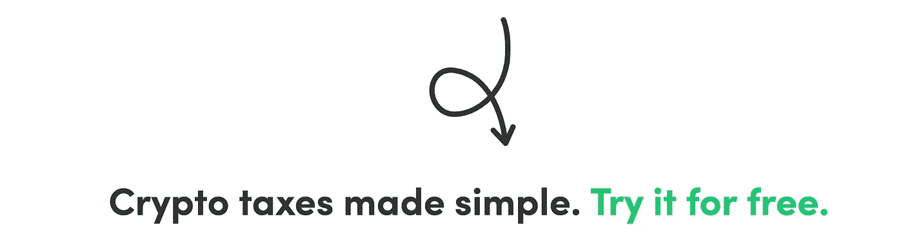

# 等等！你的创业公司是做什么的？

> 原文：<https://medium.com/swlh/explaining-what-my-startup-does-for-friends-n-fam-73da48d95215>

## 一年以来，我一直在分享我的创业，有些人理解，有些人不理解，因为它不是一个迎合所有人的 Instagram 或 Snapchat。鉴于它的特殊地位，我认为它需要一个解释，我很乐意为我的朋友们做这件事。

> 首先，不是“你的创业公司是做什么的？”但应该是“你的创业公司解决什么问题？”

如果你在推特上关注我，或者在现实世界或脸书与我成为朋友，我一直在谈论、工作、思考、发推特，分享很多关于我的创业公司 [BearTax](https://bear.tax) 以及它能为人们做些什么。但是，我从我的朋友那里得到的一个常见问题是，我们在 BearTax 实际上做什么，这有什么关系？

Photo by [Hans-Jurgen Mager](https://unsplash.com/@hansjurgen007?utm_source=unsplash&utm_medium=referral&utm_content=creditCopyText) on [Unsplash](/s/photos/polar-bear?utm_source=unsplash&utm_medium=referral&utm_content=creditCopyText)

这是一个令人敬畏的一年，我很乐意在另一篇文章中分享我的旅程。今天，让我来解释一下我们在 BearTax 实际上做了什么或者 BearTax 能为它的用户做些什么。

> TL；DR: BearTax 是一个软件即服务平台，它可以从多个交易所获取你的**加密货币**交易，并按照特定的顺序将它们与买卖进行匹配，以**为你提供损益文档**(听起来很容易)用于**税务目的**。请阅读更多内容，了解其中涉及的复杂性，以及我们如何帮助用户节省数百小时的手动工作。

# 加密货币

这是一个你可能在一年多前就听说过的术语，伴随着它的大肆宣传。比特币可能是你听过的另一个串联词。没有多少人投资加密货币(相对而言，但他们中的许多人听说过它)。许多人认为这是走向去中心化世界的进步，更多的人仍然对整个事情持怀疑态度。抛开所有的判断，我们中的大多数人可能会交易来试水。

# 玩弄金钱有它的含义

不管你喜不喜欢加密货币；出于信仰投资或交易以获取利润——你必须为你的收益缴税，因为国税局把它视为财产，资本收益规则适用于它。耶！

所以，这有什么大不了的——你买了东西，你卖了东西，知道你买了什么，卖了什么——为什么不弄个计算器，找到收益，然后报告给国税局——够简单了吧？！

# 复杂到什么程度？

像比特币这样的加密货币在世界上成千上万的交易所进行交易——根据 Coinmarketcap.com 的数据，准确地说是今天的 16002 种。不相信我吗？[以下是比特币交易量排名前 400 的交易所名单。](https://coinmarketcap.com/currencies/bitcoin/#markets)

*   所以，它的价格每秒都在变化。
*   每个交易所都不一样。
*   它一年 24x7x365 天不间断交易，市场从不睡觉，不像股票！
*   想象一下，不仅仅是比特币，还有 1500 多个！
*   哇哦。你知道吗，从一个加密程序交易到另一个加密程序是要征税的——你怎么计算像美元这样的法定货币的收益呢？举个例子，如果你把比特币转换成 Ripple，用它来购买莱特币，为了安全起见，你从一家交易所退出，把它存回去买以太坊，用它来购买 ICO(这里相当于 IPO)中的一些代币。
*   这些行为中哪些是应纳税的，哪些是不应纳税的？
*   如果你是日内交易者，你如何跟踪每秒的价格？
*   当你在年底看你的交易时，你是如何协调每件事的？

除此之外，如果你买了 1 个比特币，你就可以大块卖出，不像股票。因此，必须应用 FIFO 之类的算法来跟踪购买价格。

如果你有 10-20 笔交易，你可以手工操作，但是想想 100 笔交易，200 笔交易，1000 笔交易，10K 交易——想象一下一个普通人或会计师需要付出的努力。

> [BearTax](https://bear.tax) 只需几分钟就能为您搞定一切！

是的，它可以理解什么是**应税事件**，它知道如何**智能地匹配存款和取款**以保持分配给一定数量数字货币的正确购买价格，它可以**获取超过 1500 种加密货币在任何一天任何给定时间戳的价格**，它可以从加密到加密交易**衍生出法定交易**(例如:用 BTC 购买 ETH，意思是用美元出售 BTC，用美元购买 ETH)。

3 step mantra we promote at BearTax — Consolidate, Review & Download Tax documents

*这些是我们作为* ***解决方案*** *构建的功能，用于解决加密货币交易员和会计师面临的棘手问题*

# 我们在 BearTax 提供的解决方案

*   [**B2C 税务协助平台**](https://bear.tax) 用户在此注册并使用生成税务单据
*   [B2B 平台，供**注册会计师**](https://bear.tax/cpas.html) **和会计师事务所**管理客户交易和税务文件
*   [按需处理引擎](https://bear.tax/exchanges.html)用于**加密货币交易所**处理其用户的交易并交付税务文件。
*   为**对冲基金和基金管理人**整合交易并根据其需求进行处理的平台即服务

[www.bear.tax](https://bear.tax)

这就是我们在 BearTax 为世界解决的问题。我们希望让人们更容易合并和计算纳税义务，并在推动加密货币在全球的主流采用方面发挥我们的作用。我们位于佐治亚州亚特兰大**的小团队正在朝着我们的目标努力**

> 同样，这不是“你的创业公司是做什么的？”但应该是“你的创业公司解决什么问题？”

## 要了解更多关于 BearTax 的信息，请在[推特](https://twitter.com/bear_tax)上关注我们的最新动态，看看我们满意的用户[在](https://facebook.com/beartaxapp/review)[脸书](https://facebook.com/beartaxapp)上说了什么，并加入我们[电报](https://t.me/beartax)组的讨论。

如果你喜欢我解释我的创业的尝试，尽可能多次点击鼓掌按钮，并与你的朋友分享。这促使我写更多这样的内容。敬请关注 BearTax 上关于技术和营销努力的文章，它可以帮助任何 SaaS 的创业公司。

## 这篇文章发表在 [The Startup](https://medium.com/swlh) 上，这是 Medium 最大的创业刊物，拥有+426，678 名读者。

## 在此订阅接收[我们的头条新闻](https://growthsupply.com/the-startup-newsletter/)。

