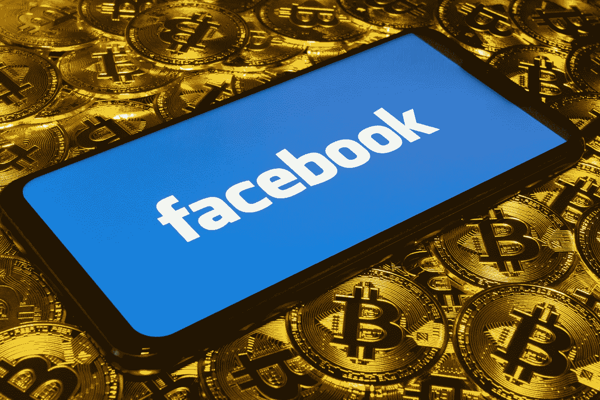

# 脸书硬币——加密货币市场的胜利还是 NWO 的噩梦？

> 原文：<https://medium.com/swlh/facebook-coin-cryptocurrency-market-win-or-nwo-nightmare-ed7bee03858e>

*   脸书已经证实，它将在 2020 年 Q1 发布自己的加密货币和加密支付系统
*   脸书将其新的加密货币命名为“全球硬币”，而不是脸书硬币
*   像 Cardano 的 Charles Hoskinson 这样的加密领域的杰出人物，已经在警告未来脸书对数字货币的垄断

# 脸书备受期待的全球硬币让人们产生了分歧

多年来，加密货币市场评论员一直猜测所谓的“脸书硬币”可能即将出现。即由脸书创建的加密货币，以货币化用户内容并促进对等用户支付。评论员的推测现在是正确的。

# 什么是全球币？

2019 年 5 月 24 日，脸书宣布进军加密货币领域。然而，定于 2020 年推出的加密货币不会被称为脸书币。相反，脸书目前已经选定了“全球硬币”这个名字

全球硬币将如何运作仍然是个谜。然而，我们确实知道脸书正在以符合监管批准的方式开发全球硬币，并将在 Instagram、WhatsApp 和 Facebook Messenger 上推出支付。

*   全球硬币是由领先的加密货币经济学家和开发者开发的，如麻省理工学院的克里斯蒂安·卡塔利尼
*   据报道，领先的金融行业内部人士会见了脸书，如英国央行行长马克·卡尼
*   脸书鼓励零售商在用户使用全球硬币支付时，为脸书上市的产品提供折扣，以激励用户采用加密货币

# 脸书想与微信抗衡

全球硬币最终将如何显现仍是一个猜测。不过，可以肯定的是，脸书希望利用其数字货币来效仿中国社交媒体平台微信的商业成功。

# 微信是什么？

在中国，领先的社交媒体平台微信推出了一款移动支付应用，每月处理的支付量超过 PayPal 和 Apple Pay 的总和。使用微信的移动支付如此普遍，以至于许多零售商拒绝接受法定现金。这导致在 2018 年，[中国人民银行](http://techgenix.com/alipay-and-wechat-pay/)不得不在全国范围内发布提醒，中国人民银行发行的现金仍然是法定货币。

微信在中国如此受欢迎，以至于许多中国人都没有银行账户。这个流行的社交媒体应用程序允许用户支付消费品，也可以借钱给朋友和家人。然而，这也带来了重大的社会挑战。

# 全球硬币可能成为极权主义的噩梦

想象一下成为一名国际电影明星。现在想象一下，你正在为一次国际航班打包行李，却在登机口被拒绝登机。现在想象一下，你发现政府没收了你所有的财富，你再也不能自由旅行，在社交媒体上交流，甚至谋生。

以上所有可能听起来像奥威尔式的。不过以上都准确描述了 2018 年中国 Xmen 女星[范冰冰](https://www.weeklyblitz.net/news/chinas-social-credit-system-coming-towards-america/)发生了什么。

微信在中国是中国社会信用体系的重要组成部分。因此，如果一个人触犯了法律或被怀疑有不法行为，他们可能会发现无法旅行，甚至无法购买日常必需品。

# 脸书是下一个微信吗？

脸书成为微信和中国社会信用体系的等价物的想法听起来可能很荒谬。然而，近年来，脸书因禁止直言不讳的保守派用户的账户而受到批评。

在最近的一个案例中，一群 160 万名 [CrossFit 健身爱好者被脸书](https://www.theverge.com/tldr/2019/5/24/18638670/crossfit-facebook-instagram-suspends-delete)无缘无故禁止。这促使 CrossFit 自己公开宣布自愿删除其所有脸书附属社交媒体账户。给出的理由包括:

*   脸书收集用户信息并与政府机构和情报机构共享
*   在公司、政治和政府利益集团的命令下，脸书无缘无故地禁止用户账户
*   脸书经常审查新闻内容，这反映了对左派的片面政治偏见

全球硬币受到批评，因为它可能是为了模仿中国日益增长的基于微信的无现金社会。因此，要实现这一点，脸书和环球硬币将不得不垄断移动支付市场，这可能非常危险。

# 脸书创造的数字货币可能不会受欢迎

除了对移动支付垄断的担忧，一些人认为脸书创造的数字货币可能无法激起真正的脸书用户的兴趣。正如 TradeShift 首席执行官 Christian Lanng 所指出的，脸书已经试图在 2015 年垄断移动支付市场，通过其 Messenger 应用程序引入支付。

尽管进行了代价高昂的营销活动，但脸书支付未能抓住脸书 28 亿用户的想象力。因此，今年早些时候，脸书在欧洲推出了其支付服务。

# 投资者应该考虑投资脸书硬币吗？

当全球硬币在 2020 年 Q1 推出时，它无疑会引发一波兴奋的投资者兴趣。脸书是世界上最大的社交媒体平台。如果全球硬币有一个有限的总供应量和实际效用价值，因此，它可能会成为一个顶级令牌投资尽早。

遗憾的是，脸书还没有正式宣布硬币最初将如何发行。他们也没有说明硬币将如何工作。在这种情况下，投资者将不得不等待更多细节的发布，然后再规划最初的投资策略。

*原载于 2019 年 6 月 18 日*[*【https://bittreo.com*](https://bittreo.com/global-coin/)*。*