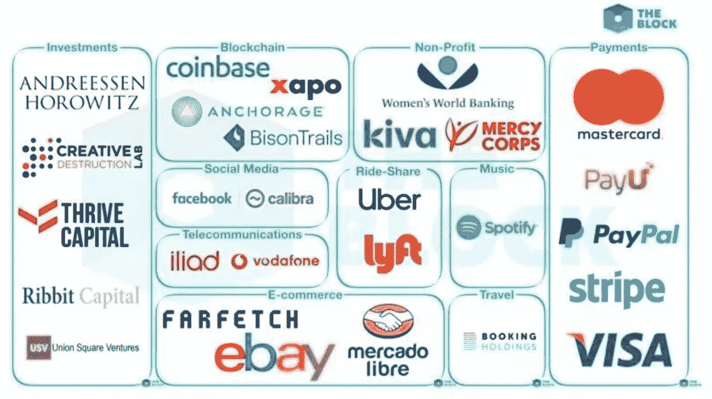

# 脸书数字货币:起源、意义和后果

> 原文：<https://medium.com/swlh/facebook-digital-currency-origin-meaning-and-consequences-5a5016afcb9d>

6 月 18 日，脸书的瑞士子公司 Libra Network (Libra Network)将发布其加密数字货币项目白皮书。此前 BBC 报道称，这种数字货币名为 GlobalCoin，翻译过来就是“全球货币”。但后来有报道称，GlobalCoin 只是其员工的内部昵称。数字货币的正式名称是 Libra(天秤座)。虽然名字没有 GlobalCoin 尖锐，但是 Libra 本身象征着平衡和公平，Libra 听起来也像 LIBOR(伦敦银行间同业拆放利率)，所以可以说这个名字还是凸显了始作俑者的野心和一点点叛逆精神。

数字货币项目一般的做法是先发行白皮书，之后发行半年到一年的数字货币。白皮书的发布意味着 Libra 项目进入倒计时。从目前透露的信息来看，脸书数字货币是基于区块链的，将于 2020 年第一季度正式发行。据区块链媒体 THE BLOCK 报道[1]，该计划将建立一个由 100 个合作联盟节点组成的数字经济。目前，Visa、万事达、优步、Paypal 等公司已经签约成为创始节点。随着时间的推移，脸书和 WhatsApp 的全球用户总数将达到 27 亿。

脸书数字货币的推出并不是孤立的，在此之前已经发生了一系列事件，包括:

Figure 1\. The Facebook digital currency partner reported by The Block (picture from The Block)

2018 年 7 月，纽约证券交易所的实际所有者 ICE 与微软、波士顿咨询集团和星巴克合作，成立了加密数字资产服务 Bakkt。
2019 年 2 月，摩根大通发布数字货币摩根币进行机构间清算
2019 年 3 月，IBM 宣布跨境支付区块链世界有线
2019 年 6 月 12 日，Visa 宣布跨境支付区块链网络 B2B Connect

上述一系列事件表明，美国主流经济正逐渐接受区块链和数字货币。但这些东西的影响与即将到来的脸书数字货币相比就相形见绌了。脸书数字货币将是 2009 年比特币主网上线后，加密数字货币领域最重大的事件，标志着非国家发行的数字货币应用从 1.0 升级到 2.0。区块链、数字货币、穿越经济将因此一步到位进入互联网和金融科技的主战场，成为数字经济下一阶段的主角。

由于众所周知的原因，面对如此重大的事件，中国的相关产业无法做出反应，这是非常令人担忧的。必须认识到，如果中国不积极参与数字经济革命的这一新阶段，不仅会在新的竞争中完全处于被动，而且在互联网和金融科技领域已经获得的优势也可能会丧失。

经过媒体报道，人们对脸书数字货币的发行有了一定的了解，但可能并不清楚其中的含义。因此，本文将对这一事件进行介绍和分析，主要围绕以下四个问题:

一、脸书推出加密数字计划的动机是什么？

二、脸书数字货币的战略目标和意义是什么？

第三，脸书数字货币的后果是什么？

第四，我们该怎么办？

本文将从目前已经报道的事实出发，以及加密数字货币本身的发展规律，沿着合理的逻辑路径对上述问题进行分析。我们希望这些想法将激发更多关于脸书数字货币和加密数字经济的研究和讨论。限于自己的见识，我们的观点难免有偏颇和延迟，我们愿意接受各界的批评和指责。

1.脸书启动数字货币的直接动机

脸书推出数字货币计划的动机相对简单。这是脸书决策者对 2018 年隐私泄露丑闻的直接回应。

丑闻爆发于 2018 年 3 月。当时有内部线路透露给美国媒体。脸书违反了用户协议，向一家大数据分析公司提供了超过 5000 万用户的隐私数据，这可能会影响舆论和政治投票。由于川普治下美国独特的政治气候，这一事件被一再放大，关于脸书各种侵犯用户隐私数据的事实被一一曝光。傲慢的扎克伯格和他的主要助手桑德伯格被依次带上美国国会听证会，大批退休员工倒戈，媒体陷入一片混乱。就连他以前的企业家也公开建议拆分。脸书。在这种情况下，脸书的前景自 2004 年建国以来首次蒙上阴影。

最近的欧洲之行加深了扎克伯格对脸书未来的担忧。2018 年 5 月，《通用数据保护法》(GDPR)在欧盟生效。与此同时，扎克伯格出席了欧洲议会的两场听证会，并接受了质询。第一次相对温和，而第二次是致命的。随后，扎克伯格因拒绝前往英国接受质询而差点被捕，让他清楚地意识到，在美国，尤其是在欧洲，脸书目前的商业模式将面临根本性的威胁。

简单来说，脸书的商业模式就是通过无偿或低成本获取用户数据，通过高水平的大数据分析精准刻画用户特征和喜好，精准推送广告，赚取广告费。

这种商业模式是脸书首创，也是极致。脸书投入大量资源，汇聚全球最优秀的科技精英，将实时大数据分析和计算广告推向无人能及的水平，极大地推动了人工智能技术的发展。然而，这种模式有一个致命的问题，它需要分析用户数据的权利。当欧美国家的用户数据保护新规则开始逐步建立，用户数据的所有权和控制权被明确分配给用户。脸书必须在用户明确授权并支付对价后对数据进行分析。事实上，这意味着其原有商业模式的成本和风险将大幅增加，甚至可能在未来变得无利可图。脸书需要寻找新的商业模式。

激发重大变革和创新最有效的方法，就是把一个拥有巨大资源和远见、勇气的人推到悬崖边上。据报道，不迟于 2018 年 6 月，扎克伯格及其核心员工已经大致确定将加密数字货币的使用作为新的战略突破口，150 人的团队已经开始实质性推进。

具体决策过程尚未为外界所知，但扎克伯格做出这个决定，一方面是形势使然，另一方面也凸显了其个性和魄力。平心而论，数字货币不是脸书的自然选择，也不是最安全、最合理的选择。2018 年，脸书的净利润达到 250 亿美元，用户超过 26 亿，市值超过 5000 亿美元。他站在了行业的制高点，拥有全球最大的用户群和源源不断的现金。如果安全的话，脸书可以在电子商务、云计算甚至搜索领域与其他巨头并驾齐驱。即使想做金融科技，也有大量传统成熟的模式可供选择。可以说，扎克伯格最终选择区块链加密数字货币作为主攻方向，非同一般。已经超越了简单的“找路”的意义，必须有更高的战略目标。

2.脸书的数字货币战略目标

我们不希望脸书公开宣布其数字货币计划的完整战略。但是，如果我们充分理解锚定法定货币的加密数字货币的本质，再加上合理的逻辑推演，我们可以得出这样的结论:在脸书发行数字货币之后，未来有可能实现三个层次的战略目标，即:

第一层，获得新的盈利模式。

第二层成为全球数字经济的中央银行。

第三层，脸书数字经济帝国的建立。

2.1 获得新的盈利模式

Libra 能够在不侵犯用户隐私的情况下让脸书进入庞大的支付业务，并从最高点切入金融科技领域，赚取巨额收入和利润。

互联网支付是金融科技的基础，规模巨大，利润丰厚。2018 年，中国互联网第三方支付产生了约 28 万亿美元的交易，用户不到 6 亿。脸书可以有效地将用户转化为天秤座。经过几年的发展，一年承载 50 到 80 万亿美元的交易额不是天方夜谭。这意味着 Libra 只需要收取千分之二的费用，费用收入高于目前的脸书收入，而这一切都不需要过多的用户数据，在端到端加密的情况下。执行。

跨境支付也是一块大蛋糕。全球跨境支付业务的总规模目前为 125 万亿美元，利润丰厚。经常出国旅游的人都知道，在国外零售窗口兑换现金，手续费往往是 3 到 7 个百分点。如果在离开时将没有花掉的外汇换回本国货币，现金的买入价和卖出价之间可能存在高达百分之十的价差。通过 Libra 的统一数字货币系统，脸书可以将用户在这方面的交易成本降低一个数量级，扼杀传统的兑换业务，它仍然可以获得高额利润。

此外，天秤座的另一项能力是结合脸书固有的业务，在避免用户数据过度收集的同时，为互联网广告业务注入新的生命。具体来说，脸书可以在其社交网络、游戏和其他业务中建立一个基于 Libra 的证书激励系统。Libra rewards 不是过度分析用户数据，而是可以配合一个直通的二级市场，在不知道用户具体喜好的情况下，鼓励用户点击广告，引导用户深度互动。此外，这种传递激励系统还可以将每个用户转化为其广告销售或分销渠道。例如，用户通过与广告互动获得优惠券，但他不需要它。在传统的互联网广告模式中，事情已经结束了。但在直通式激励模式下，用户可以通过自有渠道或二级市场转让和销售这张优惠卡，并获得相应的佣金奖励。因此，这些用户事实上已经成为脸书广告业务的分销渠道，脸书完全依靠市场机制在不侵犯用户隐私的情况下将广告提升到一个新的水平。

当然，我们也可以完全想象脸书与银行、基金、证券公司、交易所、保险公司等传统金融机构合作。，在自己的体系内创造各种金融产品，成为用户的金融服务，全球最大的金融机构。中介，赚取高额中介费。

因此，天秤座有能力为脸书创造新的盈利模式，不仅可以摆脱现有盈利模式被颠覆的威胁，还可以让脸书在互联网领域迈出新的一大步。
我们认为这绝不是脸书释放天秤座的最高目标。

2.2 数字经济中央银行

It is said that Libra will anchor a basket of currencies consisting of multi-country currency, which sounds similar to the International Monetary Fund’s Special Drawing Rights (SDR) and is similar to the renminbi after 2005\. This means that Libra is a so-called “stabilized currency” in the field of encrypted digital currency and the economy of the economy, to control price fluctuations within a certain range, and not to provide incentives through the appreciation of the certificate. Instead, Libra will pay dividends to the holder, bringing the entire system closer to a bank.

We believe that Facebook is hoping to upgrade to a superbank that has both coin and credit rights in the digital economy world through the Libra project.

The key here is the right to issue currency, or simply the coinage. According to Professor Benjamin Cohen, the essence of coinage is to avoid the burden of adjusting costs by delaying and passing on others [2]. To put it in a more common way, it is the power to delay and pass on debts after debts. For example, an entity that owns the coinage rights, while acknowledging that its issued currency is its own liability, will also indicate the mortgage assets corresponding to these liabilities on the statement, but has no obligation to pay the currency holders. Although the central bank needs to clearly indicate on the balance sheet how much gold, foreign exchange, treasury bonds and other assets behind the currency are used as collateral and support, when an ordinary person takes money to go to the central bank to convert into gold, foreign exchange or treasury bills, The central bank will not accept it. The central bank may be the only institution with this privilege under the current legal system.

So can Facebook have such privileges through Libra? To answer this question, we need to figure out the implementation mechanism of the encrypted digital stable currency.

The first thing to note is that stabilizing coins is actually a pseudo-concept, and there is no such thing as a stable currency in the world. The so-called stable currency is actually just a convenient exchange name. In the field of encrypted digital currency, it usually refers to the digital currency whose price bites an external target. That is to say, the stability of the stable currency is not the stability of its purchasing power, but the stability of its relative currency price with respect to the anchoring target.

At present, there are roughly three ideas for realizing stable coins.

The first is the legal currency debt mortgage. In layman’s terms, a certain amount of legal currency is mortgaged to the depository, and then the same number of digital currencies are issued on the chain. Every digital currency has equivalent currency collateral behind it. Once the digital currency holder asks to exchange the legal currency, the issuer must immediately cash it in equal amounts. In this sense, the stable currency is only the symbol of the legal currency debt issued on the blockchain. In the case of 100% cash preparation, the model itself has neither expanded nor contracted the circulation of legal currency. It only moved part of the legal currency to the blockchain, and the issuer does not really have the coinage right.

The second is the mortgage of digital assets. This is a unique pattern on the blockchain that collateralizes the decentralized digital assets (bitcoin, Ethereum, etc.) on the blockchain into a smart contract to issue a digital currency that is stable relative to the legal currency. The representative of this model is the MakerDAO project. This way can be considered to have “partial coinage.” On the one hand, smart contracts can choose the type of coin-casting assets themselves. This is the unique power of the central bank. On the other hand, the digital currency sent out in this way is redeemable. Users can redeem these digital currencies as collateral assets at their disposal through smart contracts, which is different from the central bank’s currency.

The third is the algorithm central bank, which simulates the central bank’s algorithm of adjusting the money supply according to CPI or a basket of currency prices, and flexibly expands and contracts the digital money supply by sensing the supply and demand relationship of the market, trying to achieve price stability. This is a way of fully owning the coinage, completely simulating central bank operations. However, because there is no injection of government authority, this model is only a simple example, and there are no successful examples.

What is the way Libra will be implemented?

We believe that in the short term, Libra will be issued as a legal currency debt collateral. In the long run, Libra will adopt a hybrid model to achieve the factual mastery of the coinage.

According to information disclosed in relevant media reports, Libra will not anchor a legal currency but anchor a basket of currencies. That is to say, in the early stages of its development, Libra will reserve a certain amount of cash in the proportion determined by the currency basket, and issue digital currency as a mortgage. This is the easiest way, the most cautious, the most acceptable for regulation, and Facebook’s ability is enough to do it.

In order to achieve this, Libra has to find a currency basket and can cash in a variety of legal currencies. In order to achieve this, Facebook must find business partners around the world, allowing users to freely convert Libra into corresponding legal currency. To this end, Facebook will share the coinage rights with these partners.

What really matters is that Libra has been running stable for several years. At that time, the digital economy of e-commerce, games, services, and finance will be established in the Facebook network. A large number of products and services will be directly quoted by Libra and accepted by Libra. Global Facebook users will gradually establish direct trust in Libra’s local currency. In other words, people trust Libra’s value no longer because it can be easily converted into French currency, no longer because of the support of any third-party assets, but only Libra, just because of the entire Facebook social network and countless More than two billion people in the secondary market are willing to actively accept Libra for their assets, cash, products, and services.

At this point, it means that a large part, or even the vast majority, of Libra in circulation, only circulates within the Facebook digital economy and will not be honored. Facebook will still provide a promise of fulfillment, but in fact does not need to bear the obligation to redeem, which gives it a certain right to add Libra by purchasing or trading various assets. And this is the de facto coinage.

This partly explains why Libra does not anchor the dollar directly but rather anchors a currency basket. If Libra anchors the dollar, then when Libra masters the coinage, Facebook will, in fact, become another dollar central bank outside the Fed. This matter is too big a political or conceptual impact and must be circumvented. Anchoring a currency basket actually creates an independent currency, that is, Facebook is going to be the central bank, but the central bank of an independent digital economy, not the second dollar central bank.

2.3 数字经济帝国
也许人们要问了，即使脸书成为数字经济央行，会发生什么？我们相信，脸书将通过 100 家盟友建立自己的金融银团系统，并以此为基础建立强大的数字经济帝国。

脸书与 100 个盟国之间将建立怎样的治理关系，如何与盟国分享铸币权，是否被赋予信用扩张权，目前尚未可知。无论如何，可以肯定的是，这些节点，在足够的激励下，将成为脸书数字经济在各个地区和行业的代表。它们将带动 27 亿用户在这个经济体中运营、创业、投资、交易、相互提供服务，从事各种各样的金融活动。事实上，这将在互联网上创造一个完全数字化的经济帝国。假以时日，这个数字经济帝国的 GDP 可能会超过世界上大多数国家，并逐渐建立起自己的一套治理体系。

而作为这个世界的政府和中央银行，脸书将完全进化成一个新物种。当今世界的其他一切，无论大小，都已经和这样的脸书处于完全不同的水平。

3.结果

从中长期来看，脸书数字货币将会造成一系列复杂而深远的后果。对这些后果的全面分析远远超出了本文的范围，在这里我们将重点讨论其中的四个。

3.1 加密数字货币成为不可逆转的趋势

2009 年 1 月 3 日比特币网络上线后，加密数字货币作为人类经济史上的新生事物诞生了。经过十年的发展，加密数字货币已经具备了一定的规模，取得了长足的发展。但同时，由于其对传统货币理论和体系的冲击，也由于这一新生事物的不成熟，加密数字货币也遭受了巨大的争议和压力，有各种势力希望将其扼杀在萌芽状态。，把它从历史和现实中抹去。应该说，在脸书数字货币发行之前，扭转历史趋势的可能性仍然存在。之后，在 100 多个组织和 27 亿全球用户被卷入这一历史进程后，这种可能性已经完全消失，没有任何人或组织能够阻止加密数字货币的发展。

当然，对于加密数字货币行业内部来说，互联网巨头的加入本身就是一个转折点。在此之前，这场运动基本上由一小撮理想主义者主导，他们提出了金融民主化、开放金融、循证经济、无边界金融、去中心化经济等一系列口号。全球公众带来了不同的选择。当脸书这样的巨人加入，这项运动将从理想主义的 1.0 升级到商业的 2.0。理想主义将永远是这场运动的一部分，但资本和商业的力量将逐渐发挥主导作用。虽然无奈，但这是历史的必然。

好消息是，这一过程将再次激发大量创新和财富创造，并催生新的数字经济巨头，带来又一个充满激情的创业时代。

3.2 货币竞争原子化

One of the original goals of Bitcoin was to ensure that everyone had complete control over their digital assets. To this end, Nakamoto has made the Bitcoin network a peer-to-peer, freely accessible anonymous payment network, making pervasive and non-rejective properties a natural feature of blockchain payment networks. As a result, the digital currency on the blockchain can directly penetrate every scene in daily life, resulting in atomic competition between different currencies.

There are many definitions of blockchains, but from the perspective of discussing Facebook’s digital currency, it should be seen as a super-sovereign, open payment and financial network on the Internet.

In layman’s terms, the payment network is a “money-going” network, and the financial network will take notes, securities and other financial data in addition to money. Today’s mainstream payment and financial networks are centralized. The Internet that we are familiar with is two separate networks, which are generally constructed by the central bank and the financial institutions of the banks. China’s second-generation CNAPS (China Modern Payment System) and CNFN (China National Financial Network) are the world’s most advanced national payment systems and financial core networks established on a centralized infrastructure. We need to move even a penny between bank accounts through bank counter services, ATM, online banking and Internet third-party payment, all through the network system.

The traditional sovereign currency can obtain a monopoly position in a sovereign state, except for legal and ideological norms, because the state can ensure that only the payment network of the sovereign currency can exist legally in its territory, while other sovereign currencies Payment network is different. For example, the reason why the renminbi cannot be circulated in Japan is not that the Japanese police supervise various businesses all day, using batons to force them to refuse renminbi payments, but because the Japanese government can easily prohibit renminbi payments and financial networks from being laid out in Japan. , that is, to conduct rejection management.

Why can the government easily manage rejection? It is because the centralized financial network structure is very complicated, and the scale and construction cost are also very large. If you want to lay it in other countries, the cost is high and the situation is large and must be approved by the government.

But the blockchain has turned it all over. What is the nature of the blockchain? It is to put the core network of payment and finance directly on the Internet, without the need for licenses, paving lines, and building a lot of infrastructures. Anyone who wants to use only one mobile phone can freely connect to the payment network at a very low cost close to zero and use digital currency to complete the payment transaction.

In fact, in the past decade, Bitcoin has fully demonstrated the characteristics and power of super-sovereign payment networks. The blockchain 2.0 technology represented by Ethereum shows that the blockchain has sufficient potential to develop into a super-sovereign financial infrastructure, not just a payment network. Any user, without the approval and authorization of anyone, or with a license, can create, store, pay and trade digital assets in the blockchain, and participate in various complex financial and trade activities such as investment and financing. Unless the government completely serves the Internet or checks everybody’s Internet terminal equipment without interruption, there is no way to ban this behavior.

For today’s sovereign countries, if the government can effectively manage its domestic payment financial network, within the country, the official method currency can dominate the world. Trading and competition between different sovereign currencies can only take place on the border, that is, in the foreign exchange market. However, when the blockchain, a super-sovereign global payment finance network, directly penetrates the nerve endings of the economy, the traditional currency border ceases to exist, and multiple currencies will coexist under the same scene.

The Facebook digital currency blockchain will have 2.7 billion mobile terminals, and each of its mobile apps will become a “light node” or “wallet” for Libra’s payment network, and any user can connect to the payment network at any time. . Libra is expected to be the world’s first and largest cross-border, super-sovereign digital currency payment network. In this case, the government’s ability to limit and manage the payment network will be greatly weakened, and it is almost impossible to achieve such a rejection of the payment network. In other words, this payment network can penetrate into any sovereign currency zone at any time, coexist and compete with it.

After Facebook, there will also be some new transnational, super-sovereign digital currencies. In the future, every user needs to choose one of several currencies in daily payment. The currency competition is directly carried out at the level of atomic trading, which will have a great impact on the existing monopoly of the domestic currency.

3.3 跨国公司联盟主导货币非国有化进程

The digital currency dominated by Facebook and its business allies is a typical non-state currency. The emergence of this situation fully confirms Hayek’s vision and judgment on currency development in the 1970s [3].

Libra is a non-nationalized digital currency operated by a super Internet giant and supported by 100 partners. It is expected that the coinage, governance, and proceeds of this digital currency will be distributed among the 100 “nodes” according to a set of rules. Therefore, compared to Bitcoin and Ethereum, it is centralized, but it is decentralized relative to the existing sovereign currency. It may still represent the interests of a small group in the final analysis, but there are more democratization and sharing spirit in the specific governance model, which is somewhat transcendental compared to the existing sovereign currency. This must be acknowledged.

Since the emergence of the currency, it has always had both economic and political functions. On the one hand, it is the exchange medium, value storage, and accounting unit, on the other hand, it is a symbol of the state’s political power. As Mundell said, “a powerful country with a strong currency.” A country can force its citizens to use and only use the officially issued currency, reflecting the ability of the regime to rule within. Correspondingly, a sovereign currency can be widely used outside the country, and it will also be regarded as a sign that the country’s powerful forces are overflowing and Ze is the best in the world. Therefore, competition between currencies has been given strong political significance.

However, with the advancement of globalization, the scale of international trade has expanded rapidly. In order to reduce transaction costs, people need a unified world currency. For this reason, they have to choose the sovereign currency of the most powerful countries as the international trade and reserve currency, that is, the world currency. In the past, Athens’s silver coins, Byzantine gold coins, Florence’s Florin, the Dutch guilder, the Spanish peso, and the British pound have all played the role of international currency, and today, this role is undoubtedly the dollar.

However, using a sovereign currency to act as a world currency brings many problems. On the one hand, the issuing country of this world currency does enjoy the privilege of collecting a coinage tax to the whole world, which is itself a huge unfairness. On the other hand, this privilege is also countering the issuer of the world currency. The famous Triffin paradox pointed out that since all countries need to reserve the world currency, the issuer of this world currency has an obligation to provide additional money supply to other countries, which will lead to the country’s long-term trade deficit, and ultimately the economy will It is weakened and thus jeopardizes the status of this world currency. What the United States is facing now is actually the case.

The ideal world currency should be a single supranational currency, which would be the most economically efficient, least politically controversial, and the lowest transaction cost. Mundell once said that the optimal amount of money is just like the optimal number of God — “is odd, preferably less than three.” If more than 200 sovereign countries and regions around the world can sit down and agree on a plan to form a unified world currency, then, of course, it is the best. However, in the current situation of political fragmentation, big country game, and civilized conflict, the above assumption is tantamount to the Arabian Nights.

Facebook Digital Currency has opened up a new way of thinking. Since the country can’t do it, multinational companies can do it. Libra, a cross-border, super-sovereign, coalition, non-nationalized digital currency, is naturally in line with the interests of multinational corporations. It will effectively reduce the transaction costs between multinational companies and between different regions, and greatly improve the efficiency of collaboration, which is what multinational companies can’t ask for. No force can stop the combination of multinational companies and digital currencies.

There is the reason to believe that Facebook was only the first crab-tester and the first rebels among the Roman legions. Hundreds of multinational economic organizations will use Facebook’s digital currency as a platform to conduct a series of innovative attempts in incentives, governance, and legal compliance. Once it completes the fire test, other multinational companies will flock to it. Technology companies such as Google, Microsoft, Amazon, and IBM, as well as some self-breaking financial institutions on Wall Street, will be involved. The alliance of multinational corporations will dominate the development of non-nationalized digital currencies. The alliance between sovereign states and enterprises formed over the past 100 years will be forced to restructure. The globalization of capitalism will also enter a new stage.

3.4 Opening a new battlefield for the game of the digital economy

脸书当然不是生活在一个无法无天的世界，包括美国，各国政府也不会高兴地放弃难以建立的主权货币体系。如果天秤要对抗所有国家的所有主权货币，那就没机会了。扎克伯格必须考虑如何在现有体系的缝隙中为天秤座找到立足之地。我们认为，天秤很可能在这个过程中与美元结盟。

美元作为当前的世界货币，在相当长的一段时间内都无法受到挑战。然而，其主导地位主要体现在国际贸易、投资和外汇储备方面。由于美元支付网络也可以很容易地被主权国家区分，因此美元不能够进入居民的日常支付和公司间贸易，特别是在数字经济中。

然而，天秤座可以做美元做不到的事情。如前所述，脸书数字经济中的用户可以围绕 Libra 构建自己的新数字经济生活，在这里他们可以创造、雇佣、购物、旅行、消费、购买保险等等。

更重要的是，天秤座是一种“民间”货币，没有美元那种强烈的政治色彩。同时，天秤座的分布式治理结构和“利益共享”激励程度会比美元更好地平衡各方利益，也更容易被接受。

反过来，对于天秤座来说，会长期定位于数字经济，不会进入国际实物贸易和大额投资领域挑战美元。相反，没有美国的支持和推动，它的发展必然会遇到很多阻力。因此，它也有动力与美元形成某种形式的联盟。

当然，在某些特定场景下，天秤与美元有竞争但更多的是互补。美元和天秤的联系，在双方都需要对方的情况下，是大概率事件。

我们判断，美国政府和美联储可能还没有形成 Libra 超主权数字货币的定义，但他们的制度和习惯会让 Libra 这样的项目走得很远。第一批宣布的天秤座节点大多是美国公司和实体，他们不太可能抵御与美元结盟的压力和诱惑。因此，几乎不可避免的是，Libra 将在某种程度上成为全球数字经济领域美元体系的事实代表。从技术上来说，这并不是一件难事，但从结果上来说，意义极其重大，将使美国在数字经济竞争中取得显著的先发优势。

一旦天秤与美元结盟，从长远来看，政府尤其是民主国家的政府很难威慑天秤对其数字经济的渗透。更合理的选择只能是与脸书及其盟友合作，在税收、监管和犯罪预防等领域找到体面的解决方案。

综上所述，虽然数字货币始于 cryptanaps 的自由主义理想，但资本、国家权力一定会延伸到数字经济空间，这是不以一个理想主义者的意志为转移的。天秤座是这个过程中的一个重要事件。

4.对我们的影响

At this point, our analysis of Libra is nearing completion. But we can’t help but think about it. What does this matter mean for China? What should we learn from?

Here we talk about our own views.

First, this means that China must participate in this new competition in the digital economy and cannot escape.

We understand that for China, digital currency is an option with huge risks and opportunities. However, the launch of Libra indicates to us that such a battle for a new digital economy continent is about to open. We cannot afford the consequences of absence.

We understand people’s concerns. In the financial sector, due to the huge advantages of the US dollar and the US financial industry, and because of the inherent problems of China’s financial industry, the digital currency may be used to break China’s financial firewalls, causing asset outflows, financial risks to accumulate, and even wealth being looted. The risk is Very clear.

Therefore, nowadays, many people in the country want to bury their heads in the sand, and this thing does not exist. Some people think that they can resist the enemy outside the country through administrative and technical means, and they are lagging behind the world trend. Some people have a chance to be lucky and hope that the foreign government will collectively act to block the digital currency and reverse the historical trend. For example, a few days ago, the Indian Congress moved to severely punish the participation in bitcoin transactions. Many people were encouraged to think that the governments of the world would go to learn India. They did not know whether they had a similar illusion when they were in India three years ago.

If objective, unbiased and delusional observations on the current development of digital currency, and understanding of the enthusiasm for innovation in digital currency and the CIT economy at home and abroad, anyone will come to a clear conclusion that digital currency is inevitable It will profoundly change the digital economy and the global technology, finance, capital and economic structure. This process may have twists and turns, but it is unstoppable. The risks mentioned above always exist. We participate and have the opportunity to find a way to restrain. If we don’t participate, we will only passively beat this result.

Second, enhance the sense of crisis and raise the level of awareness of the new round of the digital economic competition.

After more than 20 years of hard work, China’s digital economy has exceeded 30 trillion yuan, especially in the fields of mobile payment and e-commerce. This aspect is a real achievement, on the other hand, it has indeed led to the mentality of being complacent and self-satisfied. We should realize that technological innovation in this field is a thousand miles away. If you don’t pay attention to it, you can change from leading to backward.

Compared with China’s current mobile payment, Libra is a system of multi-center governance, benefit sharing, and extensive incentives. One is a system with single center arbitrariness and winner-take-all; one is global, international, and pervasive. One is to start from the home to talk a little bit, a little bit of shop; one is a flat, point-to-point, ultimate penetration blockchain payment network, one is a stacked bed, a complex centralized payment clearing system; It is a digital economy native currency with a non-nationalized beautiful coat, and one is a sovereign currency that has been transplanted into the digital economy space. In the new round of competition in the global digital economy payment system, who will have the upper hand, is this not clear at a glance? If we don’t feel a sense of crisis, we will continue to lie on the so-called “new four major inventions”. Within a few years, China’s Internet payments will turn from leading industries to backward industries.

Third, enhance confidence, enlarge the pattern, and dare to compete.

China has the conditions to participate in this competition and gain a place. China has a group of powerful Internet companies, a large and young and creative group of engineers, and a large-scale real economy. If digital currency is used as a new tool, it will rapidly develop overseas business, sell Chinese products, and occupy international The market, effective support for the “Digital Belt and Road” strategy, can fully dominate the new global digital economy competition.

But to take advantage of our strengths, we must enlarge the pattern. Our current thinking is to move the renminbi into the digital economy space. But in the face of Libra, a non-state-owned digital economy, the game is destined to suffer. As mentioned earlier, Libra has the shadow of the United States behind it, but it absorbs some ideas of freely encrypted digital currency such as Bitcoin, trying to form a multi-center alliance organization in form, and sharing a set of benefits and power. The mechanism of mutual checks and balances reflects a certain transcendence and pattern. Regardless of the degree of sincerity behind it, its affinity is inconsistent with the traditional centralized currency that represents the power of the state. If China wants to compete with such a digital currency in the international market, it is impossible to push the digital renminbi hard. It must stand at the height of the community of human destiny and come up with a bigger, more selfless, more open, more international, and more Share the spirit of the program. We believe that if we can come up with such a mind to compete, the Chinese have no reason not to occupy a place in the new round of the digital economic competition.

Finally, in the face of reality, liberalize academic and technical discussions on encrypted digital currencies.

Since the release of the Morgan Coin in February this year, the situation of mainstream American institutions embracing digital currency has progressed rapidly, far exceeding the judgment of relevant institutions and experts. The entire Chinese financial technology industry seems to be a lack of preparation for this, and it seems a bit slow. This is directly related to the suppression of discussions on related topics for some time.

We understand that the topic of digital currency is extremely easy to use for illegal financial activities. Therefore, it is a real need for financial stability. But we believe that the liberalization of relevant discussions in the academic and technical fields is not only necessary but also does not conflict with the big goal of financial stability. The key to the global digital economy competition that has arrived in the financial thinking, the incentive model, the governance mechanism, and the experience of regulatory compliance and international operations. These things are not widely exchanged and fully discussed. Come.

Therefore, we propose to liberalize the academic and technical discussions on encrypted digital currency within a certain controllable range, allow relevant conferences and exchanges to be held, and quickly raise the level of awareness of this topic among Chinese industry professionals.

For us, the launch of the Facebook digital currency project should be a wake-up call, whether it is a real sleep or asleep, now it should be awake, face the reality, start to think and discuss honestly, this is to win success. premise. (Finish)

This article was personally reviewed by the famous economist Professor Zhu Jiaming and made a lot of valuable comments. I would like to express my heartfelt thanks.

Reference materials:

[1]孟雁，邵青(数字资产研究院)，孟雁的区块链思维(中国作者)
[2] The Block，脸书的加密货币合作伙伴透露，
[Https://www . The Block crypto . com/2019/06/14/face books-crypto currency-partners-discovered-we-obtain-The-The-all-list-of-狩-backers/](Https://www.theblockcrypto.com/2019/06/14/facebooks-cryptocurrency-partners-revealed-we-obtained-the-entire-list-of-inaugural-backers/)
[3]本杰明·科恩，《金钱的力量》，中信出版集团，2017.10
[4]弗雷德里希·冯·哈耶克