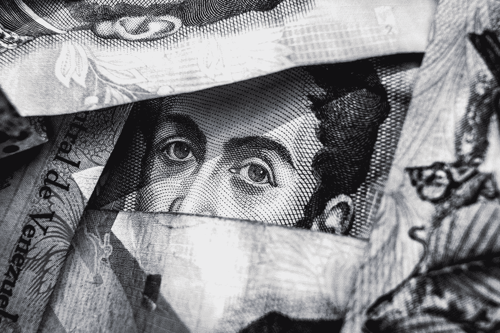

# 脸书的贪婪

> 原文：<https://medium.com/swlh/facebooks-avarice-6bfcf9300450>

## 几十年来最不负责任的公司之一没有权利自称为银行

Photo by [Freddie Collins](https://unsplash.com/@visuals_by_fred?utm_source=medium&utm_medium=referral) on [Unsplash](https://unsplash.com?utm_source=medium&utm_medium=referral)

脸书是建立在违反信任的基础上的。十五年后，扎克伯格的贪婪已经转移到了我们爱恨的脸书:

脸书[困扰](https://slate.com/technology/2019/04/facebook-data-breach-540-million-users-privacy.html)的[一段荒谬的](https://www.nytimes.com/2018/09/28/technology/facebook-hack-data-breach.html)漫长的[历史](https://www.theguardian.com/technology/2018/apr/08/facebook-to-contact-the-87-million-users-affected-by-data-breach)的[数据泄露](https://www.theguardian.com/technology/2017/jun/16/facebook-moderators-identity-exposed-terrorist-groups)、[相关诉讼](https://www.facebook.com/notes/facebook-security/important-message-from-facebooks-white-hat-program/10151437074840766)、以及 [FTC 和解](https://money.cnn.com/2011/11/29/technology/facebook_settlement/index.htm)旧…