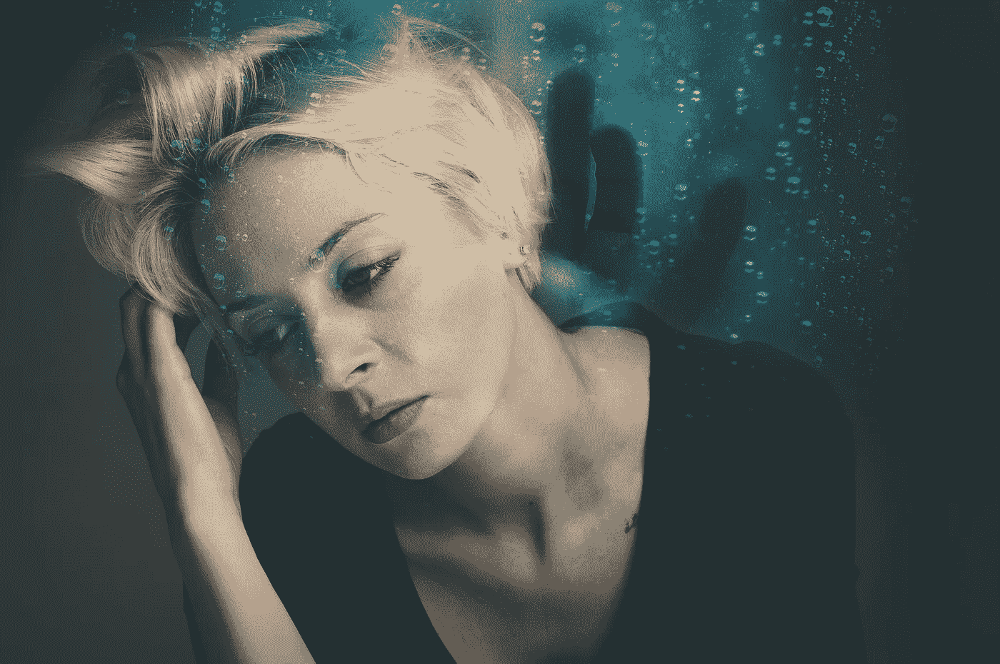

# 面对我的耻辱

> 原文：<https://medium.com/swlh/facing-my-shame-df6e80cd1b41>

我与精神障碍的斗争，几乎没有人知道我有——许多人从未听说过。

Image by [Pete Linforth](https://pixabay.com/users/TheDigitalArtist-202249/?utm_source=link-attribution&amp;utm_medium=referral&amp;utm_campaign=image&amp;utm_content=3351794) from [Pixabay](https://pixabay.com/?utm_source=link-attribution&amp;utm_medium=referral&amp;utm_campaign=image&amp;utm_content=3351794)

我记得我大约十岁左右。我母亲的长兄，一个通常很卑鄙的人，谢天谢地现在已经死了，会对我说“嗨，丑八怪！”还有我姐跟“嗨，美女！”作为一个即将进入青春期的孩子，我并不认为自己漂亮，甚至也不认为自己特别可爱，但我当然不需要我的低微…