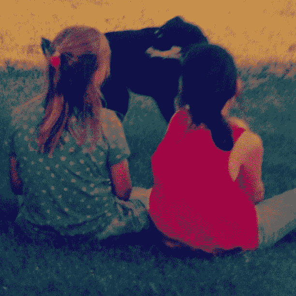
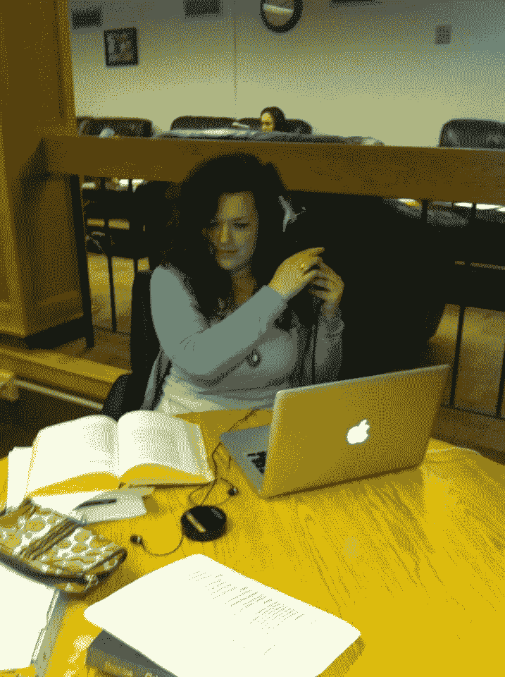

# 失败也是一种荣誉。

> 原文：<https://medium.com/swlh/failing-is-an-accolade-too-bb5cd74a0aa3>

*让我先说，我写这篇文章是因为我刚刚走出学术界这个陌生而有分寸的世界，在这个世界里，你呼吸的空气中有不足之处(见:* [*【冒名顶替综合症】*](https://www.psychologytoday.com/ca/blog/real-women/201809/the-reality-imposter-syndrome) *)。*

My cousin Erin, Jesse the dog, and I likely plotting our next business venture after the small (now failed) success of a second-hand ice cream cart we used to park by a ferry-landing. *Spoiler Erin is actually a pretty cool business lady now.

如果说迄今为止学术界和生活教会了我什么的话，那就是:失败是可以接受的。我在题目上的*唯一*专长就是失败过，搞砸过，被拒绝过几百次。其中一些仍然刺痛，一些没有，但我不能永远痛苦**…在那一刻，失败可能会感觉是世界上最糟糕的事情(*例如，*从十几岁的工作中被“放弃”,开着父母的丰田回家，在雨中，哭着听西蒙和加芬克尔重复的“美国”……我知道这很戏剧性)。**

**有时候这太可怕了，你看不到前方的路，甚至看不到尝试的意义(例如，*在花了 5 年多时间做相关工作、做志愿者、获得荣誉和硕士学位以提高自己的竞争力后，被博士课程拒绝)——但这并不意味着你将要采取的步骤和你之前采取的步骤不重要。***

**我们需要开始庆祝来自失败的成功。在一个通过社交媒体和其他途径陶醉于人们生活中看似“最美好的部分”的社会里，重要的是后退一步，想想你从失败中吸取了什么，或者更确切地说，你从不同的经历中吸取了什么 ~。你没有在简历上列出的事情可以通过这些失误来实现，而且实际上可能是你最好的一面。事实上，我敢打赌，99.9%的人并不是我们假装的“闪亮快乐的人”。**

# **我从失败中学到了一些东西:**

**如果有人不喜欢我做事的方式没关系，也许其他人会喜欢。 *例如，*在 12 年级时因为我平庸的写作技巧被“要求”离开 AP 英语，后来转到一个普通的*英语班，在那里我的第一篇论文(也是学术出版物)获得了 A+。***

**我下定决心了。例如，在一门研究生统计学课程中得了一个 B，然后重修直到我的知识达到 A+水平(我知道:笑死了，对一个 B 的反应……向研究生院大喊完全扭曲了世界观！).**

**我超级有趣。 *如*我本科毕业的部分。**

**我关心他人。 *我所有的* 失败实际上都让我在表达成功的时候有点不舒服，因为我知道在某个地方有人感觉像废物，因为他们也很努力。某种程度的失败是真正感同身受的关键(在我看来)。我不是说我们不应该庆祝我们的成功，只是说承认失败也很酷。**

# **我最引以为豪的三件事没有写在简历上，但却比我任何千篇一律的成就更能说明我的性格:**

1.  **我奶奶去世前，让我给她致悼词。从我的角度来看，这是我一生中最大的赞美(因为她认为我会公正地对待她)，也是我一生中最大的压力源之一(因为我想公正地对待她)。**
2.  **我曾经给法官写过一封信，是关于我教的一个项目中的一名学生，并帮助他避免了坐牢(这是因为以前的指控，这家伙是我见过的最有韧性/最勤奋的人之一)。他从法庭回来时脸上的表情=最好。**
3.  **我花了几个小时去收拾别人留下的破碎的人的碎片。**

**最后，记住这一点，**没有人比你强，你也没有比任何人强**。我的祖父母过去常常对他们的 11 个孩子说这句话，我的整个家庭一直在向他们灌输这句话(这是一种强化)。换句话说:**不要**，**我们都只是环境的产物** *(我完全认识到我是一个非常好的环境的产物)*。没错，**你并不特别**(也许你很有成就或才华，但归根结底，要求改变的人和你一样，都是人类经历的一部分)*。***

**每个人的旅程都是不同的，你不知道什么在影响着别人，除非你花时间去倾听。我们不应该被我们的成绩、金钱或社交媒体上的喜欢所定义。每个人都有价值，没有人是伟大的，或者擅长于所有的事情，失败让我们成为人类。这种不断比较的文化并不重要；重要的是我们在最好和最坏的时候如何对待彼此。因为如果我们在失败中没有彼此的支持，我们就无法学会适应，没有适应，我们就会停止尝试。**

****

**My friend Emma in our undergrad curling her hair in the library — I can’t remember what we studied for in there — but I happily remember why we never sat in the designated quiet areas. *****You can work hard and not take yourself too seriously.****