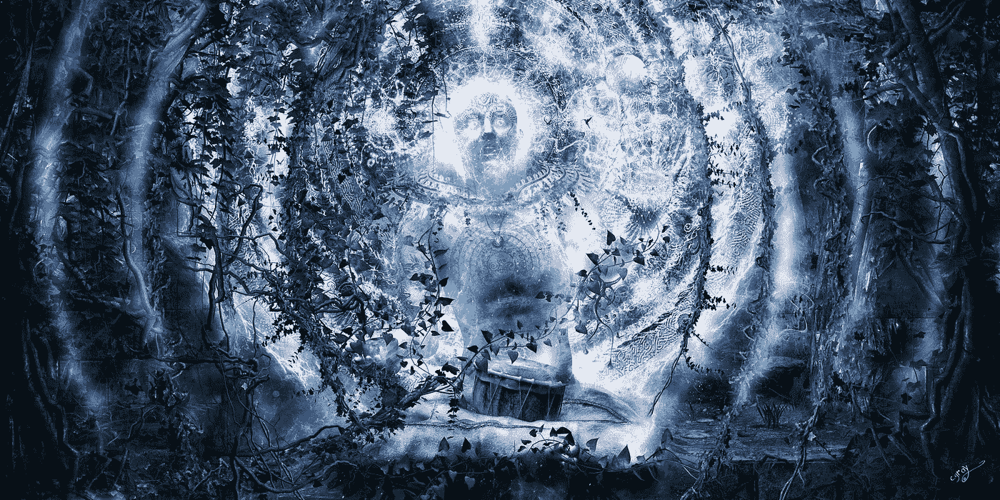

# 如何重构失败来最大化你的一天

> 原文：<https://medium.com/swlh/failure-is-flow-is-success-2e3816cd6571>

## 失败是成功的源泉

真正不可阻挡的是那些不需要太多快乐的人，因为他们如此专注于解决当前挑战的 T2。

像斯蒂芬·金这样的作家每天写 2000 字，尽管不断遭到拒绝。

> “到我十四岁的时候，我墙上的钉子不会……