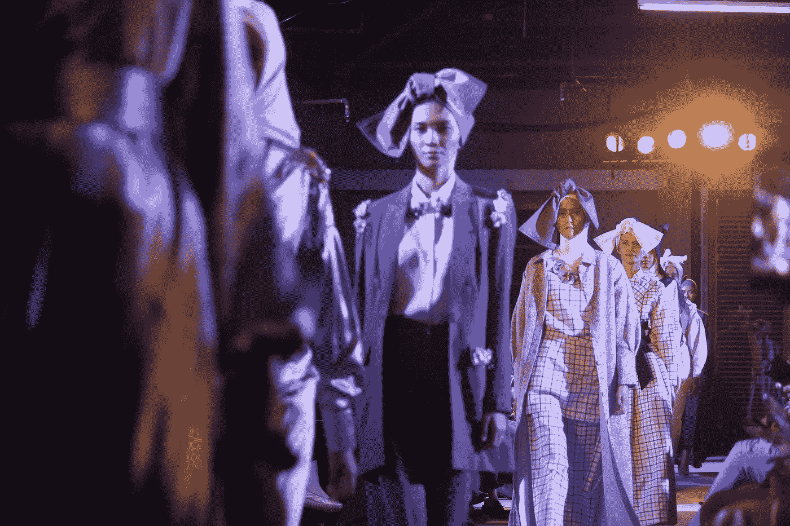

# 失败是新的成功:通过拥抱你的失误来寻找灵感

> 原文：<https://medium.com/swlh/failure-is-the-new-success-find-inspiration-by-embracing-your-missteps-1f93963fc6a7>

Originally published on [**JOTFORM.COM**](https://www.jotform.com/blog/failure-new-success/)

1975 年，如今已成为传奇的《Vogue》主编为安娜·温图尔打扮还是《时尚芭莎》的初级编辑。然后她[被解雇了](https://www.glamour.com/story/famous-women-failure-quotes)。

很难想象像温图尔这样的人——完美无瑕，被认为是她所在领域的佼佼者，受人尊敬到令人畏惧的程度——会犯错误。但是温图尔安排的照片拍摄…