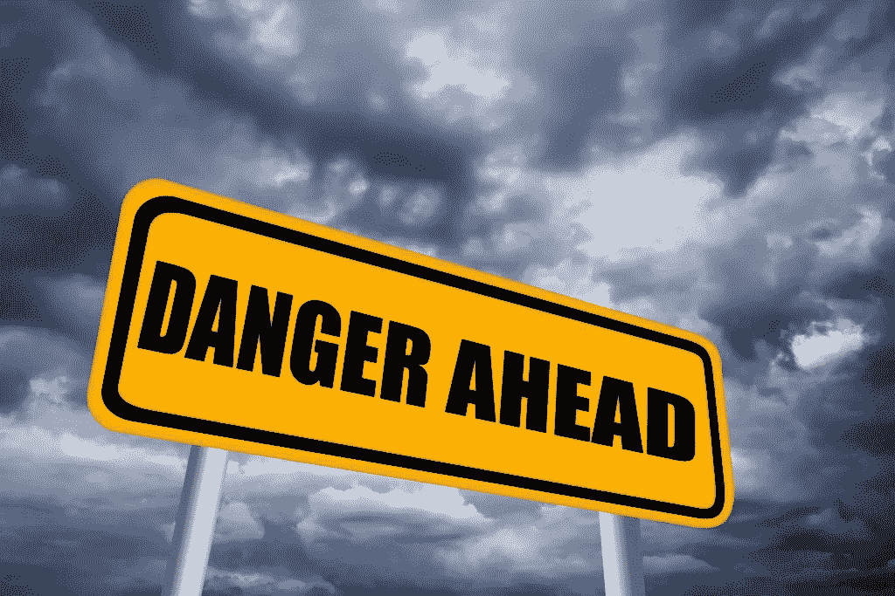

# 在企业可持续发展、塑料污染和气候变化方面，虚假领导是危险的。

> 原文：<https://medium.com/swlh/fake-leadership-is-dangerous-when-it-comes-to-corporate-sustainability-plastic-pollution-and-b9b3b2716cd5>

For the better part of the last 15 years, a hopeful public has been pacified with promises, while the corporate sustainability movement continues to track in a direction that suppresses meaningful regulations.

最近，我一直在思考企业可持续发展的状况，以及它如何没有兑现可持续商业模式的承诺。在你质疑这个事实之前，请记住，2018 年[二氧化碳排放量](https://www.theguardian.com/environment/2018/dec/05/brutal-news-global-carbon-emissions-jump-to-all-time-high-in-2018)达到了近年来的最高水平，[塑料污染](https://www.independent.co.uk/life-style/food-and-drink/food-microplastics-eating-plastic-pollution-environment-a8395556.html)继续恶化…