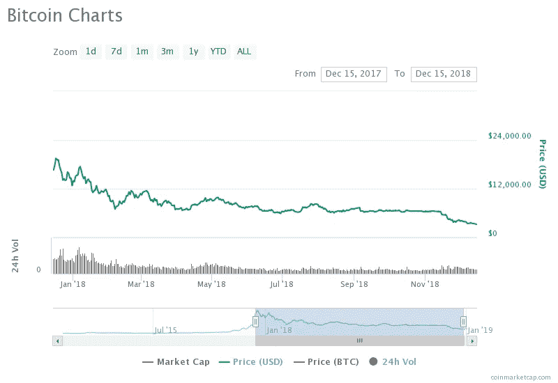

# 著名的比特币价格预测:谁在赌？

> 原文：<https://medium.com/swlh/famous-bitcoin-price-predictions-whos-on-the-money-5d470ea4bc85>

去年是[比特币](https://cryptpresso.com/bitcoin/) (BTC)极其动荡的一年。我们看到 BTC 的房价下跌了 84 %( T5 ),从近 2 万美元(T7)的历史高点跌至 3200 美元(T8 )( T9)的低点。当然，我们预计加密市场会有波动，价格通常会在一天内上涨或下跌 30%。这就是为什么**比特币价格预测**往往更关注长期。

的确，最近很多**名人**都做过比特币价格预测。约翰·迈克菲、詹姆森·洛普，甚至文克莱沃斯的双胞胎兄弟 T21 都发表了一些关于 BTC 能走多远的有趣言论。

# 2018 年的奋斗

比特币一直是不稳定的。自从 2009 年出现以来，这种加密货币的价格已经涨跌了很多次。BTC 的价值在 2018 年暴跌，在今年的最后几周损失尤为严重。然而，随着需求的增加，许多专家认为 BTC 早就应该迎来另一轮牛市了。这可能很快就会发生，或者我们可能要等到 2020 年**区块奖励减半**。

比特币的**散列率**也在 2018 年最后一个季度下降了 30%。然而，这也不全是坏消息。事实上，难度的降低提高了人们的希望，矿工们可能会再次将他们的计算能力奉献给比特币网络。其他计划在 2019 年进行的项目，包括 [Bakkt](https://www.bakkt.com/index) 和[纳斯达克的比特币期货](https://coinedtimes.com/bitcoin-4200-recovery-due-to-nasdaq-news/)，也可以**吸引投资**。

# 未来会带来什么？

预测 BTC 的未来价格是非常困难的，不管你知道多少。事实上，即使是最有经验的交易者也会犯错，特别是在短期内。例如，就在圣诞节前， **BTC 回升到 4200 美元**。许多交易员认为期待已久的**牛市已经到来**。然而，仅仅几天后，格林奇就带着所有的收益跑了。

从长远来看，供应将对 BTC 的价格产生更大的影响。很快，在 2020 年，我们可以期待比特币的整体奖励减半会推高 BTC 的价值。

# 比特币价格预测:透视水晶球

因此，我们研究了估算 BTC 未来价格的相关因素。现在是时候看看一些专家怎么说了。我们会提前警告你，事后看来，这些比特币价格预测中的一些**可能看起来很疯狂**。

# 约翰·麦卡菲

> 到 2020 年，比特币将达到 100 万美元

如果你和比特币有任何关系，或者你的电脑上曾经安装过**迈克菲杀毒**软件，你就会听说过这个**古怪的商人**。约翰·迈克菲是一名计算机程序员，他通过自己的反病毒程序赚了数百万美元。在过去几年里，他还是区块链理工大学和比特币的主要支持者。

为什么迈克菲在这个名单上？因为在 2017 年 11 月 29 日，他做出了有史以来最古怪的比特币价格预测之一。迈克菲大胆宣称，到 2020 年，BTC 的收入将达到 100 万美元。根据目前的证据，他可能开始紧张了。

有人甚至制作了一个[网站来跟踪](https://bircoin.top/)迈克菲声明的**准确性。为了他，让我们希望 BTC 的价格在 2019 年呈指数增长。**

# 文克莱沃斯双胞胎

> 到 2010 年，比特币将达到 32 万美元…

你可能记得文克莱沃斯双胞胎是马克·扎克伯格在《T2》*《社交网络》* 中的竞争对手。嗯，这些兄弟已经成为成功的商人，现在拥有一家名为双子座的美国密码交易所。事实上，他们最近发行了自己的稳定币:[双子星币](https://coinmarketcap.com/currencies/gemini-dollar/) (GUSD)。即使在熊市期间，他们的累积财富也达到了 10 亿美元，这使他们成为有史以来最成功的两位秘密企业家。

[泰勒·文克莱沃斯](https://twitter.com/tylerwinklevoss)上榜是因为他在 2018 年 2 月预测**比特币价格将达到 32 万美元**。如果我们要挑剔的话，我们可以说文克莱沃斯的野心只有迈克菲的三分之一。他的预测也略有不同，因为他从来没有为这个价格指定一个结束日期。

# 詹姆森·洛普

> 到 2020 年，比特币将达到 25 万美元

[詹姆森·洛普](https://twitter.com/lopp)是 [Casa](https://keys.casa/) 的**基础设施工程师**和[bitcoinsig.com](https://sites.google.com/site/bitcoinsig/)的创造者，也是著名的**比特币投资者**。他是一个著名的霍德勒，无论事情看起来多么糟糕，他总是对比特币保持热情。因此，他对 2020 年比特币价格达到 25 万美元的预测并不令人惊讶。

尽管他采取了比迈克菲和文克莱沃斯双胞胎稍微保守一点的方法，他的身材看起来仍然很乐观。

# 蒂姆·德雷珀

> 到 2020 年，比特币将达到 25 万美元

作为一名美国风险投资人，蒂姆·德雷珀(Tim Draper)对加密市场的影响是巨大的。他创办了[德雷柏费希尔杰维特森](https://dfj.com/) (DFJ)、德雷柏协会，甚至[德雷柏大学](https://www.draperuniversity.com/)。他最著名的时刻是在 2014 年的一次**比特币拍卖**中，他购买了近 **3 万 BTC。**

他正确地预测到，在那次拍卖后的三年内，BTC 的价格会达到一万美元。他还表示，到 2020 年，BTC 的价值将达到 25 万美元。鉴于他的过往记录，我会我会认真对待德雷柏的话。

# 约瑟夫·斯蒂格利茨

> BTC 将暴跌至 100 美元

在**对上述分析师的真正反对**中，[约瑟夫·施蒂格利茨](https://twitter.com/JosephEStiglitz)对 BTC 的未来持**否定态度。作为著名的经济学家和 2001 年诺贝尔经济学奖得主，斯蒂格利茨已经明确表示他不相信密码学。因此，他认为 **BTC 在被“监管遗忘”后，其价值将暴跌至***【100】美元***

*和努里埃尔·鲁比尼一样，他是比特币最大的批评者之一。事实上，斯蒂格利茨经常抨击 crypto 在主流市场缺乏应用。然而，他从来没有彻底解释过他消极的原因。*

# *最后的想法*

*只有时间能告诉我们这些比特币价格预测——如果有的话——哪一个会达到预期。尽管你刚刚读到的一些数据可能看起来有些牵强**，但我不会太快忽视它们。***

*不管 BTC 未来如何，重要的是要记住，即使在熊市中，采用率也在增长。毕竟，加密货币和区块链技术为用户提供了大量的好处。无论你认为 **BTC 将继续增长**，还是你认为它已经完成了自己的使命，我们都同意**未来将是迷人的**。*

**

## *这篇文章发表在 [The Startup](https://medium.com/swlh) 上，这是 Medium 最大的创业刊物，拥有+409，714 名读者。*

## *订阅接收[我们的头条新闻](http://growthsupply.com/the-startup-newsletter/)。*

**