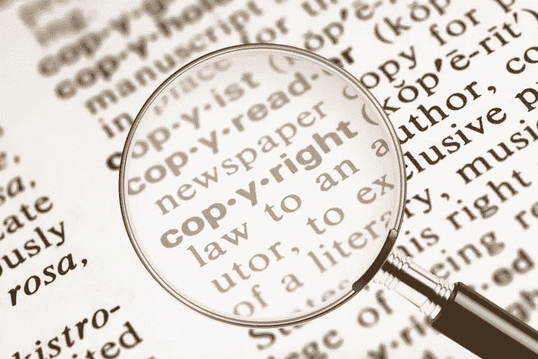

# 同人小说和版权:数字时代让版权法过时了吗？

> 原文：<https://medium.com/swlh/fanfiction-and-copyright-has-the-digital-age-rendered-copyright-laws-obsolete-aa8a82be6fc5>

本文认为，数字时代已经让版权变得过时，因为网络同人小说的激增表明，当代版权正在违背其最初的目标。版权最初旨在促进通过原创作品的创作实现的思想共享和文化提升，以及教育…