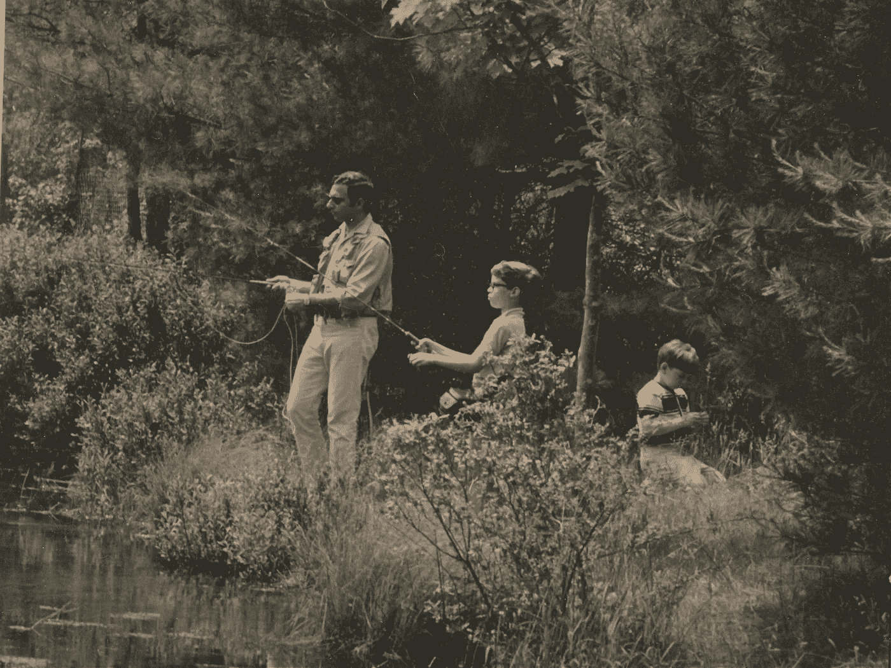

# 父亲、时尚和家庭治疗

> 原文：<https://medium.com/swlh/fathers-fashion-family-therapy-4062cf1c7498>

向我父亲致敬，2019 年父亲节

*(left to right) Arnold M. Katz, outfitted by Abercrombie & Fitch, with the author and his brother, Stephen.*

我记得我的父亲是时尚和风格的导师。他把标准定得很高。对我来说，这是错误的酒吧。

在我的记忆中，他的服装不仅在视觉上引人注目，而且也反映了他关于基本目标、成就和地位的个人陈述。