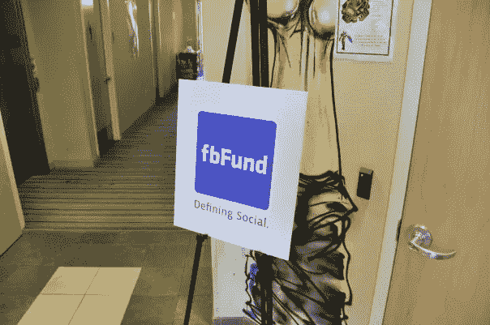

# fbFund:帮助创办 Lyft 的投资基金，你从未听说过

> 原文：<https://medium.com/swlh/fbfund-the-investment-fund-youve-never-heard-of-that-helped-start-lyft-bc57ee661162>

那是 2008 年。我坐在帕洛阿尔托市中心一间没有窗户的会议室里，那是脸书最初的办公室之一。作为种子投资小组 [fbFund](https://www.crunchbase.com/organization/fbfund#section-overview) 的一员，我们筛选了数百名申请人，并挑选了少数人进行面试和评估，以获得资助。

在我们面前的是一位聪明兴奋的企业家，他正在设置他的笔记本电脑来推销他的想法。罗根·格林(Logan Green)留着卷曲的金发，带着随和的微笑，穿着袖子太大的西装外套，他向我们讲述了他与约翰·齐默(John Zimmer)一起创办的初创公司 Zimride。

[Zimride](https://en.wikipedia.org/wiki/Zimride) 是一款社交拼车应用，它利用你在脸书的人脉来匹配同路的人。

我记得我以为他们的数字不会让我们大吃一惊。他们的想法很独特，但不是革命性的。但是感觉很好。我们抓住了机会。

我们的团队当时进行了投资，并在 2009 年再次投资。

后来，齐姆里德成为了 [Lyft](http://www.lyft.com) 。上周，它成为第一家首次公开募股的 fbFund 公司，价值超过 240 亿美元。

_______

fbFund 是 Chamath Palihapitiya 倡导的一个项目，他现在是 Social + Capital 的管理合伙人。它源于这样一个想法，即在我们这个科技和创意的时代，一点点投资就可以走很长的路。

当时，我们有 1000 万美元来支持那些通过在产品中加入社交整合来展示价值的公司。这笔钱来自创始人基金和 Accel，但由脸书管理。

我们的种子投资团队很小但很强大。我二十出头的时候是一个 Facebooker 用户，没有什么投资经验。我和我在脸书的队友，以及创始人基金的贾斯汀·菲什纳-沃尔夫森和 Accel 的安德鲁·布拉奇审查了大部分交易。最终获得批准的是当时创始人基金和 Accel 的高层彼得·泰尔和吉姆·布雷耶。

我们有全明星顾问乔希·科佩尔曼(Josh Kopelman)，他创立了首轮资本(First Round Capital)，当时来自 LinkedIn 的雷德·霍夫曼，以及谷歌的早期投资者拉吉夫·莫特瓦尼。

后来，我们的团队在 2009 年成立了首批为数不多的孵化器之一，名为 [fbFund REV](https://venturebeat.com/2009/05/28/fbfund-17-companies-and-2-nonprofits-win-head-to-palo-alto/) 。我们的基金给了一点钱，帮助行业名人上课，并创建了我们自己的导师委员会。在为期 10 周的期末，这些公司出席了我们的演示日，其中许多公司获得了第一批机构投资者的评分，这些机构投资者帮助他们进入了下一个阶段。

尽管我和我的脸书队友们没有筹集到资金，但我们觉得我们的工作是最好的:为人们提供资金，让他们去追求自己的梦想。

_______

当我们开始使用 fbFund 时，风险投资是一个不同的领域。

我们处于经济衰退中，很难起步。Y Combinator 和 Techstars 刚刚起步，有几个天使投资人在转来转去——他们中的许多人后来都创办了自己的基金。总的来说，没有太多的钱用于风投种子投资。

我们正在相对陌生的水域航行。在接下来的三年里，fbFund 资助了 50 多个团队，我在这个过程中学到了很多。

# 作为早期种子投资小组的一员，我学到了什么

## 1.多元化的团队挑选多元化的创始人。

尽管在过去的几年里，所有的努力都是为了资助更加多样化的团队，但是变化并不大。2018 年，只有约 2%的风险投资资金流向了女性领导的团队，这比 2017 年的略有[。](http://fortune.com/2019/01/28/funding-female-founders-2018/)

最近，我们看到更多的女性加入了独角兽行列，Rent the Runway 和 Glossier 的估值达到了 10 亿美元，但截至 2019 年 5 月，在 130 家风险投资支持的独角兽中，仍只有[的 14 家由女性领导。](http://fortune.com/2019/03/21/glossier-rent-the-runway-unicorn/)

我们没有打算用 fbFund 投资不同的团队，但因为我们在团队中有不同的观点和网络，我们投资的公司自然会反映这些观点。

事实证明，有女性的投资公司会投资更多的女性创始人。我们在 fbFund 的团队也证明了这一点。许多其他 Facebookers 用户寻找团队并提供帮助，但我们最初的资助团队总是主要由女性组成——有时团队中女性比例高达 75%。

当我回顾我们资助的人时，fbFund REV 中超过 35%的团队至少有一名女性联合创始人。在这些人当中，我认为我们的许多著名团队都有女性领导:

*   Wildfire 于 2012 年出售给谷歌，由维多利亚·兰塞姆(Victoria Ransom)和她的联合创始人阿兰·查德(Alain Chuard)创建。
*   Taskrabbit 于 2017 年出售给宜家，由 Leah Busque 创建，她启动了共享经济的大部分工作。
*   Leila Janah 经营着一系列产品和项目，如 Samasource、Samaschool 和最近的 LXMI，她也是这个项目的一部分。

## 2.一切都是为了人民。

人们经常谈论种子基金，好像有什么秘密公式似的。事实上，这确实需要大量的技巧，但是运气也起了很大的作用。你在正确的地方，正确的时间，拥有正确的资源。你能真正控制的唯一因素是你资助谁。

是的，如果有一个新的平台，并且你的团队是第一个上市的，那就更好了。是的，如果是几十亿美元的市场就更好了。是的，如果你不讨厌这个想法就更好了。

但是种子基金是一种冒险。通常，种子基金是在有任何有意义的数据之前对一个团队下赌注。他们有一个想法，一个创始团队，以及他们的想法可行的一点点证据。

我们当年的赌注是洛根和约翰。这需要一个有意义的支点，多年的努力，许多其他投资者、合作伙伴和朋友的支持，以及 11 年的时间才能达到 Lyft 今天的 IPO 水平。

因此，作为一个投资者，你唯一的赌注应该是在这个团队上，以及你认为他们会有多大的弹性。你认为他们会尝试多少次才会放弃？他们会忍受多少支点？他们对你的钱有多明智？坦白说，他们有多喜欢疼痛？

处于种子阶段的创业公司容易发生变化。唯一能让你保持不变的是你投资的人的性格。

## **3。你的平台运作的基金是有用的。**

fbFund 期间我们不是 VC，虽然我们的团队像投资人一样运作。我们大多数人都是脸书的雇员。就像我们的口号一样，我们在“定义社交”该基金是我们帮助指定和培育空间的机会，在这些空间中，我们像我们的社交工具一样，可以产生巨大的影响。尽管很多大公司都对整合社交感兴趣，但他们不知道如何整合。

我们一直在寻找能够向行业发出信号、帮助人们理解即将出现的伟大创意的公司。作为产品人员和营销人员，我们会资助传统风投可能忽视的团队。我们不是在寻找下一个十亿美元的公司，而是在为下一个十亿美元的公司搭建平台。

我们不是第一个也不是最后一个运营旨在为他们的平台启动生态系统的基金。 [Slackfund](https://slack.com/developers/fund) ，可能是当今最著名的基金之一，专注于改善人们在 Slack 平台上工作的地点和方式的产品。 [HTC 的 Vive X](https://vivex.vive.com/eu/) 正致力于资助那些想要“培育、培养和发展全球虚拟现实生态系统”的虚拟现实公司

这是获得关于我们平台生态系统的早期反馈并找出下一组要构建的功能的好方法。

## 4.投资需要时间…很多。

生存就是成功。投资就是要有耐心。

有了种子基金，当团队只有两到四个人时，你通常会下注。一年后，你的“成功”团队会回来说，“我们已经翻倍了！”见鬼，如果他们真的很好，也许他们已经翻了三倍。这意味着团队现在有 4 到 12 个人。他们可能还在赔钱，可能还没有产品上市。

此后的每一年，他们都会说一些类似的话，也许现在他们是 8-36 人，他们在市场上有一种产品在做一些事情。你现在赢了吗？很难说。

对我来说，我花了 3 到 5 年的时间来观察哪些团队会真正克服困难，创造出人们觉得有意义的产品。在 fbFund 成立的第四年，谷歌[以超过 3.5 亿美元的价格收购了 Wildfire](https://techcrunch.com/2012/07/31/google-acquires-wildfire) ，这是第一次有意义的收购。投资五年后，我可以判断哪些团队真的会“成功”。

10 多年后，以下是我们根据公开信息得出的一些投资要点:

*   [**野火**被谷歌以 3.5 亿美元收购](https://techcrunch.com/2012/07/31/google-acquires-wildfire/)
*   计划以 6 . 75 亿美元在 ASX 上市
*   [**TaskRabbit** 融资 5000 万美元被宜家收购](https://www.recode.net/2017/9/28/16377528/ikea-acquisition-taskrabbit-shopping-home-contract-labor)
*   [**持续联系获取的 Nutshellmail**](https://techcrunch.com/2010/05/24/constant-contact-acquires-social-media-inbox-startup-nutshell-mail/)
*   [**rentminoneline**被 RealPage](https://www.streetinsider.com/dr/news.php?id=7595776) 收购
*   [**集团卡**被 in com](https://techcrunch.com/2010/04/29/gift-card-giant-incomm-acquires-fbfund-startup-groupcard/)收购
*   [**绳结**](https://venturebeat.com/2009/01/26/fbfund-winner-weddingbook-elopes-with-the-knot/)获得的绳结

在这场漫长的游戏中，我们并不孤单。著名的孵化器 Y Combinator 最近也见证了他们的首次公开募股，去年, [Dropbox](http://www.dropbox.com) 在他们成立 13 年后首次亮相。

_______

也许是我最大的收获？创业公司不可预测。在创始人的背景或千篇一律的推介材料中，找不到可以表明企业成功的模式。通常，最古怪的想法和最谦逊的创始人最能引起轰动。

作为投资者，你必须跟着感觉走，并记住:这不是短跑。这是一场马拉松。当你押注的创始人正在取得突破、跌倒并重新站起来的时候，你所能做的就是在这个过程中提供力所能及的帮助。我很高兴我们是他们旅程的一部分，即使只是很小的一部分。

因此，让我们为 Lyft、fbFund 以及所有初创企业创始人和风险投资家干杯，他们无畏地追求自己的激情，为未来多元化和勇敢的领导者铺平道路。

恭喜你，Lyft，你的首次公开募股！

An early fbFund Ad

**以上观点仅代表我个人，不代表脸书、Accel、Founders Fund 或任何其他方。*

## 这篇文章发表在 [The Startup](https://medium.com/swlh) 上，这是 Medium 最大的创业刊物，拥有+440，678 读者。

## 订阅接收[我们的头条新闻](https://growthsupply.com/the-startup-newsletter/)。

