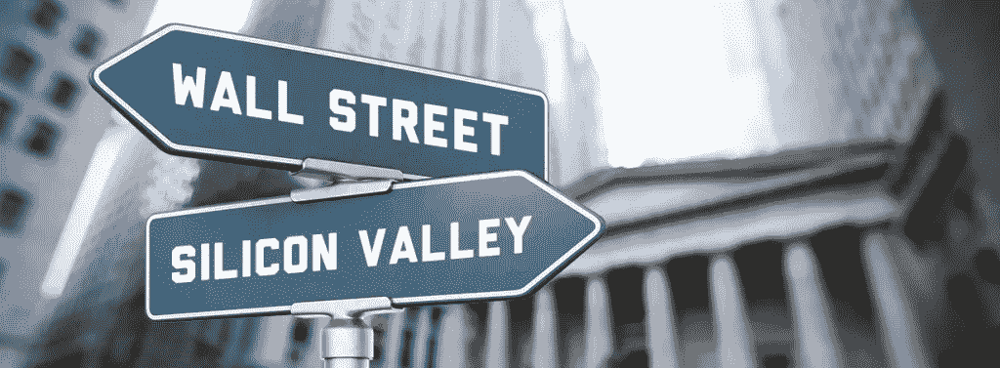
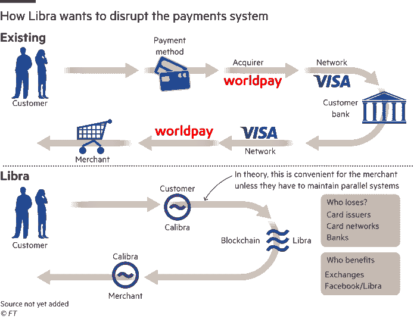

# FB 的 Libra 可能是未来漫长血腥战争的第一击——大科技对大金融

> 原文：<https://medium.com/swlh/fbs-libra-might-be-a-first-blow-in-a-long-bloody-war-ahead-big-tech-vs-big-finance-6f56a7fbb116>

几十年来，金融部门的低效率和缺乏技术进步一直是技术界广泛讨论的话题。这导致了金融科技(FinTech)的兴起，这是一个由金融和科技行业共同培育的科技生态系统，因为科技公司寻求多元化，金融公司寻求填补用户体验的空白。这可以从苹果和高盛在美国的 AppleCard、欧洲的 Transferwise(国际转账)和 BPCE 集团(法国第二大银行)以及亚洲的谷歌和 HDFC 和 ICICI 银行(印度最大的两家银行)的合作中看出。此外，在过去几年里，主要银行在投资金融科技初创公司方面变得越来越慷慨。这方面的例子有高盛和花旗对 Plaid(银行应用编程接口)的投资、高盛和摩根大通对 Motif(投资组合管理)的投资以及富国银行和 BNY 梅隆对 Symphony(通信和工作流程)的投资。大金融对区块链初创公司的投资也没有落后太多，高盛、花旗和摩根大通对 Circle、Axoni、chain、Cobalt 和 R3 进行了投资。

但从上述例子和整个行业来看，值得注意的是，鉴于大型金融机构拥有巨大的政治和金融影响力，它们对科技公司利用 Google Pay、Apple Pay、AppleCard、Amazon Card 等产品侵犯其行业非常耐心和宽容。尽管大金融和大科技有过交集，但它们以尊重和谦逊的态度相互问候，并试图建立伙伴关系。然而，脸书的天秤座可能会唤醒沉睡的金融业巨头。

Libra 直指 Big Finance 的商业模式——资金流动。银行(至少是其消费者业务)的大部分收入来自信用卡交易费(2-6%)、国际汇款、购物时的商户费用等。脸书设想的天秤座的大规模出现意味着对所有银行机构的巨大威胁。FB、PayPal、Lyft、Spotify 和优步等科技公司将决心收取消费者的任何交易费用，因为这将提高产品转化率。很简单——通过削减交易费用来降低消费者价格，将导致科技公司在相同销售成本的情况下需求增加，从而导致收入增加。

早些时候，谷歌支付(Google Pay)和苹果支付(Apple Pay)等科技产品尽管侵犯了大金融领域，但并没有试图通过规避交易费用来削弱银行利润率。由 Visa 和 Mastercard 网络支持的银行授权的信用卡仍在使用。就连推动快速国际交易的区块链最大公司之一 Ripple，也依赖于一种与金融机构相互依赖、同时又不降低收费的商业模式。

脸书的 Libra 将是科技公司首次试图直接规避银行交易费用，并对他们的整个商业模式构成严重威胁。

不足为奇的是，脸书最初为 Libra 储备提供 1000 万美元的 27 个捐助者名单中没有一家银行，而是包括了其他金融机构，如 Visa、万事达卡、PayPal 等。因为 Libra 仍然需要信用卡提供商的网络基础设施。

同样值得注意的是，脸书曾与荷兰 ING 银行接触，但他们拒绝了，而花旗集团表示，在 Libra 推出之前，它“从未与脸书进行过任何谈判”。对于脸书来说，认为花旗或高盛将成为 Libra 的一部分可能是一个疯狂的想法，Libra 是一种加密货币，本质上是为了与美元和欧元竞争。

那么，银行将如何应对？我怀疑他们会做一些事情。首先，他们会立即找一群昂贵的游说者，通过 Libra 计划运营的每个国家的政府法规来阻止 Libra。第二，他们会彼此组成财团和伙伴关系，以形成与 Libra 基金会竞争的协会，并最终增加在区块链的投资，以形成更受“他们”控制的货币和系统。第三，他们将密切关注谷歌、苹果和亚马逊等其他消费科技公司的活动，以预测未来任何此类削弱银行的产品。第四，他们会试图伤害大型科技公司，以展示权力和影响力，比如提高通过苹果或谷歌支付服务进行交易的费用，或者只是让它们更难在全球公共和私人市场转移资金。

从全球顶级机构的市场估值和招聘统计数据中可以看出，权力已经从大型金融机构向大型科技机构转移。看看大型金融机构是会奋起反击夺回头把交椅，还是会屈服于大型科技公司的强大力量，这将是一件有趣的事情。