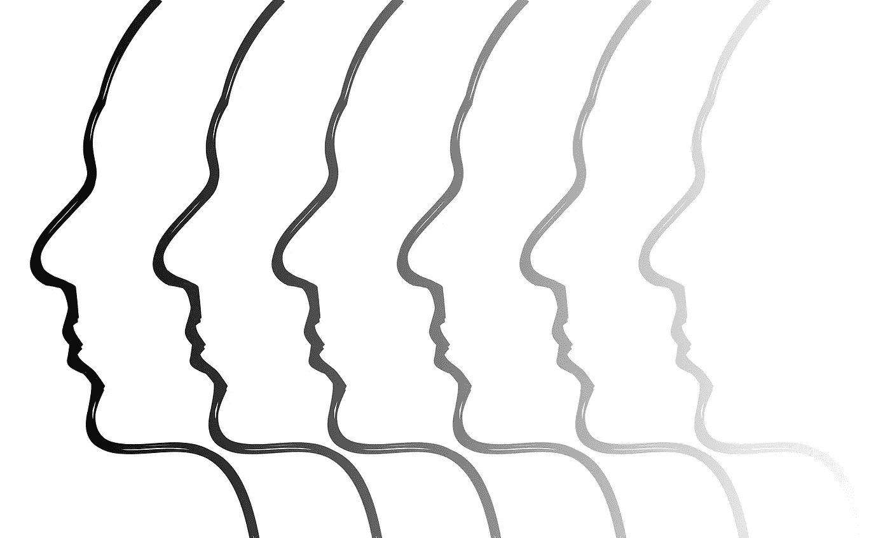

# 如果恐惧只是回声呢？

> 原文：<https://medium.com/swlh/fear-is-an-echo-d086fb9d142e>

## 恐惧真的像看上去的那样吗？

Image by Elisa Riva. Pixabay

恐惧似乎如此阴险，无处不在。它似乎在我们日常生活的幕后对我们耳语，拉我们的弦。暗中拖我们后腿，织网让我们慢下来，模糊我们的视线。

但是如果事情不是我们想的那样呢？