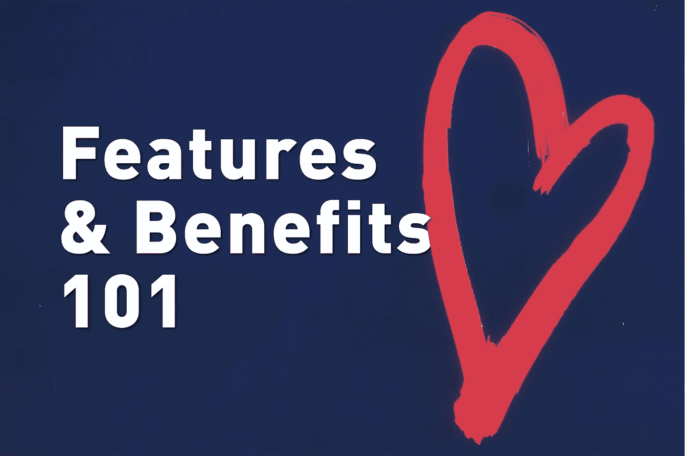
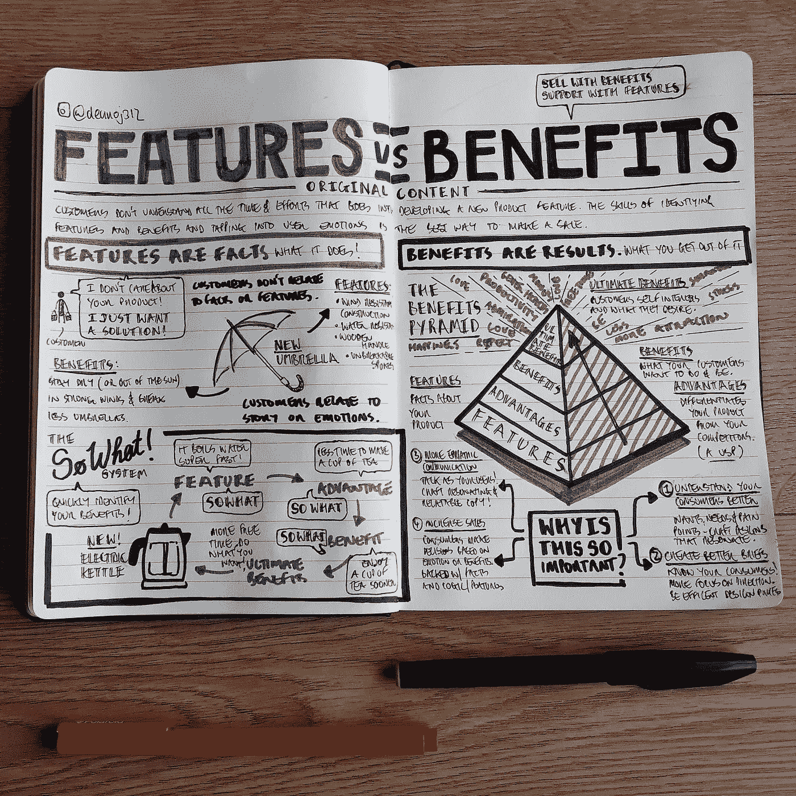
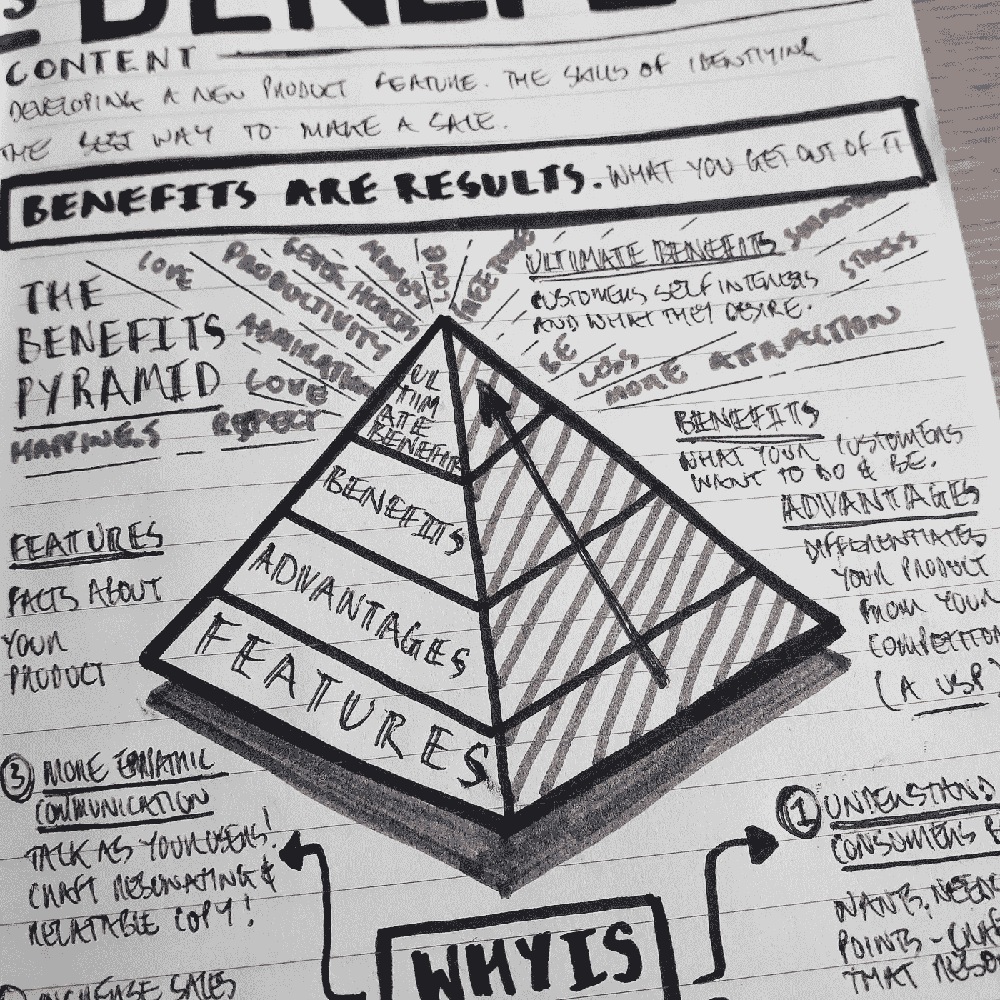
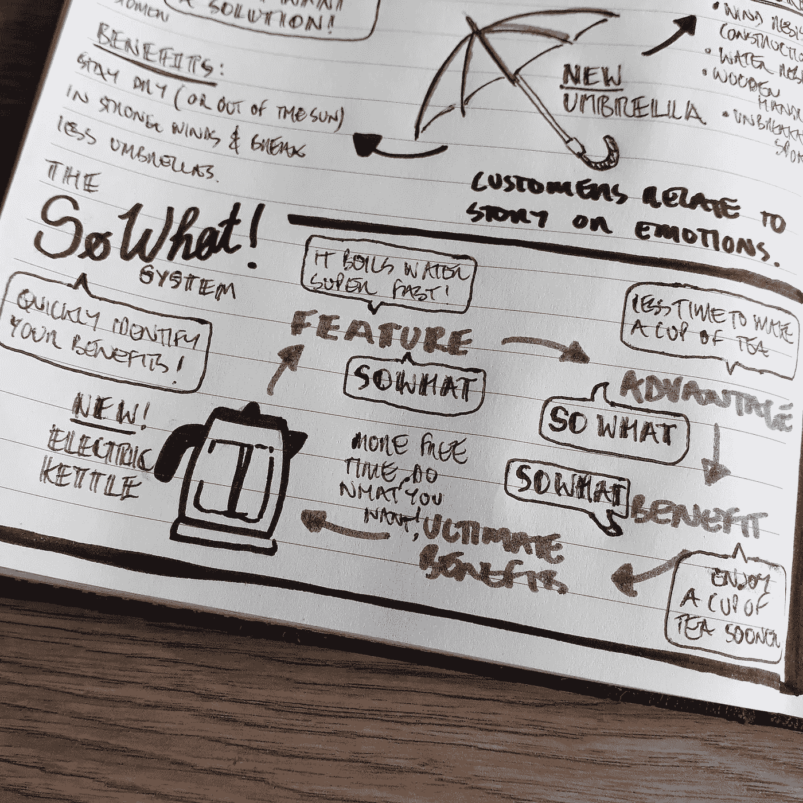

# 功能和优势 101

> 原文：<https://medium.com/swlh/features-benefits-101-c428eef8512>

*Image courtesy of @bel2000a via Unsplash.*

设计、营销、销售和广告的普遍原则之一是理解功能和优势，包括它们之间的差异以及如何利用它们来真正与消费者建立联系。

不幸的是，对于有创造力的专业人士来说，消费者根本不理解开发一个新产品所付出的所有心血、汗水和眼泪。

开发新产品功能只是成功的一半。

新功能需要与挖掘消费者情感需求的好处相关联。这是最有效的销售方式。

西奥多·莱维特说得好:“**人们不想买四分之一英寸的钻头，他们想要一个四分之一英寸的洞**”。

在本文中，我将提供特性和优点的定义，以及一些可以用来将特性转化为优点的技巧，解释为什么这对于设计过程如此重要。

首先，让我们从定义特性和优点开始。

对于创意行业如此普遍的基本原则，很有趣的是，很少有人能真正定义这两个概念。

因此，许多解决方案错过了创造能引起目标消费者共鸣的解决方案的机会。

如果你只能从这篇博客文章中得到一样东西，请让它成为:

**特性就是事实:*你的产品或服务是做什么的——基于逻辑，有时更多的是数字。***

**好处就是结果:*你的客户从中获得了什么——更多的情感和价值。***

My nudenotes I created whilst researching this article.

这里有几个例子来解释:

**电子儿童玩具** 功能:含电池。
*开箱即用* 好处:当父母没有合适的电池时，孩子不会感到不安

**电热水壶** 特点:烧开更快。
*早点享受你的一杯茶。* 好处:有更多的时间去做自己其实想做的事情。

**伞** 特点:抗风构造。即使在刮风的天气里也要保持干燥。
好处:全天候好看

这里有一个难以接受的事实:**消费者并不真正关心你的产品。**

所有消费者关心的是你的产品能为他们做什么。

对他们有什么好处？

这是消费者识别产品价值的地方:他们只是在寻找问题的解决方案，甚至是他们从来不知道自己遇到的问题。

购物是一项充满情感的活动。

消费者关心的不是事实和功能，而是故事和情感。

因此，你的设计方案应该引发情感反应。

使用与产品利益相关的情感会对消费者的购买决定产生强大的影响。

如果你目前仅仅依靠功能来销售你的产品，你就在给消费者施加压力，让他们弄清楚*为什么*他们应该购买你的产品。

这种额外的脑力劳动只是销售的另一个障碍，也是消费者不购买你产品的另一个原因。

现在，我们已经概述了特性和优点的一些定义和基础知识，我们可以开始构建一些技术来帮助您从特性到优点。

我应该提到这两种技术不是我自己的，我在研究过程中偶然发现的。

第一种技术叫做 ***利益金字塔*** 。

这是一个很好的可视化方法，可以处理你在解释一个特性和描述它的好处时应该经历的阶段。

从底层开始，你陈述你的特点(这些是关于你的产品的事实)。

接下来是优势，特性和收益的连接部分。

这是你的产品区别于竞争对手的地方。

这些通常被称为独特卖点(USP)。

接下来是利益(你的消费者得到什么)，消费者想做什么，想成为什么。

在最终利益的金字塔顶端，这是你的消费者的自身利益和他们最渴望的，这些通常是原始的人类情感，如尊重、爱、钦佩、舒适和安全，仅举几例。

Close up photo of my nudenotes on The Benefits Pyramid.

第二种手法被称为 ***那又如何？***‘系统，是为那些匆忙的人准备的一种技术！

它使你能够通过问“那又怎样？”来快速确定你的好处在每个卖点之后，直到你获得最终的利益。

这里有一个快速的例子，使用一个新的超快速沸腾技术的电水壶。

它烧水超快
**(特写)那又怎样？**

泡一杯茶的时间少了(优势)
**那又怎样？**

早点喝杯茶(好处)
**那又怎样？**

更多自由时间做自己想做的事(终极福利)
**成交！**

Close up photo of my nudenotes on The So What System.

有了这两种技术，您可以用一种简单的方式将特性转化为优势。

对于那些双手交叉阅读这篇文章的人来说，认为这是一堆新时代设计的胡言乱语，这里有一些为什么理解和使用优势比功能更重要的原因(即为什么你是错的):

**更好地了解你的消费者** 标准的模特人口统计学只能让你创造出越来越能引起消费者共鸣的设计方案。这些模特正在变得过时(这是另一篇博客文章的主题)。

随着消费者对更加个性化的设计方法的需求增长，我们需要加倍努力，为我们的目标消费者的需求和痛点构建设计解决方案。

为“少数人”设计能让你接触到“多数人”。

**更好的设计简介** 在第一点的基础上，通过更好地了解消费者的愿望和需求，我们可以从更好的设计参数开始创建更好的设计简介，从而更专注于我们的设计流程，更有效地利用我们的时间。

这些额外的时间可以用于开发设计解决方案，通过基于情感的益处与消费者交流，消费者会觉得这些解决方案更有价值。

**更有同理心的文案** 对你产品的特点和好处有一个坚定的理解，可以让你在整个设计过程中更好地沟通。

它提高了你与消费者用同一种语言交流的能力，为你所有的演讲和推销，尤其是包装、营销和广告，精心制作能引起共鸣的文案。

文案中的重复特征看起来好像你不知道消费者为什么应该购买你的产品或服务，所以消费者也不会对你的产品有任何信心。

**增加销量** 正如本文前面提到的，消费者通过理解一个故事和其中的好处，在很大程度上基于情感做出购买决定。

当然，这些将会有特征和事实的支持，但是和你的消费者在他们的水平上交谈将会吸引他们进入你的产品。

这就是特性和优势 101！我希望这能启发您重新审视在设计流程和解决方案中使用特性和优势的方式。

作为一个小小的毕业礼物，这里有一个链接，链接到我为准备写这篇博客而制作的一张 [**高分辨率 PDF**](https://www.nightskycreative.org/nsc-blog/features-and-benefits-101) 。

我还包括了本文中使用的一些标注图像。

没有陷阱，这是一个完全免费的资源，你可以在任何需要的时候用作参考。

**想要更多这样的？**
然后去 instagram 关注我 [**@deanoj312**](https://www.instagram.com/deanoj312/?hl=en&source=post_page---------------------------) 。
或前往 nightskycreative.org**的 [**获取 nudenotes 世界上每件事情的每周更新！**](https://www.nightskycreative.org/?source=post_page---------------------------)**