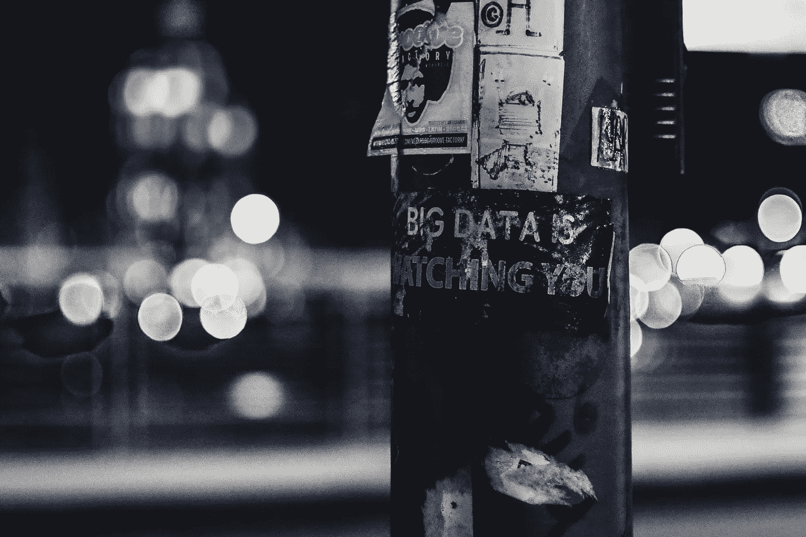

# 联邦机构有权访问你的私人数据

> 原文：<https://medium.com/swlh/federal-agencies-have-access-to-your-private-data-b1d7df52b2b2>

## 数字时代特有的监管机制和快速进化变化…

Big Data is Watching You — Photo by [ev](https://unsplash.com/@ev?utm_source=unsplash&utm_medium=referral&utm_content=creditCopyText) on [Unsplash](https://unsplash.com/search/photos/data?utm_source=unsplash&utm_medium=referral&utm_content=creditCopyText)

有一个相当新的趋势已经在美国站稳脚跟，那就是将联邦公共卫生与整个医疗保健行业“整合”。如果没有标准化的要求，这是不可能的…