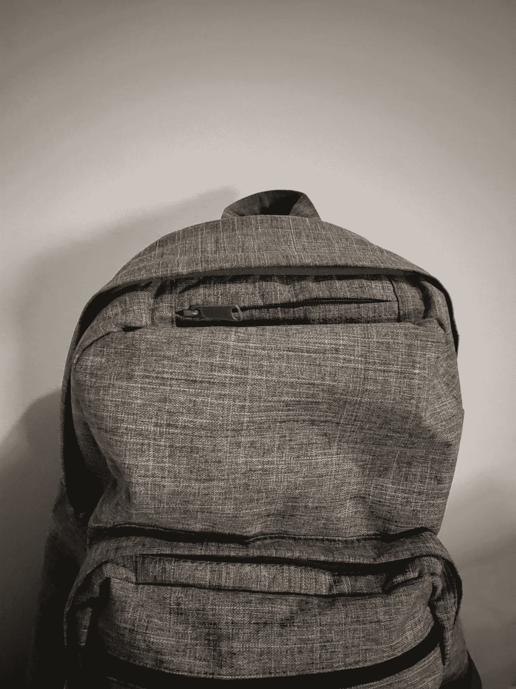

# 斐波那契的背包

> 原文：<https://medium.com/swlh/fibonaccis-backpack-d23bb346bf00>

My trusty backpack

不久前，我发现了一个有趣的面试问题。不感兴趣是因为问题非常具有挑战性，但感兴趣是因为施加不同的约束改变了解决问题的整个方式。

假设说，你的任务是在宠物店为动物买房子。但是…我们谈论的是哪种动物呢？如果有仓鼠，小笼子里有几只…