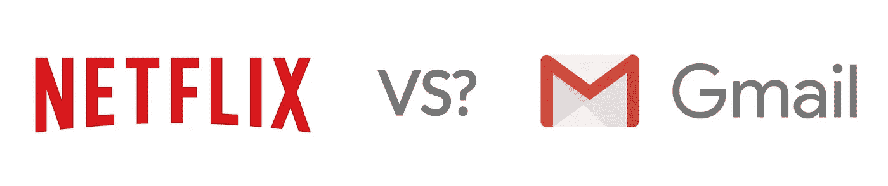

# 金融激励、最大化主义和不必要的密码部落主义

> 原文：<https://medium.com/swlh/financial-incentive-maximalism-and-the-unnecessary-tribalism-of-crypto-a3f4ad91f2d>

## 为什么部落主义在密码中猖獗？我们能做些什么

加密货币行业是一个迷人的领域。它优雅地将金融、技术和密码学的学科融合成一只全新的野兽，为老问题提供新的解决方案。

我们已经取得的成就有很多值得赞赏的地方。加密技术正在经济冲突的领域产生真正的影响[。密码爱好者是建立意识、真正采用的热情支持者，并在互联网上拥有一些](/the-mission/how-cryptocurrency-can-help-developing-countries-2a720192ba6a)[最佳迷因游戏](https://i.imgur.com/jGKDErX.jpg)。最重要的是，一些最聪明的技术头脑正在[加入](https://news.mit.edu/2019/vault-faster-more-efficient-cryptocurrency-0124)来研究我们如何利用它来提升互联网。

话虽如此，这个行业一直让我感到沮丧的一个方面是，相信有一天会有一种硬币主宰所有其他硬币。这种观点被称为“最大化主义”，它阻碍了这一新兴产业的发展。

加密货币通过使用金融激励自然会助长极大主义。我们已经走到这一步是可以理解的，但如果我们能够找到一种方法来理解为什么会发生这种情况，以及我们如何采取不同的观点，加密货币行业将受益。

## 财务激励是根本

加密货币通常比传统协议更复杂。他们利用财务激励来保护促进交易的网络。当我们在这里说“安全”时，它意味着货币运行的方式，它将惩罚不良行为，奖励良好的参与者，使网络运行更加可靠。采矿就是一个很好的例子:

假设其中一台计算机 Miner A 正在决定在下一个块中应该处理哪些事务，并且意外地(或恶意地)包含了彼此冲突的事务，这可能会加倍花费金钱。

在利害关系证明系统中，当另一个参与者矿工 B 看到错误时，矿工 B 会因为指出错误而获得奖励。奖励将来自矿工 A，他们的股份将被“削减”；因为他们的错误而直接损失金钱。

然而，如果矿工 A 只是做了正确的事情，他们将获得对他们的努力的整体奖励以及任何交易处理的所有费用。

引入财务激励带来了新的挑战，但这是允许无信任方在共享数据层中进行交互的必要组成部分。参与的财务影响使每个人都表现良好，并允许系统工作。

## 为什么你从来没有听说过 TCP maximalism

协议是我们在互联网上的计算机和人之间连接、通信和移动数据的方式。

如果您在浏览器或手机上阅读本文，那么您使用的是一种更常见的协议组合:TCP 和 HTTP。

这种协议组合决定了您的设备如何查找和请求这篇文章，如何安全地将数据传输到您的设备，以及如何可靠地传递您的设备向您呈现内容所需的信息。

互联网上使用的协议[范围很广](https://en.wikipedia.org/wiki/Internet_protocol_suite)，这里有一个简短的例子，涵盖了我们最常见的一些应用:
*观看网飞公园&记录(TCP)
*与你在东京的表兄进行 Skype 通话(UDP)
*在你的 Gmail 帐户中发送草稿(SMTP)
*在你的媒体应用程序上调出这篇博文(HTTPS)

这些协议根据其预期用途有不同的要求和特征。例如，TCP 要求来自请求者的确认接收到传输的响应；UDP 没有。这使得 UDP 更适合于对丢失有容忍度的流数据，例如视频会议。如果你加载 HTML 来呈现一个页面，你不能错过一半的标记而仍然正常进行，所以我们使用 TCP。

这些协议没有一个比另一个好。它们服务于不同的目的，并且都不适合其他的用例。更重要的是，因为协议不依赖于令牌的发行，所以您没有任何 TCP 硬币或 UDP 硬币。在谁使用哪个方面你没有既得利益，所以你不关心网飞使用什么协议，你只想看你的电影。

## 那么为什么密码中存在极大主义呢？

确保网络安全的财务激励与行业内广泛投机背后的驱动力相同。通过使用安全网络，参与者对他们持有的价值具有既得利益。

这种既得利益通过硬币之间的零和竞争表现出来。快速浏览一下 Crypto Twitter，你会发现各种各样的人都说他们手中的硬币将会彻底改变一切，而他们手中没有的硬币是“狗屎硬币”。最大化主义的出现可以归结为几个特征:
*加密货币实现了一种可交易的代币，以利用金融激励
*网络中的参与者对他们拥有的硬币有既得利益
*参与者拥有 FOMO，认为另一枚硬币将比他们的升值更多
*这种东西很复杂，区分两枚旨在实现相同功能的硬币的技术特征可能很有挑战性

当网络中的参与者固执己见，只主张一枚硬币(通常是他们手中的硬币)时，他们被称为“最大化主义者”。当你让相互竞争的最大化主义者争论哪个硬币会“赢”时，你最终会看到猖獗的部落主义，让人们彼此对立。

## 部落主义有什么问题？

从市场的角度来看，部落主义没有任何意义。密码市场是非常相关的。认为另一枚硬币升值或贬值会对你的资产产生影响的想法是没有根据的。霍德博特去年对此做了很好的分析，发现排名前 200 的硬币中有 50%的[**相关性为 0.80 或更高**](https://www.hodlbot.io/blog/how-many-cryptocurrencies-are-simply-following-the-market) 。

all the sparklines lined up in a row

加密货币的部落主义分散了人们对正在取得的真正进展的注意力。我一直想知道，如果上世纪 70 年代，当瑟夫建立互联网的基础时，有数百万用户对他的工作进行挑剔，TCP 的发展会是什么样子。

最终的结果是，对于初学加密的人来说，这是一个更具侵略性、更令人困惑的行业。他们所看到的是来自对立部落的马克思主义者之间的内讧，他们不知道应该用什么货币来满足自己的需求。

## 最大化主义的替代方案:秘密寡头垄断

两枚硬币竞相提供相同的功能没有错，但认为一枚硬币可以服务于加密货币的所有用例是荒谬的。这就像是说，我们应该使用发送电子邮件的相同协议来提供网飞电影。

如果我们能够远离最大化主义，转向不同硬币的景观，每个硬币都服务于它们的目的，我们就可以将竞争优势指向生产方向。

如果我们可以找到加密货币打算提供的效用类别，我们就可以在这些类别中培养有眼光的消费者。最适合支付交易的网络可能不适合执行智能合约。就像 TCP 和 UDP 有不同的特点，如果我们能分别对待这些用例，每个用例在各自的类别中都可以做得更好。

该行业将朝着围绕每个公用事业垂直行业形成秘密寡头垄断的方向发展。随着时间的推移，我们将了解加密货币适用于哪些用例，执行良好的解决方案将在每个类别中胜出。几个有竞争力的硬币将在每个类别中做得很好，我们将摆脱一个硬币将服务于所有用例的期望。随着其用例和网络的成熟，支付、身份、存储和其他领域都将建立自己的寡头垄断。

这使得消费者可以根据网络在各自类别中的表现来选择与他们互动的网络。我们有希望摆脱“除了比特币之外的一切都是狗屎币”的观念，转向“我更喜欢 x 而不是 y，因为它的阻塞时间很快”或“我喜欢 x，因为我可以通过押注我的硬币赚取利息”。它将使 crypto 更有吸引力，我认为这是业内每个人都希望的。