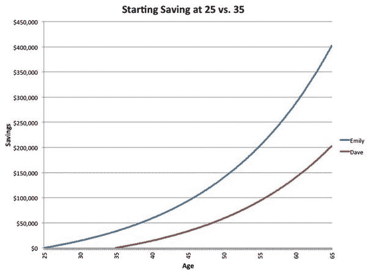

# 财务错误

> 原文：<https://medium.com/swlh/financial-mistakes-273f00f7506b>

# 尽快投资，否则以后踢自己！

看到那个图表了吗？Emily 和 Dave 投资了相同的金额，花费了非常相似的时间。*然而，艾米丽的进步完全摧毁了戴夫的进步。*

这是显而易见的，你开始得越早，复利就开始得越早。大多数人认为他们可以在稍后的年龄开始投资，以获得同样的收益，但实际上…