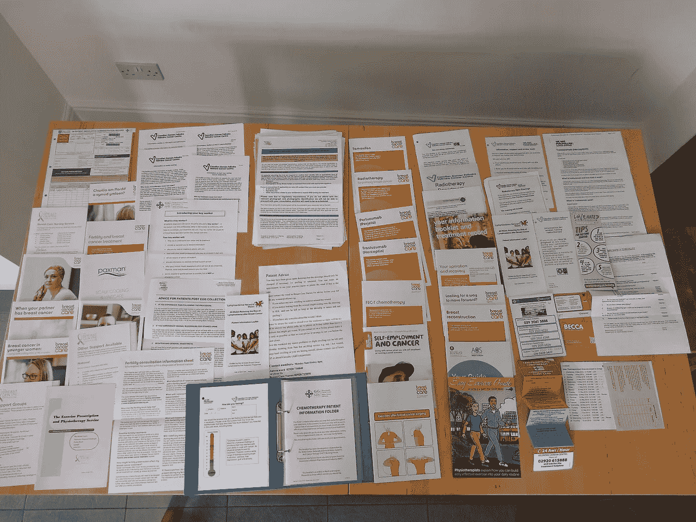

# 在内容世界中找到自己的位置

> 原文：<https://medium.com/swlh/finding-my-place-in-the-content-world-84937dc6bec4>

自 2012 年以来，我一直是一名内容方面的自由职业者，但总是在职称上挣扎。作为一名文案，我从未感到完全自在。我写的字从来没有 salesy。每个项目都是从我们为谁写作和为什么写作开始的。随着时间的流逝，我很幸运地对我接手的项目更加挑剔了——对为了内容而粗制滥造毫无兴趣。直到 2017 年冬天，我读了莎拉·理查德(Sarah Richard)的《内容设计》(Content Design)一书，才发现了内容世界的一个新学科:内容设计似乎是我的地盘。

# **调研- >需求- >内容**

前一年，我开始和一个小团队一起开发一个应用程序，帮助患有甲状腺疾病的人生活得更健康、更快乐。我的第一个任务是弄清楚甲状腺到底是什么，以及为什么全球这么多人难以获得他们需要的护理和治疗。

对于那些不知道的人来说，这是你颈部的一个蝴蝶状腺体，它几乎控制着你身体的一切。甲状腺疾病很难诊断和管理，医生需要来自患者的大量信息，这款应用程序将有助于跟踪这些信息。但它不仅仅是跟踪症状、设置药物提醒和存储测试结果。这也与教育有关。

我们听甲状腺社区的故事，研究流行的论坛、网站和博客，了解常见的问题和需求。我们绘制了人们在医疗系统中的旅程，他们共同追求感觉更好。我们研究了他们使用的语言，以及针对他们的危言耸听和蛇油兜售。

我们理解人们是脆弱的，渴望感觉更好。他们害怕自己再也不会感觉好了。他们转向网络社区寻求帮助和安慰，并经常相互解释彼此的测试结果、症状和经历。许多人自我治疗，尝试不同的(通常很贵的)东西，只是为了感觉“正常”。

我们知道需要有研究支持的可靠信息，而不是基于个人经验和假设。我的主要角色变成了设计一系列文章和指南，通过应用程序发布，帮助人们更多地了解自己的状况以及如何应对。它们将由医疗保健专业人员签署，并由参与测试的人进行测试。

# **癌症与内容**

快进到 2018 年 8 月，我的整个人生都戛然而止。我被诊断患有乳腺癌，我妈妈也有这种病。

随着我经历一次又一次的治疗——化疗、手术和放疗，我的工作时间变慢了。我花了两年时间帮助建立这个应用程序的内容库，但是这个项目的工作停止了。

当 a 经历医疗系统时，我想了很多关于我收到的信件和小册子，以及我每周遇到的医疗专业人员所使用的语言。许多信息是压倒性的和不必要的——是“很高兴知道”而不是“需要知道”。以防万一的信息。

An image of all the letters, leaflets and booklets I received during 9 months of cancer treatment. It made me ask: how much is too much?

我的感觉每天都在改变。有时我想知道关于癌症的一切。其他时候，我是如此不知所措，无法阅读或集中注意力。在糟糕的一天，我记得发现麦克米伦的一些关于自我就业和癌症的内容令人恼火，因为它太有同情心了。我对一个网页很恼火，它有一个冗长的“那里那里”的介绍，而不是提供我需要的信息。

当然，像癌症这样的健康状况会引起一系列的情绪，并引发许多问题。

你如何为那些正在经历困难时期的人——除此之外，经历症状或药物副作用的人写文章？那些知道自己的病情是终身的或者随时可能复发，而且没有灵丹妙药的人？

我也想了很多我们为之写作的人。回想起来，内容是否恰当？这是他们需要的吗？

# **新的一章**

即将结束 9 个月的治疗是可怕的，但也是一种解脱。在停工期间，我反思了过去的项目和我希望在未来实现的目标。我喜欢与一家健康创业公司合作，并愿意支持更多与健康相关的项目，以解决现实生活中的问题并提供清晰、可访问的信息。

上个月是另一个学习曲线。我接触了一些很棒的内容设计师，并进行了一些有趣的 Twitter 对话。作为一名内容设计师，我被热烈欢迎加入了 [Scope 的内容团队](https://medium.com/content-at-scope)，在那里我学习了关于[残疾的社会模式](https://www.scope.org.uk/about-us/social-model-of-disability/)，以及设计无障碍内容意味着什么。但是还有很多东西要学。

如果你像我一样，正处于内容职业的反思期，你可能会在网上寻找灵感和想法。以下是我在过去几个月中喜欢并保存的一些内容、语言和服务设计相关的文章:

*   我们不是我们的用户:我们不应该告诉他们如何感受
*   [如何编写可访问的超链接](http://verymeta.com/accessible-hyperlinks/) —伊恩·布鲁姆，非常元
*   [残疾、语言和服务设计](/content-at-scope/disability-language-and-service-design-998cc7b5f30a) —杰克·加芬克尔，范围
*   [为健康素养低的用户创造更好的内容](https://digital.nhs.uk/blog/transformation-blog/2019/creating-better-content-for-users-with-low-health-literacy) —英国国民保健服务数字部的马克·罗宾逊和安娜·萨维奇
*   [忘记结束:拥有你的专业知识，而不是](https://uxdesign.cc/forget-sign-off-own-your-expertise-instead-9ddf2749c24e)——凯瑟琳·布拉德肖-琼斯，BBC
*   你或许应该少发布一些内容
*   [可读性指南 2019 年 5 月更新](http://contentdesign.london/data/readability-guidelines-may-2019-update-by-lizzie-bruce/) — Lizzie Bruce，伦敦内容设计
*   [写自动回复，感觉不到自动](https://uxdesign.cc/writing-automatic-replies-that-dont-feel-automatic-6a9e528a6bd0)——Amy Leak，BBC
*   [为什么我选择使用同理心地图而不是人物角色](https://hippodigital.co.uk/2019/06/why-i-chose-to-work-with-empathy-maps-instead-of-personas/) — Leah Thompson，Hippo Digital
*   [为什么《卫报》改变了其关于环境的语言](https://www.theguardian.com/environment/2019/may/17/why-the-guardian-is-changing-the-language-it-uses-about-the-environment) —《卫报》
*   [为什么英国国家医疗服务系统希望病人便便、小便和生病](https://www.theguardian.com/lifeandstyle/shortcuts/2019/mar/19/why-nhs-wants-patients-to-poo-pee-be-sick)——卫报
*   当我们不再将癌症视为一场输赢之战时，好的一面就会到来

## 我是加的夫的一名自由内容设计师，为 Scope 和 RNLI 等组织工作。32 岁时，我也被诊断出患有乳腺癌。

## 如果你正在经历类似的事情，[看看我的其他帖子](/@niacampbell)，并随时联系:hello@niacampbell.co.uk。