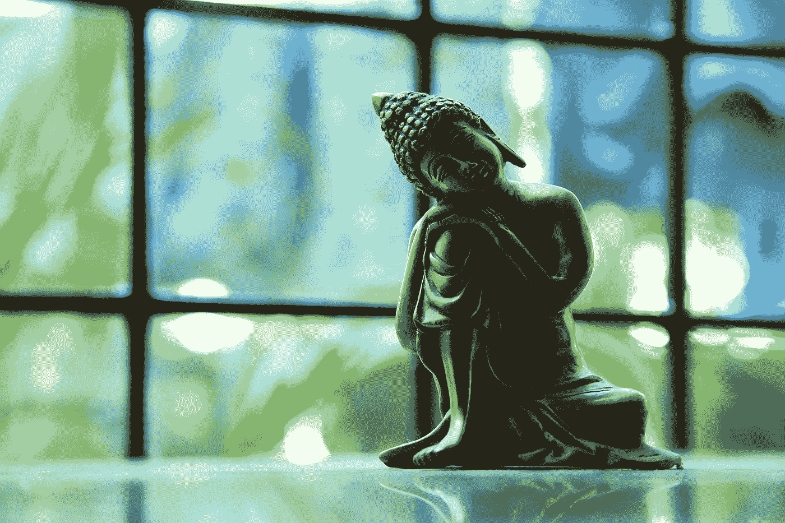

# 在佛牙中寻找平静

> 原文：<https://medium.com/swlh/finding-peace-in-buddhas-tooth-2eb341ca2fe1>

Photo by [wilsan u](https://unsplash.com/@wilsanphotography?utm_source=medium&utm_medium=referral) on [Unsplash](https://unsplash.com?utm_source=medium&utm_medium=referral)

我们躲进新加坡的佛牙寺和博物馆，躲避热带暴雨。因为我丈夫是牙医。当你和牙医一起旅行时，你怎么能错过一个专门展示牙齿的博物馆呢？

该博物馆声称收藏了佛陀的左犬齿，是从他在印度 Kushinagar 的火葬柴堆中找到的。我们坐着这辆车从一层楼绕到另一层楼…