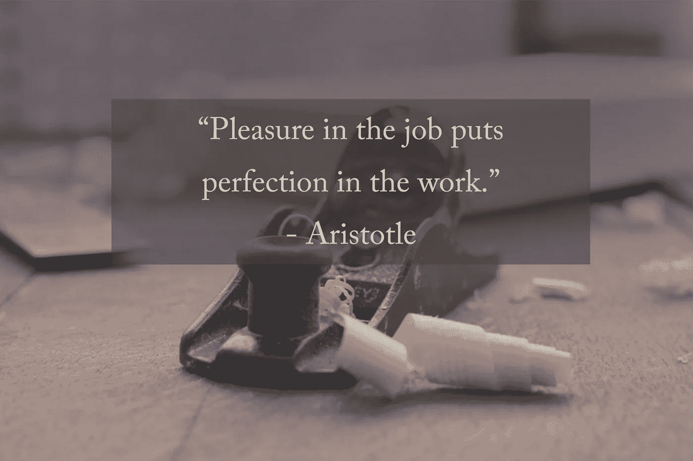

# 在日常生活中寻找工作目标

> 原文：<https://medium.com/swlh/finding-purpose-at-work-in-everyday-moments-c2a5d1c1f897>

只有一小部分人真正热爱他们的职业。这是一个可悲的现实，但为了支付我们生活的必需品和享受生活的乐趣，我们必须就业。

*当你讨厌自己的工作时，你会怎么做？*

我的父亲总是说，如果你足够幸运有一份工作，那么你就处于一个令人羡慕的地位，猫鸟…